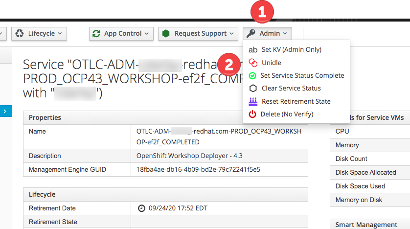

= Red Hat OpenShift Service Mesh Advanced - Instuctor Notes

:numbered:

== Lab Assets

. link:https://docs.google.com/spreadsheets/d/1vazinjjbOSN-uDY8u_mmg-lXtrRlZtm1l5vJQucdKz8/edit#gid=959461386[Class Assignment Spreadsheet]

== *OCP 4.3 Workshop Deployer*
. Provisioned from https://labs.opentlc.com 
.. *Services -> Catalogs -> OPENTLC OpenShift 4 Labs -> OpenShift Workshop Deployer - 4.3*

. Instructor uses _MachineSet API_ to scale to appropriately sized cluster
.. Emergency Response (16GB RAM) + Istio Control Plane (6GB RAM) = 22GB RAM per student
.. Provision 1 worker node per 2 students.

.. Find the currently available machinesets: oc get machinesets -n openshift-machine-api
+
----
$ oc get machinesets -n openshift-machine-api
----

.. Scale up a machineset, using this command:
+
----
oc scale machineset <MACHINESETNAME> --replicas=<COUNT> -n openshift-machine-api
----

. Configure Environment to Stay Up
.. During the course, you want the environment to stay up, without idling. You can set this in the CloudForms UI.
.. Select your service, then select *Admin* drop-down
.. Select *Unidle*

== Prep Provisioning Environment

You will need an environment to run the Ansible provisioning playbooks. 

NOTE: If you are using a Mac, it is best to run the installation from a Linux environment. You can order a *Student VM* from OPENTLC.

=== Install Python Package Manager - pip

. Download and install pip
+
----
$ curl "https://bootstrap.pypa.io/get-pip.py" -o "get-pip.py"

$ python get-pip.py
----

. Verify The Installation
+
----
$ pip --version
----

=== Install Supporting Python Packages

The installation requires Python modules `lxml` and `kubernetes`

. Install lxml python module
+
----
$ sudo pip3 install lxml
----

. Install kubernetes python module
+
----
$ sudo pip3 install openshift
----

=== Install Ansible Tooling

The installation requires Ansible tooling

. Install Ansible
+
----
$ sudo dnf -y install ansible
----

== 3scale Control Plane

The 3scale installation process has three major steps:

.. Provision 1 3scale Control Plane
.. Provision 1 tenant per student
.. Provision 1 set of API gateways (staging and production) per tenant

. link:https://github.com/gpe-mw-ansible-org/3scale_multitenant[3scale_multitenant] ansible is recommended (for the time being).
+

== Emergency Response Demo

. Instructor layers 1 Emergency Response Demo per student
.. git clone https://github.com/btison/emergency-response-demo-install.git
.. git checkout service-mesh-advanced-ilt
.. cd ansible
.. cp inventories/inventory.template inventories/inventory
.. Add the value of your link:[mapbox token] to the _map_token_ variable in _inventories/inventory_ file. ie;
+
-----
[all:vars]
# MapBox API token, see https://docs.mapbox.com/help/how-mapbox-works/access-tokens/
map_token=pk.eyJ1KJoiamjyaWRlIiwiGSI6ImNqeGNjamxqYjAxcXczdXBrcW5mbmguamkifQ.iBEb0APX1Vmo_VtsDj-Y3f
-----

.. execute:
+
-----
start_id=1
end_id=20

for x in $(seq $start_id $end_id); do
   ansible-playbook -i inventories/inventory playbooks/install.yml \
      -e project_admin=user$x \
      -e set_realm_admin_as_default=True \
      -e install_monitoring=False \
      -e install_tools=False
done
-----

== *Red Hat Service Mesh*
. The ansible found in the course link:https://github.com/gpe-mw-training/ocp_service_mesh_advanced[Lab Assets] is recommended.

[IMPORTANT]
====
After running the Red Hat Service Mesh installation playbook, the `opentlc-mgr` cluster admin user will no longer be active. A new cluster admin user has been created as part of the installation playbook: `cluster-admin`, with the same password.
====
