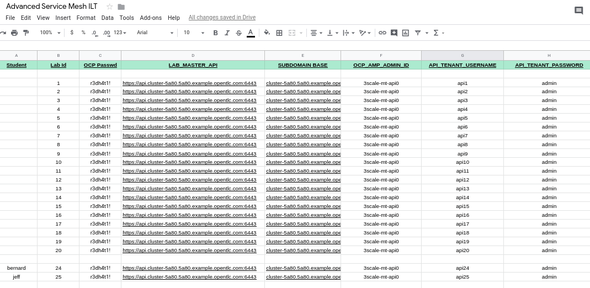

:noaudio:
:scrollbar:
:toc2:
:linkattrs:
:data-uri:

= Lab Assets and Tooling 

.Goals
* Overview of student lab environment
* Overview of pre-installed Red Hat Service Mesh _operator_
* Overview of pre-installed Red Hat Service Mesh _control plane_
* Overview of the 3 user roles typically involved in a Red Hat Service Mesh managed environment
* Introduction to Emergency Response demo

:numbered:

== Local Workstation

=== Client Utilities

. openssl
+
RHEL / Fedora:  `yum install openssl`

. link:https://stedolan.github.io/jq/download/[jq]
+
Fedora: `dnf install jq`

. link:https://mirror.openshift.com/pub/openshift-v4/clients/oc/4.2/[oc utility version 4.2]
+
After installing the `oc` client, please ensure its on your $PATH and that its version is in the OpenShift 4.2 family:
+
-----
$ oc version
-----
+
.Output
-----
Client Version: v4.2.0
-----

. link:https://github.com/istio/istio/releases/tag/1.3.5[istioctl utility]
.. This link provides a more recent version of the _istioctl_ command line utility than the version of istio that Red Hat Service Mesh 1.0 is based on.
+
However, for the purpose of this course, this version of _istioctl_ works well.
.. After downloading, unarchive the download and place the _bin/istioctl_ binary somewhere on your $PATH

=== Environment Variables

. Have your instructor share with you the lab details spreadsheet.
+

. Open a terminal window on your local machine and download the script that sets needed environment variables for the labs in this course:
+
-----
$ mkdir -p $HOME/lab

$ curl https://raw.githubusercontent.com/gpe-mw-training/ocp_service_mesh_advanced/master/utils/set_env_vars.sh \
    -o $HOME/lab/set_env_vars.sh && \
    chmod 775 $HOME/lab/set_env_vars.sh
-----

. Using your favorite text editor, modify the environment variables in this downloaded shell script.
+
Refer to the lab details spreadsheet shared by your instructor.

. Execute the shell script so that the environment variables are applied to your existing shell:
+
-----
$ $HOME/lab/set_env_vars.sh
-----

== OpenShift
Your student lab is built on a shared OpenShift v4 cluster in the cloud.

. OpenShift users
+
In this OpenShift lab environment, you are provided with two different OpenShift users:

.. *$ERDEMO_USER*
+
This user is an admin of your microservice architected business application used for this course (the _Emergency Response Demo_).
In addition, this user has view access to a variety of other namespaces.

... At the terminal, authenticate into OpenShift using the user: $ERDEMO_USER
+
-----
$ oc login $LAB_MASTER_API -u $ERDEMO_USER -p $OCP_PASSWD
-----

... View a listing of OpenShift projects that you have access to:
+
-----
$ oc get projects
-----
+
You should see a listing similar to the following:
+
-----
istio-operator       Service Mesh Operator         Active
kafka-operator-erd                                 Active
tools-erd                                          Active
user50-er-demo                                      Active
admin50-istio-system   admin5 Service Mesh System   Active
-----
+
In subsequent sections of this lab, you will be introduced to each of these namespaces.

.. *$SM_CP_ADMIN*
+
This your Red Hat Service Mesh _control plane_ administrator.
In addition to be the admin of your Red Hat Service Mesh _control plane_, this user has view access to a variety of other namespaces.

... At the terminal, authenticate into OpenShift using the user: $SM_CP_ADMIN
+
-----
$ oc login $LAB_MASTER_API -u $SM_CP_ADMIN -p $OCP_PASSWD
-----

... View a listing of OpenShift projects that you have access to:
+
-----
$ oc get projects
-----
+
You should see a listing similar to the following:
+
-----
3scale-mt-api0         3scale-mt-api0                Active
admin50-istio-system   admin50 Service Mesh System   Active
istio-operator         Service Mesh Operator         Active
user50-er-demo                                       Active
-----

. OpenShift Web Console:
.. At the terminal, determine the URL of the OpenShift Console:
+
-----
$ oc whoami --show-console
-----

.. Open a browser tab and navigate to the URL determined in the previous step.
.. Authenticate using the values of $ERDEMO_USER and $OCP_PASSWD

== Red Hat Service Mesh resources: _cluster-admin_

Red Hat Service Mesh implements _soft multi-tenancy_ that provides a three-tier RBAC model comprising the roles of cluster-admin, mesh-admin and namespace-admin.

In this section of the lab, you are oriented to the Red Hat Service Mesh resources owned by an OpenShift cluster-admin (ie:  your instructor).

=== Operator

. Switch to the administrator of your Service Mesh _control plane_ ( who has also been given view access to the _istio-operator_ namespace)
+
-----
$ oc login -u $SM_CP_ADMIN -p $OCP_PASSWD
-----

. View the previously installed Service Mesh operator found in the _istio-operator_ namespace:
+
-----
$ oc get deploy istio-operator -n istio-operator
-----
+
.Sample output
-----
istio-operator   1/1     1            1           15h
-----
+
** This operator is global (to the OpenShift cluster) in scope.
** The administrator of the _istio-operator_ namespace is the OpenShift cluster-admin .

=== Istio CNI plugin

While injecting the _Envoy_ service proxy sidecar into an application pod, link:https://istio.io/[community Istio] typically uses an link:https://kubernetes.io/docs/concepts/workloads/pods/init-containers/[init-container] to manipulate the iptables rules of the OpenShift node where the application pod runs.
It modifies these iptables in order to intercept requests to application containers.
Although the _Envoy_ service proxy sidecar does not require root to run, this short-lived _init-container_ does require link:https://docs.docker.com/engine/reference/run/#runtime-privilege-and-linux-capabilities[cap_net_admin] privileges.

The use of this _init container_ in each application pod with elevated _cap_net_admin_ privileges is a security vulnerability.
Subsequently, Red Hat Service Mesh avoids this approach.

Instead, Red Hat Service Mesh makes use of the link:https://istio.io/docs/setup/additional-setup/cni/[istio-cni plugin].
The _istio-cni_ plugin is an implementation of the link:https://github.com/containernetworking/cni[Linux container network interface] specification.
The _istio-cni_ plugin is responsible for manipulating iptables routing rules on a pod injected with the _Envoy_ side-car container.

The _istio-cni_ plugin still run with elevated privileges.
Subsequently, the _istio-cni_ plugin is implemented as a _DaemonSet_ in the _istio-operator_ namespace (which typically will be owned by the OpenShift cluster-admin).

. View the previously installed _istio-cni_ pods implemented as an OpenShift _DaemonSet_ in the cluster-admin's _istio-operator_ namespace:
+
-----
oc get daemonset istio-node -n istio-operator
NAME         DESIRED   CURRENT   READY   UP-TO-DATE   AVAILABLE   NODE SELECTOR                 AGE

istio-node   12        12        12      12           12          beta.kubernetes.io/os=linux   4d21h
-----
+
As a _DaemonSet_, a Istio _CNI_ pod runs on every node of the OpenShift cluster.

. Notice the use of the Red Hat supported _istio-cni_ Linux container image:
+
-----
$ oc describe daemonset istio-node -n istio-operator | grep Image
-----
+
.Output
-----
registry.redhat.io/openshift-service-mesh/istio-cni-rhel8:1.0.1
-----

=== CRDs
Custom Resource Definitions (CRDs) facilitate domain specific extensions to the OpenShift master API.
Red Hat Service Mesh defines several CRDs to faciliate the provisioning and lifecycle of a service mesh.

. View the Service Mesh related _custom resource definitions_ that extend the OpenShift master API:
+
-----
$ oc get crd --as=system:admin | grep 'maistra\|istio'
-----

.. You'll have to impersonate an OpenShift Cluster Admin to do so.  
This normally would not be provided to you (a servie mesh _control plane_ administrator) in a production environment.
.. You should see about 55 CRDs.

.. Some of the more prominant service mesh related CRD extensions to the OpenShift master API include the following:

... *adapters.config.istio.io*
+
link:https://istio.io/docs/reference/config/policy-and-telemetry/adapters/[Mixer adapters] allow Istio to interface to a variety of infrastructure backends for such things as metrics and logs.

... *destinationrules.networking.istio.io*
+
link:https://istio.io/docs/reference/config/networking/destination-rule/[DestinationRule] defines policies that apply to traffic intended for a service after routing has occurred. 

... *gateways.networking.istio.io*
+
link:https://istio.io/docs/reference/config/networking/gateway/[Gateway] describes a load balancer operating at the edge of the mesh receiving incoming or outgoing HTTP/TCP connections

... *servicemeshcontrolplanes.maistra.io*
+
Defines the details of a service mesh _control plane_.

... *servicemeshmemberrolls.maistra.io*
+
The ServiceMeshMemberRoll lists the projects belonging to the control plane.

... *servicemeshpolicies.authentication.maistra.io*
+
Allows for over-riding of _ServiceMeshControlPlane_ settings with either _namespace-scoped_ or _service-scoped_ policies. 

... *virtualservices.networking.istio.io*
+
link:https://istio.io/docs/reference/config/networking/virtual-service/[Virtual Service] defines traffice routing.

=== MutatingWebHooks

Injecting of the _Envoy_ sidecar container into a deployment can be done manually or automatically.
Most of the time, you will prefer automatic injection.
Automatic injection of sidecar containers into a deployment requires an OpenShift _Admission Controller_.

An OpenShift _admission controller_ is a piece of code that intercepts requests to the Kubernetes API server prior to persistence of the object, but after the request is authenticated and authorized. 
You can define two types of admission webhooks: 

* validating admission Webhook 
+
With validating admission Webhooks, you may reject requests to enforce custom admission policies. 

* mutating admission webhook
+
With mutating admission Webhooks, you may change requests to enforce custom defaults.

. Impersonate cluster-admin and get a list of _mutatingwebhookconfiguration_ resources on the OpenShift cluster:
+
-----
$ oc get mutatingwebhookconfiguration --as=system:admin | grep $SM_CP_NS
-----
+
.Sample Output
-----
[...]

istio-sidecar-injector-admin25-istio-system   2019-11-12T15:15:18Z
-----

. Extract the details of your _mutatingwebhookconfiguration_ specific to your Red Hat Service Mesh installation:
+
-----
$ oc get mutatingwebhookconfiguration istio-sidecar-injector-$SM_CP_NS \
       -o yaml \
       --as=system:admin \
       > $HOME/lab/$SM_CP_NS-mutatingwebhookconfiguration.yaml
-----
+
Study the content of the output file `$HOME/lab/$SM_CP_NS-mutatingwebhookconfiguration.yaml` and notice the following:

.. The _/inject_ endpoint of the _istio-sidecar-injector_ service from your own service mesh control plane will be invoked when auto-injecting the _Envoy_ service proxy into an application pod.
+
-----
    service:
      name: istio-sidecar-injector
      namespace: admin25-istio-system
      path: /inject
-----

.. The scope of your MutatingWebHook is the namespace of your own service mesh control plane:
+
-----
  namespaceSelector:
    matchExpressions:
    - key: maistra.io/member-of
      operator: In
      values:
      - admin25-istio-system
    - key: maistra.io/ignore-namespace
      operator: DoesNotExist
-----

== Red Hat Service Mesh resources: _mesh-admin_

Your lab environment includes your own dedicated Red Hat Service Mesh _control plane_.
This dedicated Red Hat Service Mesh _control plane_ is owned by your own _mesh admin_ user.
The lifecycle of your service mesh _control plane_ is managed by the cluster scoped Red Hat Service Mesh operator.

=== Resources

. Ensure you are still authenticated into OpenShift as the _mesh-admin_ user:
+
-----
$ oc login -u $SM_CP_ADMIN -p $OCP_PASSWD
-----

. Determine version of Red Hat Service Mesh being used in your lab environment:
+
-----
$ istioctl version --remote=true -i $SM_CP_ADMIN-istio-system
-----
+
.Output
-----
client version: 1.3.5
control plane version: 1.0.1-1
-----
+
NOTE: Red Hat Service Mesh 1.1 is expected to release Jan 29, 2020 and is expected to be link:https://issues.jboss.org/projects/OSSM/issues/OSSM-54?filter=allopenissues[based on Istio 1.3 or Istio 1.4].

. Notice the existence of the Service Mesh _control plane_ deployments:
+
-----
$ oc get deployments -n $SM_CP_NS
-----
+
.Sample output
-----
NAME                     READY   UP-TO-DATE   AVAILABLE   AGE
grafana                  1/1     1            1           24h
istio-citadel            1/1     1            1           24h
istio-egressgateway      1/1     1            1           24h
istio-galley             1/1     1            1           24h
istio-ingressgateway     1/1     1            1           24h
istio-pilot              1/1     1            1           24h
istio-policy             1/1     1            1           24h
istio-sidecar-injector   1/1     1            1           24h
istio-telemetry          1/1     1            1           24h
jaeger                   1/1     1            1           24h
kiali                    1/1     1            1           24h
prometheus               1/1     1            1           24h
-----

. Notice the existence of a _ServiceMeshControlPlane_ custom resource:
+
-----
$ oc get ServiceMeshControlPlane -n $SM_CP_NS
-----
+
.Sample Output
-----
NAME           READY
full-install   True
-----
+
During installation of your lab environment, the $SM_CP_NS namespace was created and this _ServiceMeshControlPlane_ link:https://github.com/gpe-mw-training/ocp_service_mesh_advanced/blob/master/ansible/roles/maistra_control_plane/tasks/main.yml#L3-L5[was applied to it].
+
The Red Hat Service Mesh operator detected the presence of this new _ServiceMeshControlPlane_ custom resource and subsequently provisioned the service mesh control plane.
+
[NOTE]
If the status in the _READY_ column is not `True`, this means that the Service Mesh control plane was not correctly installed. In that case, examine the status of the _ServiceMeshControlPlane_ custom resource, to find out what the issue is.

. Notice the existence of a _ServiceMeshPolicy_:
+
-----
$ oc get ServiceMeshPolicies -n $SM_CP_NS
-----
+
.Sample Output
-----
NAME      AGE
default   24h
-----
+
NOTE: This Red Hat Service Mesh specific resource replaces the upstream community Istio _MeshPolicy_ (which is cluster scoped and not compatible with multi-tenancy).  As you will see in a later lab, this resource is used to configure mutual TLS (mTLS) security within a single service mesh.

. Notice the existence of various namespace scoped _RoleBinding_ resources in the service mesh control plane:
+
-----
$ oc get RoleBinding -n $SM_CP_NS
-----
+
.Sample Output
-----
istio-citadel-admin50-istio-system                               24h
istio-citadel-admin50-istio-system                               24h
istio-egressgateway-admin50-istio-system                         24h
istio-galley-admin-role-binding-admin50-istio-system             24h
istio-ingressgateway-admin50-istio-system                        24h
istio-ingressgateway-sds                                         24h
istio-mixer-admin-role-binding-admin50-istio-system              24h
istio-pilot-admin50-istio-system                                 24h
istio-sidecar-injector-admin-role-binding-admin50-istio-system   24h
kiali                                                            24h
prometheus-admin50-istio-system                                  24h
-----
+
The use of a project scoped _RoleBinding_ rather than a cluster-scoped _ClusterRoleBinding_ is a key enabler of _multi-tenant_ capabilities of the Red Hat Service Mesh product.

. Notice the existence of an empty _ServiceMeshMemberRoll_ called _default_ :
+
-----
$ oc get ServiceMeshMemberRoll default -o template --template='{{"\n"}}{{.spec}}{{"\n\n"}}' -n $SM_CP_NS
-----
+
.Output
-----
map[]
-----
+
In a later lab, you (as the service mesh control plane admin) will add the namespace where your Emergency Response application resides to this currently empty ServiceMeshMemberRoll.

== Emergency Response Demo: _namespace-admin_

For the purpose of this course, your service mesh control plane will manage your own instance of the link:https://www.erdemo.io[Emergency Response application].

The intent of the Emergency Resonse demo is to showcase the breadth of the Red Hat middleware portfolio running on Red Hat OpenShift.

The services of the Emergency Response demo use a mix of both HTTP based synchronous communication and AMQ Streams based asynchronous communication.
As such, the Emergency Response demo is an excellent application to highlight the existing capabilities and limitations of a service mesh.

=== Resources

. Your $ERDEMO_USER account has admin privileges to your dedicated Emergency Response application.
+
Switch to this user as follows:
+
-----
$ oc login -u $ERDEMO_USER -p $OCP_PASSWD
-----

. You can view its OpenShift DeploymentConfigs in the _$ERDEMO_USER-er-demo_ namespace as follows:
+
-----
$ oc get dc -n $ERDEMO_NS
-----
+
.Sample Output
-----
NAME                                REVISION   DESIRED   CURRENT  
postgresql                          1          1         0        
user50-disaster-simulator           1          1         0        
user50-emergency-console            1          1         0        
user50-incident-priority-service    1          1         0        
user50-incident-service             1          1         0        
user50-mission-service              1          1         0        
user50-process-service              1          1         0        
user50-process-service-postgresql   1          1         0        
user50-process-viewer               1          1         0        
user50-responder-service            1          1         0        
user50-responder-simulator          1          1         0         
-----

. The DeploymentConfigs of your Emergency Response demo are intially placed in a paused state.
+
In the next lab of this course, you will resume all of these DeploymentConfigs after you have registered your _$ERDEMO_USER-er-demo_ namespace in the _ServiceMeshMemberRoll_ of your service mesh control plane.

. Notice the Emergency Response demo also makes use of Red Hat AMQ Streams for event-driven, streams-based communication between many of its services:
+
-----
$ oc get deploy -n $ERDEMO_NS
-----
+
.Sample Output
-----
NAME                            READY   UP-TO-DATE   AVAILABLE   AGE
kafka-cluster-entity-operator   1/1     1            1           3d5h
-----
+
-----
$ oc get statefulset -l strimzi.io/kind=Kafka -n $ERDEMO_NS
-----
+
.Sample Output
-----
kafka-cluster-kafka       3/3     3d5h
kafka-cluster-zookeeper   0/3     3d5h
-----

. Also, notice the Emergency Response demo also makes use of Red Hat JBoss _Data Grid_:
+
-----
$ oc get statefulset -l application=datagrid-service -n $ERDEMO_NS
-----
+
.Sample Output
-----
datagrid-service   3/3     3d5h
-----

=== Getting Started

. The Emergency Response Demo includes a web console where you can view emergency _incidents_ being accepted by volunteer _responders_.
This web console is accessible at the following URL:
+
-----
echo -en "\n\nhttps://$(oc get route $ERDEMO_USER-emergency-console -o template --template={{.spec.host}} -n $ERDEMO_NS)\n\n"
-----

. You can log into the web console and simulate an emergency by following the instructions in the link:https://www.erdemo.io/gettingstarted/[Getting Started guide].

Attempt to create one or more emergency _incidents_ that volunteer community _responders_ respond to.

== Appendix

=== Reference

. link:https://servicemesh.io/[The Service Mesh: What Every Software Engineer Needs to Know about the World's Most Over-Hyped Technology]
. link:https://issues.jboss.org/projects/OSSM/issues/OSSM-11?filter=allopenissues[Red Hat Service Mesh Jiras]
. link:https://docs.openshift.com/container-platform/4.2/service_mesh/service_mesh_arch/understanding-ossm.html[Red Hat Service Mesh product documentation]

ifdef::showscript[]

endif::showscript[]
