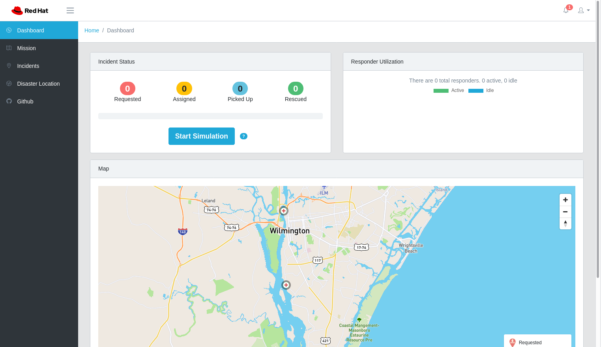
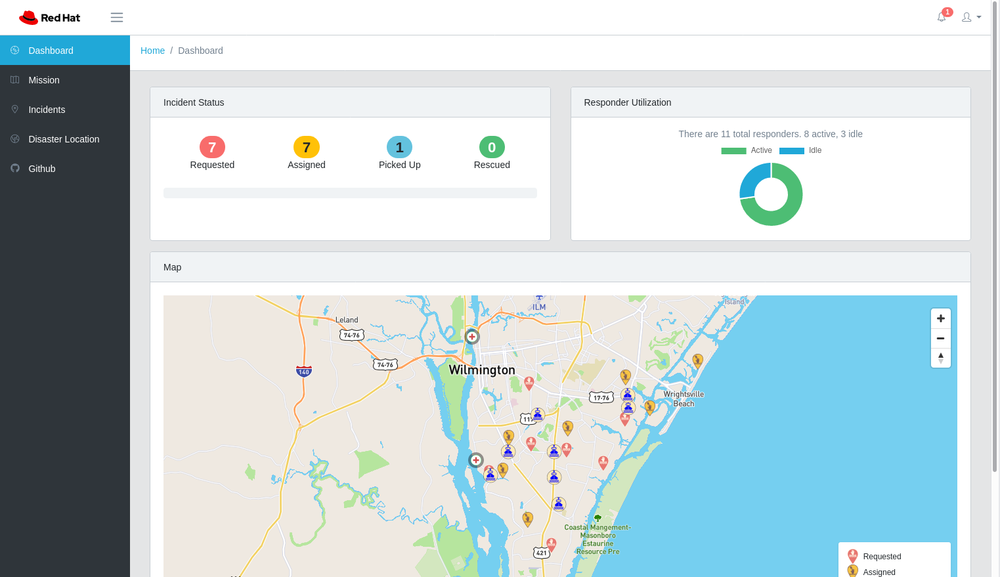
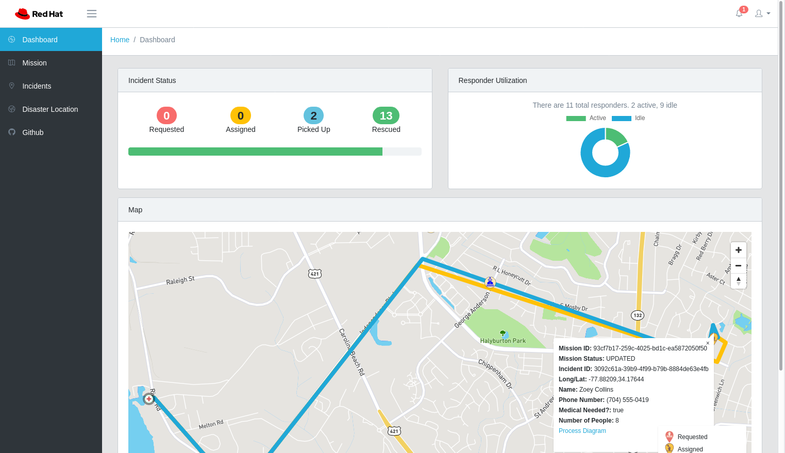
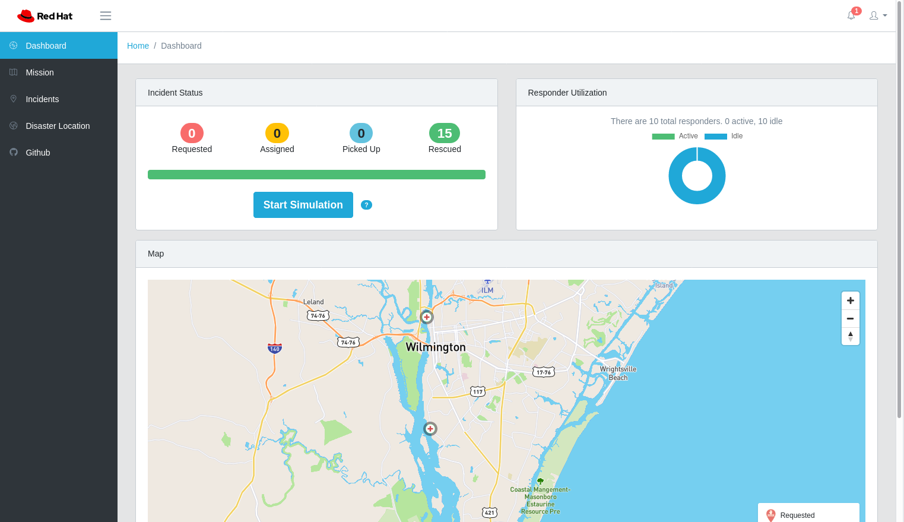

:noaudio:
:scrollbar:
:toc2:
:linkattrs:
:data-uri:

== Assets and Tooling Lab

*IMPORTANT: This course is intended for use in an instructor-led classroom environment. While you can access the content online and attempt to perform the labs, Red Hat does not provide instructor support for use of this course outside of an instructor-led classroom environment.*

.Goals
* Review lab environment
* Review preinstalled Red Hat^(R)^ OpenShift^(R)^ Service Mesh _operator_
* Review preinstalled OpenShift Service Mesh _control plane_
* Review the three user roles typically involved in an OpenShift Service Mesh-managed environment
* Become familiar with Emergency Response Demo

:numbered:

== Set Up Workstation

In the labs for this course, you use the command line for many of the tasks. 
The labs assume that you are using the proper versions of these tools, all of which can be found on the provided Student VM.

. Go to the link:https://labs.opentlc.com/[OPENTLC lab portal^] and use your OPENTLC credentials to log in.
. Navigate to *Services -> Catalogs -> All Services -> OPENTLC OpenShift 4 Labs*.
. On the left, select *OpenShift 4 Student VM*.
. On the right, click *Order*.
. On the *Lab Information* Tab make the following selections:
.. *4.6* for *OpenShift Release*
.. The region closest to you for *Region* (North America, EMEA, APAC or LATAM)
. On the bottom right, click *Submit*.
+
[IMPORTANT]
Do not select *App Control -> Start* after ordering the client VM. This is not necessary in this environment. Selecting *Start* may corrupt the lab environment or cause other complications.

* After a few minutes, expect to receive an email with instructions on how to connect to the environment.

. Read the email carefully and specifically note the following:
* The hostname for your Student VM.
* The username and password for your Student VM

=== Start Client VM After Shut Down

To conserve resources, the Student VM shuts down automatically after eight hours. 
In this section, you restart the Student VM for this course after it has shut down automatically.

. Go to the link:https://labs.opentlc.com/[OPENTLC lab portal^] and use your OPENTLC credentials to log in.
. Navigate to *Services -> My Services* (this should be the screen shown right after logging in).
. In the list of your services, select your *OpenShift 4 Student VM*.
. Select *App Control -> Start* to start your *OpenShift 4 Student VM*.
. Select *Yes* at the *Are you sure?* prompt.
. On the bottom right, click *Submit*.

After a few minutes, expect to receive an email letting you know that the Student VM has been started.

=== Set Environment Variables

. Ask your instructor to share the lab details spreadsheet:
+
image::images/lab_details_spreadsheet.png[]

. Open a terminal window on your local machine and download the script that sets the environment variables required for the labs in this course:
+
-----
$ mkdir -p $HOME/lab

$ curl https://raw.githubusercontent.com/gpe-mw-training/ocp_service_mesh_advanced/master/utils/set_env_vars.sh \
    -o $HOME/lab/set_env_vars.sh && \
    chmod 775 $HOME/lab/set_env_vars.sh
-----

. Using your favorite text editor, modify the environment variables in this downloaded shell script.
* Refer to the lab details spreadsheet shared by your instructor.

. Execute the shell script so that the environment variables are applied to your existing shell:
+
-----
$ $HOME/lab/set_env_vars.sh
-----

. Ensure that the environment variables are set correctly.
+
----
$ echo $GW_PROJECT
----
+
.Sample Output
----
user2-gw
----
+
NOTE: If you see empty output, make sure you source your `.bashrc` file using `source $HOME/.bashrc`.

=== Download `istioctl`

Some exercises in this course use the `istioctl` Istio command line tool. +
Download the upstream Istio distribution from link:https://github.com/istio/istio/releases/tag/1.6.5[]. Make sure to download the _1.6.5_ version, which corresponds with the upstream Istio version that Red Hat Service Mesh is based on. +
Extract the archive and add the `bin` folder to your path.

== Review OpenShift Container Platform Assets

Your lab is built on a shared OpenShift Container Platform 4 cluster in the cloud.

=== Explore OpenShift User: `$ERDEMO_USER`

This user is an administrator of your microservice-architected business application used for this course--the _Emergency Response Demo_ application.
In addition, this user has view access to a variety of other namespaces.

. At the terminal, authenticate into OpenShift Container Platform as the `$ERDEMO_USER` user:
+
-----
$ oc login $LAB_MASTER_API -u $ERDEMO_USER -p $OCP_PASSWD
-----

. View a listing of OpenShift projects that you have access to:
+
-----
$ oc get projects
-----
+
.Sample Output
-----
NAME                  DISPLAY NAME                        STATUS
3scale-mt-api0        3scale-mt-api0                      Active
admin50-istio-system  admin50 Service Mesh Control Plane  Active
istio-operator        istio-operator                      Active
kafka-operator-erd                                        Active
tools-erd                                                 Active
user-sso                                                  Active
user50-er-demo                                            Active
user50-gw                                                 Active
-----

* Subsequent sections of this lab introduce you to each of these namespaces.

=== Explore OpenShift User: `$SM_CP_ADMIN`

This user is your OpenShift Service Mesh control plane administrator.
In addition, this user has view access to a variety of other namespaces.

. At the terminal, authenticate into OpenShift Container Platform as the `$SM_CP_ADMIN` user:
+
-----
$ oc login $LAB_MASTER_API -u $SM_CP_ADMIN -p $OCP_PASSWD
-----

. View a listing of OpenShift projects that you have access to:
+
-----
$ oc get projects
-----
+
.Sample Output
-----
NAME                  DISPLAY NAME                        STATUS
3scale-mt-api0        3scale-mt-api0                      Active
admin50-istio-system  admin50 Service Mesh Control Plane  Active
istio-operator        istio-operator                      Active
user50-er-demo                                            Active
-----

=== Access OpenShift Container Platform Web Console

. At the terminal, determine the URL of the OpenShift Container Platform web console:
+
-----
$ oc whoami --show-console
-----

. Open a browser and navigate to the URL revealed in the previous step.
. Authenticate using the values of `$ERDEMO_USER` and `$OCP_PASSWD`.

== Review OpenShift Service Mesh Resources: `cluster-admin`

OpenShift Service Mesh implements _soft multi-tenancy_ that provides a three-tier RBAC model comprising the roles of `cluster-admin`, `mesh-admin`, and `namespace-admin`.

In this section of the lab, you review the OpenShift Service Mesh resources owned by an OpenShift user with the `cluster-admin` role--in this case, your instructor.

=== Explore Operator

. Switch to the administrator of your Service Mesh control plane (who also has view access to the `istio-operator` namespace):
+
-----
$ oc login -u $SM_CP_ADMIN -p $OCP_PASSWD
-----

. View the previously installed Service Mesh operator found in the `istio-operator` namespace:
+
-----
$ oc get deploy istio-operator -n istio-operator
-----
+
.Sample Output
-----
NAME             READY   UP-TO-DATE   AVAILABLE   AGE
istio-operator   1/1     1            1           15h
-----

* This operator is global in scope to the OpenShift cluster.
* The administrator of the `istio-operator` namespace is the OpenShift user with `cluster-admin` rights.

=== Explore Istio CNI Plug-in

When the link:https://istio.io/[Istio] community project injects the _Envoy_ service proxy sidecar into an application pod, it typically uses link:https://kubernetes.io/docs/concepts/workloads/pods/init-containers/[init containers] to manipulate the iptables rules of the OpenShift node where the application pod runs.
It modifies these iptables in order to intercept requests to application containers.
Although the Envoy service proxy sidecar does not require `root` to run, this short-lived `init-container` container does require link:https://docs.docker.com/engine/reference/run/#runtime-privilege-and-linux-capabilities[`cap_net_admin` privileges].
This use of `init container` in each application pod with elevated `cap_net_admin` privileges is a security vulnerability.

OpenShift Service Mesh avoids this approach.
Instead, it makes use of the link:https://istio.io/docs/setup/additional-setup/cni/[`istio-cni` plug-in].
This plug-in is an implementation of the link:https://github.com/containernetworking/cni[Linux container network interface] specification.
It is responsible for manipulating iptables routing rules on a pod injected with the Envoy sidecar container.

The `istio-cni` plug-in still runs with elevated privileges.
Subsequently, it is implemented as a DaemonSet in the `istio-operator` namespace, which is typically owned by the OpenShift user with `cluster-admin` privileges.

. View the previously installed `istio-cni` pods implemented as an OpenShift DaemonSet in the `istio-operator` namespace:
+
-----
$ oc get daemonset istio-node -n istio-operator
-----
+
.Sample Output
-----
NAME         DESIRED   CURRENT   READY   UP-TO-DATE   AVAILABLE   NODE SELECTOR                 AGE

istio-node   12        12        12      12           12          beta.kubernetes.io/os=linux   4d21h
-----

* As a DaemonSet, an Istio CNI pod runs on every node of the OpenShift cluster.

. Examine the use of the Red Hat-supported `istio-cni` Linux container image:
+
-----
$ oc describe daemonset istio-node -n istio-operator | grep Image
-----
+
.Sample Output
-----
registry.redhat.io/openshift-service-mesh/istio-cni-rhel8@sha256:6312d3d...
-----

=== Explore CRDs
Custom Resource Definitions (CRDs) facilitate domain-specific extensions to the OpenShift master API.
OpenShift Service Mesh defines several CRDs to facilitate the provisioning and life cycle of a service mesh.

. View the service mesh-related CRDs that extend the OpenShift master API:
+
-----
$ oc get crd --as=system:admin | grep 'maistra\|istio'
-----
+
[NOTE]
You need to impersonate an OpenShift cluster admin to do this because a service mesh control plane administrator does not have access to this in a production environment.

* Expect to see about 30 CRDs.

. Review some of the more prominent service mesh-related CRD extensions to the OpenShift master API including those in the following table:
+
[cols="2",options="header"]
|======
|CRD | Description
| `adapters.config.istio.io`
|link:https://istio.io/docs/reference/config/policy-and-telemetry/adapters/[Mixer adapters] allow Istio to interface to a variety of infrastructure back ends for things such as metrics and logs.
| `destinationrules.networking.istio.io`
|link:https://istio.io/docs/reference/config/networking/destination-rule/[`DestinationRule`] defines policies that apply to traffic intended for a service after routing has occurred.
| `gateways.networking.istio.io`
|link:https://istio.io/docs/reference/config/networking/gateway/[Gateway] describes a load balancer operating at the edge of the mesh receiving incoming or outgoing HTTP/TCP connections.
| `servicemeshcontrolplanes.maistra.io`
|Defines the details of a service mesh control plane.
| `servicemeshmemberrolls.maistra.io`
|The `ServiceMeshMemberRoll` resource lists the projects belonging to the control plane.
| `servicemeshpolicies.authentication.maistra.io`
|Allows for overriding of the `ServiceMeshControlPlane` settings with either namespace-scoped or service-scoped policies.
| `virtualservices.networking.istio.io`
|link:https://istio.io/docs/reference/config/networking/virtual-service/[Virtual Service] defines traffic routing.
|======

=== Explore Mutating Webhooks

You can inject the Envoy sidecar container into a deployment manually or automatically.
Most of the time, you use automatic injection, which requires an OpenShift _admission controller_.

An OpenShift admission controller is a piece of code that intercepts requests to the Kubernetes API server prior to persistence of the object, but after the request is authenticated and authorized.
You can define two types of admission webhooks:

* *Validating admission webhook*: Allows you to reject requests to enforce custom admission policies.

* *Mutating admission webhook*: Allows you to change requests to enforce custom defaults.

In this section, you explore the mutating admission webhook.

. Impersonate `cluster-admin` and get a list of `mutatingwebhookconfiguration` resources on the OpenShift cluster:
+
-----
$ oc get mutatingwebhookconfiguration --as=system:admin | grep $SM_CP_NS
-----
+
.Sample Output
-----
[...]

istiod-full-install-admin50-istio-system        1          19h
-----

. Extract the details of `mutatingwebhookconfiguration` specific to your OpenShift Service Mesh installation:
+
-----
$ oc get mutatingwebhookconfiguration istiod-full-install-$SM_CP_NS \
       -o yaml \
       --as=system:admin \
       > $HOME/lab/$SM_CP_NS-mutatingwebhookconfiguration.yaml
-----

. Study the content of the `$HOME/lab/$SM_CP_NS-mutatingwebhookconfiguration.yaml` output file and note the following:

* The `/inject` endpoint of the `istiod` service from your service mesh control plane is invoked when auto-injecting the Envoy service proxy into an application pod:
+
-----
    service:
      name: istiod-full-install
      namespace: admin25-istio-system
      path: /inject
      port: 443
-----

* The scope of your mutating webhook are the namespaces of your service mesh data plane. Namespaces belonging to a service mesh instance have a label `maistra.io/member-of` with value equal to the namespace of the service mesh control plane.
+
-----
  namespaceSelector:
    matchExpressions:
    - key: maistra.io/member-of
      operator: In
      values:
      - admin1-istio-system
    - key: maistra.io/ignore-namespace
      operator: DoesNotExist
    - key: istio-injection
      operator: NotIn
      values:
      - disabled
    - key: istio-env
      operator: DoesNotExist
-----

== Review OpenShift Service Mesh Resources: `mesh-admin`

Your lab environment includes a dedicated OpenShift Service Mesh control plane.
This dedicated control plane is owned by your `mesh-admin` user.
The life cycle of your service mesh control plane is managed by the cluster-scoped OpenShift Service Mesh operator.

=== Explore Resources

. Make sure you are still authenticated into OpenShift as the `mesh-admin` user:
+
-----
$ oc login -u $SM_CP_ADMIN -p $OCP_PASSWD
-----

. Determine the version of OpenShift Service Mesh being used in your lab environment:
+
-----
$ istioctl version --remote=true -i $SM_CP_ADMIN-istio-system
-----
+
.Sample Output
-----
client version: 1.6.5
control plane version: OSSM_2.0.0
data plane version: 1.6.5 (3 proxies)
-----
+
[NOTE]
====
The output of the `istioctl` command might be `no running Istio pods in "admin1-istio-system"`. If this is the case, add the label `istio=pilot` to the `istiod` pod in the control plane.
====

. Examine the service mesh control plane deployments:
+
-----
$ oc get deployments -n $SM_CP_NS
-----
+
.Sample Output
-----
NAME                   READY   UP-TO-DATE   AVAILABLE   AGE
grafana                1/1     1            1           163m
istio-egressgateway    1/1     1            1           163m
istio-ingressgateway   1/1     1            1           163m
istiod-full-install    1/1     1            1           167m
jaeger                 1/1     1            1           163m
kiali                  1/1     1            1           162m
prometheus             1/1     1            1           163m
-----

. Examine the `ServiceMeshControlPlane` custom resource:
+
-----
$ oc get ServiceMeshControlPlane -n $SM_CP_NS
-----
+
.Sample Output
-----
NAME           READY   STATUS            PROFILES    VERSION   AGE
full-install   9/9     ComponentsReady   ["default"]   2.0.0.2   168m
-----

* During the installation of your lab environment, the `$SM_CP_NS` namespace was created and this link:https://github.com/gpe-mw-training/ocp_service_mesh_advanced/blob/master/ansible/roles/maistra_control_plane/tasks/main.yml#L62-L64[`ServiceMeshControlPlane` custom resource] was applied to it.
The OpenShift Service Mesh operator detected the presence of this new custom resource and subsequently provisioned the service mesh control plane.
+
[NOTE]
If the status in the `READY` column is not `9/9`, this means that the service mesh control plane did not install correctly. If this occurs, examine the status of the `ServiceMeshControlPlane` custom resource to determine the issue.

. Note the existence of a _PeerAuthentication_ resource called `default` in the service mesh control plane. This resource manages mesh-wide MUTUAL TLS mode, which is set to `PERMISSIVE`:
+
-----
$ oc get PeerAuthentication -n $SM_CP_NS
-----
+
.Sample Output
-----
NAME                            AGE
default                         169m
disable-mtls-jaeger-collector   168m
grafana-ports-mtls-disabled     168m
-----
+
----
$ oc get Peerauthentication default --template '{{.spec.mtls.mode }}{{"\n"}}' -n $SM_CP_NS
----
+
.Sample Output
----
PERMISSIVE
----

. Examine the various namespace-scoped `RoleBinding` resources in the service mesh control plane:
+
-----
$ oc get RoleBinding -n $SM_CP_NS
-----
+
.Sample Output
-----
admin                            ClusterRole/admin                                     3h5m
istio-ingressgateway-sds         Role/istio-ingressgateway-sds                         3h
istiod-pilot-full-install        ClusterRole/istiod-full-install-admin1-istio-system   3h5m
kiali                            Role/kiali                                            179m
mesh-users                       Role/mesh-user                                        3h5m
prometheus-admin1-istio-system   ClusterRole/prometheus-admin1-istio-system            3h1m
system:deployers                 ClusterRole/system:deployer                           3h5m
system:image-builders            ClusterRole/system:image-builder                      3h5m
system:image-pullers             ClusterRole/system:image-puller                       3h5m
view                             ClusterRole/view                                      173m
-----
+
NOTE: The use of a project-scoped `RoleBinding` resource rather than a cluster-scoped `ClusterRoleBinding` resource is a key enabler of the multi-tenant capabilities of the OpenShift Service Mesh component.

. Note the existence of an empty `ServiceMeshMemberRoll` resource called `default`:
+
-----
$ oc get ServiceMeshMemberRoll default -o template --template='{{"\n"}}{{.spec}}{{"\n\n"}}' -n $SM_CP_NS
-----
+
.Sample Output
-----
map[]
-----

* In a later lab, you (as the service mesh control plane admin) add the namespace where your Emergency Response Demo application resides to this currently empty `ServiceMeshMemberRoll` resource.

== Review Emergency Response Demo: `namespace-admin`

For the purposes of this course, your service mesh control plane manages your instance of the link:https://www.erdemo.io[Emergency Response Demo application].

The Emergency Response demo is designed as a distributed, cloud-native and mostly event-driven distributed application.

The services of the Emergency Response Demo application use a mix of HTTP-based synchronous communication and AMQ Streams-based asynchronous communication.
Because of this, the demo is an excellent application to highlight the existing capabilities and limitations of a service mesh.

=== Explore Resources

. Switch to the `$ERDEMO_USER` user:
+
-----
$ oc login -u $ERDEMO_USER -p $OCP_PASSWD
-----
* Your `$ERDEMO_USER` account has admin privileges to your dedicated Emergency Response Demo application.

. View the OpenShift DeploymentConfigs in the `$ERDEMO_USER-er-demo` namespace:
+
-----
$ oc get dc -n $ERDEMO_NS
-----
+
.Sample Output
-----
NAME                              REVISION   DESIRED   CURRENT   TRIGGERED BY
postgresql                        1          1         1         config,image(postgresql:9.6)
process-service-postgresql        1          1         1         config,image(postgresql:9.6)
user50-disaster-simulator         1          1         1         config,image(user50-disaster-simulator:c6818a7a8)
user50-emergency-console          1          1         1         config,image(user50-emergency-console:1fa91c80b)
user50-incident-priority-service  1          1         1         config,image(user50-incident-priority-service:1f5b136f5)
user50-incident-service           1          1         1         config,image(user50-incident-service:ba3e9bca3)
user50-mission-service            1          1         1         config,image(user50-mission-service:803e6420f)
user50-process-service            1          1         1         config,image(user50-process-service:cbfad8cf2)
user50-process-viewer             1          1         1         config,image(user50-process-viewer:8eac584e7)
user50-responder-service          1          1         1         config,image(user50-responder-service:4ca7b4bab)
user50-responder-simulator        1          1         1         config,image(user50-responder-simulator:66105af21)
-----

. Observe that the Emergency Response Demo application also makes use of Red Hat AMQ streams for event-driven, streams-based communication between many of its services:
+
-----
$ oc get deploy -n $ERDEMO_NS
-----
+
.Sample Output
-----
NAME                            READY   UP-TO-DATE   AVAILABLE   AGE
kafka-cluster-entity-operator   1/1     1            1           3d5h
-----
+
-----
$ oc get statefulset -l strimzi.io/kind=Kafka -n $ERDEMO_NS
-----
+
.Sample Output
-----
kafka-cluster-kafka       3/3     3d5h
kafka-cluster-zookeeper   3/3     3d5h
-----

. Also, observe that the Emergency Response Demo application makes use of Red Hat Data Grid:
+
-----
$ oc get statefulset -l application=datagrid-service -n $ERDEMO_NS
-----
+
.Sample Output
-----
datagrid-service   3/3     3d5h
-----

=== Get Started

The Emergency Response Demo application includes a web console where you can view emergency _incidents_ being accepted and rescued by volunteer _responders_.

==== Visit ER Demo App
. Access the web console at the following URL:
+
-----
echo -en "\n\nhttps://$(oc get route $ERDEMO_USER-emergency-console -o template --template={{.spec.host}} -n $ERDEMO_NS)\n\n"
-----

. On the login page, login with username `incident_commander` and password `r3dh4t1!`.

. Click the *Dashboard* link in the left panel. You will see the main application screen.
+

===== Incident Status
The Incident Status section tracks the data for number of incidents requested, assigned, picked up and rescued. These values update in real-time based on application events.

===== Responder Utilization
The Responder Utilization section monitors the total number of responders, active and idle responders. This section is also updated in real-time based on application events.

===== Map
The map shows the location of the incidents, responders and their associated routes. 

==== Mission

When a Responder is assigned an Incident, a Mission is created. The Mission defines where the Responder needs to go to collect the victims of the Incident and what shelter the victims should be dropped off at.

The Emergency Response application allows for interaction with demo participants. Participants can register in the application as a responder, and be assigned missions. Individual missions can be followed in the Mission tab of the dashboard.

==== Incidents

An incident is a request for help from an individual (or group of individuals) that are in need of rescue. Details of an Incident include the location (Lat, Long), the number of people stranded and whether medical assistance is required.

. Click the *Incidents* link

** This screen shows a list of incidents. At the moment, this screen is empty, but we will create incidents in the next section.
+
image::images/er-demo-incidents-empty.png[]

==== Running the demo

There are two ways to run the demo, with the _Simulation_ button on the main dashboard, or with the _Disaster Simulator_ application.

. Click the blue _Start Simulation_ button to start a simulation.
+

. As part of the simulation, 20 responders are generated, as well as 15 incidents. The incidents are assigned to responders, which start to move towards their assigned incident, and then to the designated shelter. The location of the incidents and the movement of the responders can be followed on the map.
+

+
Clicking on one of the incident or responder icons, will show details about the incident or responder, and show the route the responder is following. 
+

+
The `Process Diagram` link in the incident details popup opens a tab with the RHPAM process instance diagram which manages the lifecycle of the incident.
+
image::images/er-demo-view-process-diagram.png[]

. When all the incidents are rescued and the evacuees dropped off at a shelter, the simulation is finished.
+

+
Please note that this will take several minutes.

Another way to launch the demo is through the _Disaster Simulation_ application, which allows more control over the number of incidents and responders that are generated. 

. In your terminal window, type the following:
+
-----
$ echo -en "\n\nhttp://$(oc get route $ERDEMO_USER-disaster-simulator -o template --template={{.spec.host}} -n $ERDEMO_NS)\n\n"
-----

. In your web browser, visit the above URL.

. In the disaster simulator screen, you can create incidents, responders, and clear (delete) incidents, responders and missions.

== Appendix

=== Reference

. link:https://servicemesh.io/[The Service Mesh: What Every Software Engineer Needs to Know about the World's Most Over-Hyped Technology]
. link:https://issues.jboss.org/projects/OSSM/issues/OSSM-11?filter=allopenissues[OpenShift Service Mesh Jiras]
. link:https://docs.openshift.com/container-platform/4.2/service_mesh/service_mesh_arch/understanding-ossm.html[OpenShift Service Mesh component documentation]

ifdef::showscript[]

endif::showscript[]
