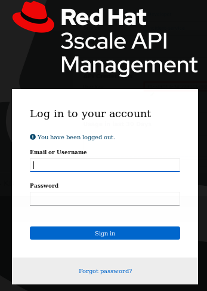
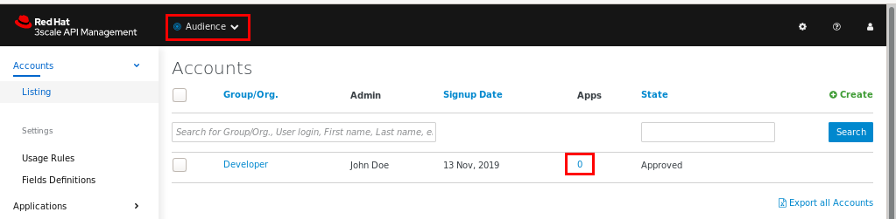
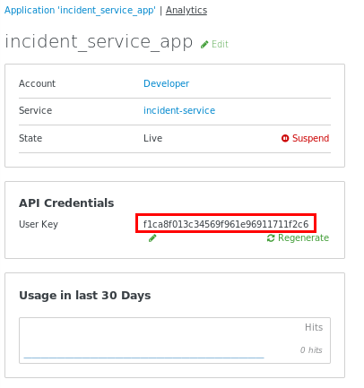
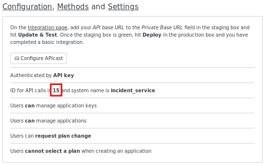

:noaudio:
:scrollbar:
:toc2:
:linkattrs:
:data-uri:

= North / South Traffic Lab

.Goals
* Utilize a phased approach toward management of a micro-service architected application
* Use API Gateway to apply policies to _north-south_ traffic into the  Emergency Response application

:numbered:

== Overview

Securing and managing a micro-service architected application is often going to be a phased endeavor driven by (among other variables) the sophistication of your customer.

One potential strategy for onboarding customers on this journey could be to start by applying API policies to _north / south_ traffic into the application.

Red Hat has a supported product that is well suited for exactly this use-case:  Red Hat 3scale API Management.
On-boarding your new customer might potentially be as straight forward as leveraging the 3scale link:https://www.3scale.net/[SaaS offering].

As you'll experience in later labs of this course, API policy management (via Red Hat 3scale) and service mesh management (via Red Hat Service Mesh) are *complementary* technologies.

In this lab, you will quickly ease your customer into the management of their _north / south_ API traffic by applying API policies using Red Hat 3scale API Management.

In later labs of this course, this traffic will eventually be routed through the _ingress-gateway_ of Red Hat Service Mesh such that *both* service mesh network policies and api management policies are applied.

== Access Multi-Tenant 3scale API Management

Your lab environment includes access to a _multi-tenant_ 3scale API Management installation.

For the purposes of this lab, you serve as the administrator of your own 3scale API Management _tenant_ (domain).

. At the command line, log into your OpenShift environment as the owner of the Emergency Response application:
+
-----
$ oc login -u $ERDEMO_USER -p $OCP_PASSWD
-----

. Access your 3scale by Red Hat Admin Portal by pointing your browser to the output of the following:
+
-----
$ echo -en "\n\nhttps://$(oc get routes -n $API_MANAGER_NS | grep admin | grep $ERDEMO_USER | awk '{print $2}')\n"
-----
+

. Authenticate using the values of the following environment variables:
.. *Username*:  $API_TENANT_USERNAME
.. *Password*:  $API_TENANT_PASSWORD

== API Gateways
Your lab environment is provisioned with a set of API gateways that are specific to your _tenant_.
You have full administrative access to your tenant-specific API gateways.
These are the API gateways that you initially use to apply API policies to your back-end services.

. Get a list of these API gateways by executing the following command:
+
-----
$ oc get dc -n $GW_PROJECT
-----
+
.Sample output
-----
NAME            REVISION   DESIRED   CURRENT   TRIGGERED BY
prod-apicast    1          1         1         config
stage-apicast   1          1         1         config
-----

. The value of `$THREESCALE_PORTAL_ENDPOINT` is set in the `apicast-configuration-url-secret` secret in the $GW_PROJECT namespace:
+
----
$ echo $(oc get secret apicast-configuration-url-secret -o yaml -n $GW_PROJECT | grep password | awk '{print $2}' | base64 -d)
----
+
.Sample Output
----
https://95d1c0a311ba965cd23562164db2126516344b6ff5985b49a4282662181e68ae@user25-3scale-mt-api0-admin.apps.cluster-094b.094b.example.opentlc.com
----

* The API Gateways use the value of `THREESCALE_PORTAL_ENDPOINT` to invoke the _system-provider_ of your API Manager _tenant_ and retrieve details of your APIs (aka: _policy_config_).

== Secure _incident_ service

. In the Admin Portal of your 3scale API Manager tenant, navigate to: `Audience -> Accounts -> Listing -> Developer`
+

. In the `Apps` column, click the link indicating the number of existing _applications_ (most likely 0) associated with the _Developer_ account.
. In the top right corner, click `Create Application`.
. Populate the new form with the following:
.. *Application plan:* incident-service_app_plan
.. *Service plan:* Default
.. *Name:* incident_service_app
+
Click `Create Application`.

. From the resultant page, copy the `User Key`
+

. Set the value of this `User Key` as a shell environment variable:
+
-----
$ echo "export INCIDENT_SERVICE_API_KEY=<change me>" >> $HOME/.bashrc
-----

. Set a couple of other environment variables to be used in a later lab of this course:
.. *INCIDENT_SERVICE_ID*
... From the top panel, navigate to: `API: incident-service -> Configuration, Methods and Settings`
... Locate the value of your `ID for API calls` similar to the following:
+

... Using this value, set an environment variable as follows:
+
-----
$ echo "export INCIDENT_SERVICE_ID=<change me>" >> $HOME/.bashrc
-----

.. *SYSTEM_PROVIDER_URL*
+
-----
$ echo "export SYSTEM_PROVIDER_URL=$(oc get routes -n $API_MANAGER_NS | grep admin | grep $ERDEMO_USER | awk '{print $2}')" >> $HOME/.bashrc
-----
+
This is the URL to the API Manager _system-provider_ specific to your tenant that all API gateways use to pull information about APIs.

.. *API_ADMIN_ACCESS_TOKEN*
+
-----
$ echo "export API_ADMIN_ACCESS_TOKEN=$(oc get secret apicast-configuration-url-secret -o yaml -n $GW_PROJECT | grep password | awk '{print $2}' | base64 -d | cut -d'@' -f1 | cut -d'/' -f3)" >> $HOME/.bashrc
-----
+
This access token is specific to your API _tenant_ and is used by API gateways to invoke the _System Management API_ of 3scale.

. Source your local shell configuration file:
+
-----
$ source $HOME/.bashrc
-----

== Test

. Verify that you can get a list of incidents using your user key.
+
-----
$ curl -v https://$(oc get route -n $API_MANAGER_NS | grep $ERDEMO_USER | grep prod | awk '{print $2}')/incidents?user_key=$INCIDENT_SERVICE_API_KEY
-----
+
.Sample output
-----
*   Trying 18.213.15.135...
* TCP_NODELAY set
* Connected to user1-3scale-mt-api0-mt-prod-generic.apps.cluster-a991.a991.example.opentlc.com (18.213.15.135) port 443 (#0)
* ALPN, offering h2
* ALPN, offering http/1.1
* Cipher selection: ALL:!EXPORT:!EXPORT40:!EXPORT56:!aNULL:!LOW:!RC4:@STRENGTH
* successfully set certificate verify locations:
*   CAfile: /etc/ssl/cert.pem
  CApath: none
* TLSv1.2 (OUT), TLS handshake, Client hello (1):
* TLSv1.2 (IN), TLS handshake, Server hello (2):
* TLSv1.2 (IN), TLS handshake, Certificate (11):
* TLSv1.2 (IN), TLS handshake, Server key exchange (12):
* TLSv1.2 (IN), TLS handshake, Server finished (14):
* TLSv1.2 (OUT), TLS handshake, Client key exchange (16):
* TLSv1.2 (OUT), TLS change cipher, Client hello (1):
* TLSv1.2 (OUT), TLS handshake, Finished (20):
* TLSv1.2 (IN), TLS change cipher, Client hello (1):
* TLSv1.2 (IN), TLS handshake, Finished (20):
* SSL connection using TLSv1.2 / ECDHE-RSA-AES128-GCM-SHA256
* ALPN, server did not agree to a protocol
* Server certificate:
*  subject: CN=api.cluster-a991.a991.example.opentlc.com
*  start date: Feb 26 19:41:59 2020 GMT
*  expire date: May 26 19:41:59 2020 GMT
*  subjectAltName: host "user1-3scale-mt-api0-mt-prod-generic.apps.cluster-a991.a991.example.opentlc.com" matched cert's "*.apps.cluster-a991.a991.example.opentlc.com"
*  issuer: C=US; O=Let's Encrypt; CN=Let's Encrypt Authority X3
*  SSL certificate verify ok.
> GET /incidents?user_key=75f5539befcdbc2281cda4865ff6e92f HTTP/1.1
> Host: user1-3scale-mt-api0-mt-prod-generic.apps.cluster-a991.a991.example.opentlc.com
> User-Agent: curl/7.54.0
> Accept: */*
>
< HTTP/1.1 200
< Server: openresty
< Date: Thu, 27 Feb 2020 17:19:27 GMT
< Content-Type: application/json;charset=UTF-8
< Transfer-Encoding: chunked
< Set-Cookie: 189c4bf6c04f39ccf32de656e034b6ab=a9d96e5c07b1aa2ddbf64381a78dd170; path=/; HttpOnly; Secure
< Cache-control: private
<
[{"id":"2a309c3e-5055-4133-95ef-d002eb3d8aea","lat":"34.22076","lon":"-77.85233","numberOfPeople":2,"medicalNeeded":true,"victimName":"Jacob Nelson","victimPhoneNumber":"(336) 555-6772","timestamp":1582823045447,"status":"RESCUED"},{"id":"38314372-20fb-4848-9d94-aa36d67daa8c","lat":"34.17201","lon":"-77.94345","numberOfPeople":5,"medicalNeeded":true,"victimName":"Sadie Butler","victimPhoneNumber":"(252) 555-6380","timestamp":1582823008949,"status":"RESCUED"},{"id":"dfed1977-ed9c-492e-adca-5548a80998a2","lat":"34.2273","lon":"-77.80078","numberOfPeople":4,"medicalNeeded":false,"victimName":"Henry Johnson","victimPhoneNumber":"(651) 555-8751","timestamp":1582823026442,"status":"RESCUED"},{"id":"5efdb5f8-d6f6-4e2a-b5ee-f62dd498a2dc","lat":"34.22182","lon":"-77.87534","numberOfPeople":8,"medicalNeeded":true,"victimName":"Madeline Kelly","victimPhoneNumber":"(252) 555-6330","timestamp":1582823046448,"status":"RESCUED"},{"id":"ef3f50fc-272f-418a-a98a-b67c4d61ec8c","lat":"34.08027","lon":"-77.88782","numberOfPeople":1,"medicalNeeded":false,"victimName":"Owen Tyrrell","victimPhoneNumber":"(984) 555-3310","timestamp":1582823012437,"status":"RESCUED"},{"id":"5014f1b4-2312-4ae7-a903-158b93eef060","lat":"34.18605","lon":"-77.94954","numberOfPeople":6,"medicalNeeded":false,"victimName":"Maya Russell","victimPhoneNumber":"(704)
...
-----

* Make note of the follwing:

** The lines referring to TLS and the use of server certificate. This confirms secure communication to the API.

** The 200 status code for a successful request.

** The JSON message body that is a list of incidents. Each incident describes the id, lat/long, number of people etc ...

. Now confirm that the service is truly secured. Attempt to access the service with an invalid user key.
+
-----
$ curl -v https://$(oc get route -n $API_MANAGER_NS | grep $ERDEMO_USER | grep prod | awk '{print $2}')/incidents?user_key=FAKEKEY
-----
+
.Sample output
-----
...
< HTTP/1.1 403 Forbidden
< Server: openresty
< Date: Thu, 27 Feb 2020 17:14:12 GMT
< Content-Type: text/plain; charset=us-ascii
< Transfer-Encoding: chunked
< Set-Cookie: 189c4bf6c04f39ccf32de656e034b6ab=a9d96e5c07b1aa2ddbf64381a78dd170; path=/; HttpOnly; Secure
<
...
-----

* Make note that status code is 403 Forbidden. When using an invalid user key, the user does not have access. Our API is secured.

Congratulations! You have successfully secured _north / south_ traffic into your micro-service architected Emergency Response application using the API Gateways of Red Hat's 3scale API Manager product.

API Management is a complementary technology to Service Mesh.
In subsequent labs of this course, you apply service mesh policies to _east / west_ traffic within your Emergency Response application.

ifdef::showscript[]

endif::showscript[]
