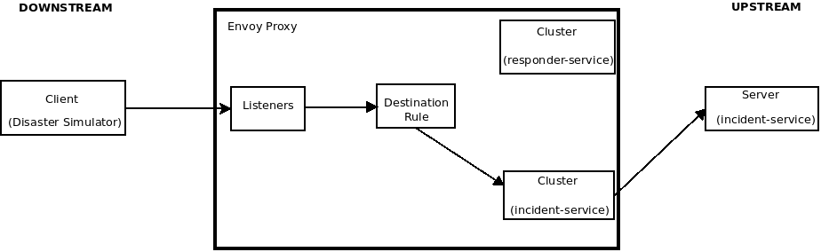

:noaudio:
:scrollbar:
:toc2:
:linkattrs:
:data-uri:

= Service Mesh Multi Tenancy Lab

.Goals
** Understand importance of Service Mesh multi-tenancy
** Understand ServiceMeshMemberRoll
** Understand Envoy _Data Plane_

:numbered:

== Multi-tenancy Overview

Faulty or compromised control planes should not be able affect any other tenants on the cluster. 
This means that control plane components and service accounts have to be locked down using appropriate Kubernetes Roles and network access limited by NetworkPolicies.

== ServiceMeshMemberRoll

. Switch to your service mesh control plane administrator user:
+
-----
oc login -u $SM_CP_ADMIN -p $OCP_PASSWD
-----

. Register the $ERDEMO_NS namespace as namespace _member_ to be monitored and manged by your service mesh control plane.
+
-----
echo "apiVersion: maistra.io/v1
kind: ServiceMeshMemberRoll
metadata:
  name: default
spec:
  members:
  - $ERDEMO_NS" | oc apply -n $SM_CP_NS -f -
-----
+
Recall that the _ServiceMeshMemberRoll_ exists in the service mesh control plane (which is owned by the admin: $SM_CP_ADMIN )

. Notice that your $ERDEMO_NS namespace now includes _kiali_ and _maistra_ annotations:
+
-----
echo -en "\n\n$(oc get project $ERDEMO_NS -o template --template='{{.metadata.labels}}')\n\n"

map[kiali.io/member-of:admin50-istio-system maistra.io/member-of:admin50-istio-system]
-----

. Notice also that your $ERDEMO_NS namespace now includes namespace scoped _RoleBindings_ associated with the Istio related service accounts from your specific service mesh control plane:
+
-----
oc get RoleBinding  -n $ERDEMO_NS -l release=istio

istio-citadel-admin50-istio-system                               24s
istio-egressgateway-admin50-istio-system                         24s
istio-galley-admin-role-binding-admin50-istio-system             24s
istio-ingressgateway-admin50-istio-system                        24s
istio-mixer-admin-role-binding-admin50-istio-system              24s
istio-pilot-admin50-istio-system                                 24s
istio-sidecar-injector-admin-role-binding-admin50-istio-system   24s
prometheus-admin50-istio-system                                  24s
-----
+
The use of a project scoped _RoleBinding_ rather than a cluster-scoped _ClusterRoleBinding_ is a key enabler of _multi-tenant_ capabilities of the Red Hat Service Mesh product.

. Red Hat OpenShift Service Mesh configures each member project to ensure network access between itself, the control plane, and other member projects.
+
Notice that your $ERDEMO_NS namespace now also includes a _NetworkPolicy_ called: _istio-mesh_
+
-----
oc get NetworkPolicy istio-mesh -n $ERDEMO_NS

istio-mesh   <none>         26m
-----
+
This _NetworkPolicy_ allows ingress to all pods specific to this namespace from all other registered _members_ of the same Red Hat Service Mesh control plane.

. Notice also that your $ERDEMO_NS namespace now includes _istio_ related secrets:
+
-----
oc get secrets -n $ERDEMO_NS | grep istio

...

stio.builder                                    istio.io/key-and-cert                 3      9m58s
istio.default                                   istio.io/key-and-cert                 3      9m55s
istio.deployer                                  istio.io/key-and-cert                 3      9m57s
istio.disaster-simulator-service                istio.io/key-and-cert                 3      9m58s
istio.emergency-console                         istio.io/key-and-cert                 3      9m54s
istio.incident-priority-service                 istio.io/key-and-cert                 3      9m57s
istio.incident-service                          istio.io/key-and-cert                 3      9m54s
istio.kafka-cluster-entity-operator             istio.io/key-and-cert                 3      9m54s
istio.kafka-cluster-kafka                       istio.io/key-and-cert                 3      9m55s
istio.kafka-cluster-zookeeper                   istio.io/key-and-cert                 3      9m55s
istio.mission-service                           istio.io/key-and-cert                 3      9m56s
istio.postgresql                                istio.io/key-and-cert                 3      9m56s
istio.process-service                           istio.io/key-and-cert                 3      9m57s
istio.process-viewer                            istio.io/key-and-cert                 3      9m54s
istio.responder-service                         istio.io/key-and-cert                 3      9m54s
istio.responder-simulator-service               istio.io/key-and-cert                 3      9m53s
-----
+
These secrets support mutual TLS functionality provided by the Red Hat Service Mesh.
More information about these secrets is provided in the next module of this course pertaining to mTLS.

== Opt-in Auto-Injection Annotations

When deploying an application into the Red Hat OpenShift Service Mesh you must opt in to injection of the Envoy _data-plane_ for each deployment.
You do so by specifying the following annotation in your deployment: _sidecar.istio.io/inject=true_ . 

Opting in ensures that the sidecar injection does not interfere with other OpenShift capabilities (such as S2I builder pods) that likely do not need to be managed by the service mesh.

In this section of this lab you (as the owner of the Emergency Response application) opt in a selective list of deployments for auto injection of a sidecar.

. Switch to the $ERDEMO_USER:
+
-----
oc login -u $ERDEMO_USER
-----
+
The $ERDEMO_USER is the admin of the $ERDEMO_NS namespace where your Emergency Response application resides.

. Review the contents of link:https://github.com/gpe-mw-training/ocp_service_mesh_advanced/blob/master/utils/inject_istio_annotation.sh[this script] (which will iterate through your Emergency Response Deployment Configs and add the _sidecar.istio/inject=true_ annotation) and answer the following questions:

.. Which Deployment Configs resources of the Emergency Response demo are to be opted into your service mesh ?
.. Which resources of the Emergency Response demo will not be managed by your service mesh ?

. Execute the shell script that adds Envoy auto-injection annotations to Emergency Response deployments:
+
-----
curl https://raw.githubusercontent.com/gpe-mw-training/ocp_service_mesh_advanced/master/utils/inject_istio_annotation.sh \
    -o $HOME/lab/inject_istio_annotation.sh && \
    chmod 775 $HOME/lab/inject_istio_annotation.sh && \
    $HOME/lab/inject_istio_annotation.sh
-----

. After completion of the script, review the list Emergency Response related pods:
+
-----
oc get pods -l group=erd-services -n $ERDEMO_NS

user50-disaster-simulator-1-p9gfl          2/2     Running   7          9h
user50-incident-priority-service-1-hgmdn   2/2     Running   4          9h
user50-incident-service-1-sz4dk            2/2     Running   3          9h
user50-mission-service-1-jz2r8             2/2     Running   9          9h
user50-process-service-4-cz5sz             2/2     Running   5          7h17m
user50-responder-service-1-qm5gn           2/2     Running   3          7h14m
user50-responder-simulator-1-tdrz2         2/2     Running   6          7h13m
-----
+
Notice that each of these pods indicates that two containers have started.

. You could use a script such as the following to identify a list of container names for each of the pods:
+
-----

for POD_NAME in $(oc get pods -n $ERDEMO_NS -l group=erd-services -o jsonpath='{range .items[*]}{.metadata.name}{"\n"}')
do
    oc get pod $POD_NAME  -n $ERDEMO_NS -o jsonpath='{.metadata.name}{"    :\t\t"}{.spec.containers[*].name}{"\n"}'
done

...

user50-disaster-simulator-1-p9gfl    :          user50-disaster-simulator        istio-proxy
user50-incident-priority-service-1-hgmdn    :   user50-incident-priority-service istio-proxy
user50-incident-service-1-sz4dk    :            user50-incident-service          istio-proxy
user50-mission-service-1-jz2r8    :             user50-mission-service           istio-proxy
user50-process-service-4-cz5sz    :             user50-process-service           istio-proxy
user50-responder-service-1-qm5gn    :           user50-responder-service         istio-proxy
user50-responder-simulator-1-tdrz2    :         user50-responder-simulator       istio-proxy
-----

.. Notice that each pod now contains an additional _istio-proxy_ container co-located with the primary business service container.
.. Recall from a previous lab that Red Hat Service Mesh uses a Kubernetes' link:https://kubernetes.io/docs/reference/access-authn-authz/admission-controllers/#mutatingadmissionwebhook[MutatingAdmissionWebhook] for automatically injecting the sidecar proxy into user pods.

== Envoy _Data Plane_

=== Architecture
Envoy has many features useful for inter-service communication.
To help understand Envoy's features and capabilities, you should be familiar with the following terminology:

* *listeners*
+
Listeners expose a port to the outside world into which an application can connect.
ie: a listener on port 8080 would accept traffic and apply any configured behavior to that traffic.

* *routes*
+
Routes are rules for how to handle traffic that came in on listeners;
ie: if a request comes in and matches /incident, then the route will direct that traffic to the incident _cluster_.

* *clusters*
+
Clusters are specific upstream services to which Envoy can direct traffic.
ie:  incident-v1 and incident-v2 can be separate clusters and _routes_ can specify rules about how traffic can be directed to either v1 or v2 of the incident service.

Traffic coming into Envoy comes into a _listener_ and is coming from a _downstream_ system.
This traffic gets routes to one of Envoy's _clusters_ which is responsible for sending that traffic to an _upstream_ system.
_Downstream_ to _upstream_ is how traffic always flows through Envoy.

{nbsp}
{nbsp}

=== Service proxy container configuration

. Delete _deploy_ pods that are in a _completed_ status and have not yet been deleted:
+
-----
curl https://raw.githubusercontent.com/gpe-mw-training/ocp_service_mesh_advanced/master/utils/delete_pod_deploys.sh \
    -o $HOME/lab/delete_pod_deploys.sh && \
    chmod 775 $HOME/lab/delete_pod_deploys.sh

$HOME/lab/delete_pod_deploys.sh
-----

. Capture the details of the _istio-proxy_ container configuration from the _responder-service_ pod of the Emergency Response demo :
+
-----
oc get pod -n $ERDEMO_NS \
       $(oc get pod -n $ERDEMO_NS | grep "^$ERDEMO_USER-responder-service" | awk '{print $1}') \
       -o json \
       | jq .spec.containers[1] \
        > $HOME/lab/responder_envoy.json
-----

. Study the details of the _istio-proxy_ container:
+
-----
less $HOME/lab/responder_envoy.json
-----

. Answer the following questions pertaining to this _istio-proxy_ container:

.. What URL does OpenShift use to pull the remote Envoy proxy image that serves as the basis of this Envoy proxy sidecar?
.. What is the maximum amount of RAM and CPU dedicated to this Envoy proxy sidecar container ?
.. What is the URL that the Envoy proxy sidecar uses to communicate with _Pilot_ component of Red Hat Service Mesh ?

ifdef::showscript[]

1) registry.redhat.io/openshift-service-mesh/proxyv2-rhel8:1.0.1
2) cpu: 500m,  memory: 128Mi
3) istio-pilot.admin50-istio-system:15010

endif::showscript[]

=== Modified iptables 

When an Envoy service proxy is injected into an application pod, the _istio-cni_ resource modifies iptables on the node that the pod lands on.
Recall from a previous lab that the _istio-cni_ resource is deployed as a _daemonset_ and subsequently runs one pod per all nodes in an OpenShift cluster.

In particular, the _istio-cni_ resource creates iptable rules such that all ingress to and egress out of the application container is redirected to port 15001 of the pod.
The Envoy service proxy has its listener bound to port 15001.

[blue]#Have your instructor demonstrate these modified iptable rules in a manner similar to the following:#

. Identify the OCP worker node that one of the Emergency Response application pods is running on:
+
-----
oc get pod user50-responder-service-6-5xr86 -o json | jq .spec.nodeName

...

ip-10-0-136-113.eu-central-1.compute.internal
-----

. Identify the id of either container (application container or _envoy-proxy)  in that pod:
+
-----
oc describe pod user50-responder-service-6-5xr86 | grep cri-o

...

Container ID:  cri-o://397fea50eb8ecd03db9fe8c9a7657c7980f23c8462e9cf2554e9a4493308e651
Container ID:  cri-o://90260d3d7ece810bb4c44a8aee3e23ebe50fd6b1225d48e6e103da070194c53a
-----

. Set up a debug session into the node where the target Emergency Response pod runs:
+
-----
oc debug node/ip-10-0-136-113.eu-central-1.compute.internal
-----

. On that OCP node, switch to the host operating system shell that can run host operating system binaries:
+
-----
chroot /host
-----

. Using the previously determined containerId, determine the operating system process id of the container on the OpenShift node:
+
-----
crictl inspect --output json  90260d3d7ece810bb4c44a8aee3e23ebe50fd6b1225d48e6e103da070194c53a | grep pid

45315
-----

. Using the process Id of the container, view the iptable rules on that host machine:
+
-----
sh-4.4# nsenter -t 45315 -n iptables -t nat -S
-P PREROUTING ACCEPT
-P INPUT ACCEPT
-P POSTROUTING ACCEPT
-P OUTPUT ACCEPT
-N ISTIO_REDIRECT
-N ISTIO_IN_REDIRECT
-N ISTIO_INBOUND
-N ISTIO_OUTPUT
-A PREROUTING -p tcp -j ISTIO_INBOUND
-A OUTPUT -p tcp -j ISTIO_OUTPUT
-A ISTIO_REDIRECT -p tcp -j REDIRECT --to-ports 15001
-A ISTIO_IN_REDIRECT -p tcp -j REDIRECT --to-ports 15001
-A ISTIO_INBOUND -p tcp -m tcp --dport 8080 -j ISTIO_IN_REDIRECT
-A ISTIO_INBOUND -p tcp -m tcp --dport 9779 -j ISTIO_IN_REDIRECT
-A ISTIO_INBOUND -p tcp -m tcp --dport 8778 -j ISTIO_IN_REDIRECT
-A ISTIO_OUTPUT ! -d 127.0.0.1/32 -o lo -j ISTIO_REDIRECT
-A ISTIO_OUTPUT -m owner --uid-owner 1000710001 -j RETURN
-A ISTIO_OUTPUT -m owner --gid-owner 1000710001 -j RETURN
-A ISTIO_OUTPUT -d 127.0.0.1/32 -j RETURN
-A ISTIO_OUTPUT -j ISTIO_REDIRECT
-----
+
The output above shows that all the incoming traffic for this operating system process to port 8080, 9779 and 8778 (which are the ports that the Emergency Response responser-service is listening on ), are being REDIRECTED to port 15001, which is the port that the _istio-proxy_ is listening. 
The same holds true for the outgoing traffic.

=== Administration API

The Envoy data plane API provides an open standard for centralized management of a large fleet of Envoys.
Instead of copying configuration files to the many Envoy proxies in a typical microservice architected application, a central point of control is available.

The admin API of each envoy container is available by using the _curl_ utility from within any application pod enabled with envoy.

. Log into OpenShift as the owner of the Emergency Response application:
+
-----
oc login -u $ERDEMO_USER -p $OCP_PASSWD
-----

. Retrieve the help documentation provided by the Envoy admin API: 
+
-----
oc rsh `oc get pod -n $ERDEMO_NS | grep "responder-service" | grep "Running" | awk '{print $1}'` \
    curl http://localhost:15000/help
-----

. Retrieve the status of all of the _clusters_ that are visible to this Envoy service proxy:
+
-----
oc rsh `oc get pod -n $ERDEMO_NS | grep "responder-service" | grep "Running" | awk '{print $1}'` \
   curl http://localhost:15000/clusters?format=json \
   > $HOME/lab/responder-service-clusters.json
-----

.. Skim through the contents of `$HOME/lab/responder-service-clusters.json`

.. Notice that this information includes all discovered upstream hosts in each cluster along with per host statistics. This is useful for debugging service discovery issues.
.. Also notice that absolutely all _cluster_statuses_ reference services to your specific Emergency Response demo or your specific Service Mesh control plane.
+
Under no circumstances do any of your Envoy proxies have visibility to services that you do not own.
+
[blue]#This is critical from performance, scalability and security perspectives.#

. Inspect the configuration sent by Pilot to your pod's sidecar using _istioctl_:
+
-----
istioctl proxy-config cluster -n <POD NAMESPACE> <PODNAME> -o json
-----
+
If you search for the destination service name you will see an embedded metadata JSON element that names the specific DestinationRule that pod is currently using to communicate with the external service.

-----
oc rsh `oc get pod -n $ERDEMO_NS | grep "responder-service" | awk '{print $1}'` \
         curl http://localhost:15000/config_dump \
         > $HOME/lab/config_dump \
         && less $HOME/lab/config_dump \
         | jq ".configs | last | .dynamic_route_configs"
-----

== Network Policies

In multi-tenancy mode, Red Hat Service Mesh creates an isolated network for each mesh instance using _NetworkPolicy_ resources. Pods within the mesh can communicate with each other and with pods in the data plane. Communication between pods in different meshes is not allowed. +
Note that during the Service Mesh installation existing NetworkPolicy objects will not be touched or deleted.

. Review the NetworkPolicy resources created by the Service Mesh. 
* Log into OpenShift as the owner of the Emergency Response application:
+
-----
$ oc login -u $ERDEMO_USER -p $OCP_PASSWD
-----
* List the _NetworkPolicy_ resources in the Emergency Response namespace:
+
----
$ oc get networkpolicy -n $ERDEMO_NS
----
+
.Sample Output
----
allow-from-all-namespaces                <none>                                    17h
allow-from-ingress-namespace             <none>                                    17h
istio-expose-route                       maistra.io/expose-route=true              19h
istio-mesh                               <none>                                    19h
kafka-cluster-network-policy-kafka       strimzi.io/name=kafka-cluster-kafka       32h
kafka-cluster-network-policy-zookeeper   strimzi.io/name=kafka-cluster-zookeeper   32h
----
** NetworkPolicies `allow-from-all-namespaces` and `allow-from-ingress-namespace` are installed by default in every namespace when using _NetworkPolicy_ Openshift SDN mode. The policies allows traffic between all pods in all namespaces, as well as ingress to pods through the router.
** NetworkPolicies `kafka-cluster-network-policy-kafka` and `kafka-cluster-network-policy-zookeeper` are created when installing the Kafka cluster, and define ingress rules for the Kafka and Zookeeper pods.
** NetworkPolicies `istio-mesh` and `istio-expose-route` are created when adding the namespace to the Service Mesh.
* Review the `istio-mesh` network policy:
+
----
$ oc get networkpolicy istio-mesh -n $ERDEMO_NS 
----
+
----
kind: NetworkPolicy
apiVersion: networking.k8s.io/v1
metadata:
  annotations:
    [...]
  name: istio-mesh
  [...]
  namespace: user1-er-demo
  labels:
    [...]
spec:
  podSelector: {}
  ingress:
    - from:
        - namespaceSelector:
            matchLabels:
              maistra.io/member-of: admin1-istio-system
  egress:
    - to:
        - namespaceSelector:
            matchLabels:
              maistra.io/member-of: admin1-istio-system
  policyTypes:
    - Ingress
    - Egress
----
** The policy allows all traffic (_Ingress_ and _Egress_) between namespaces that are labeled with `maistra.io/member-of: $SM_CP_ADMIN-istio-system`. This includes the Service Mesh data plane namespace as well as the mesh member namespaces as defined in the _ServiceMeshMemberRoll_.

* Review the `istio-expose-route` network policy:
+
----
$ oc get networkpolicy istio-expose-route -n $ERDEMO_NS 
----
+
----
kind: NetworkPolicy
apiVersion: networking.k8s.io/v1
metadata:
  annotations:
  [...]
  name: istio-expose-route
  [...]
  namespace: user1-er-demo
  labels:
    [...]
spec:
  podSelector:
    matchLabels:
      maistra.io/expose-route: 'true'
  ingress:
    - from:
        - namespaceSelector:
            matchLabels:
              network.openshift.io/policy-group: ingress
  policyTypes:
    - Ingress
----
** The policy allows ingress traffic between namespaces that are labeled with `network.openshift.io/policy-group: ingress` and pods that have the label `maistra.io/expose-route: 'true'`. The `openshift-ingress` namespace - in which the OpenShift router pods run - has the label `network.openshift.io/policy-group: ingress`, so annotated pods can be reached through a route.

. Check if pods in the Emergency Response demo are reachable from outside the service mesh.
* Obtain a remote shell into the _stage-apicast_ pod in the apicast namespace
+
----
$ oc rsh -n $GW_PROJECT stage-apicast-1-xxxxx
----
* In the remote shell, curl the Incident Service through its service name:
+
----
sh-4.2$ curl http://$ERDEMO_USER-incident-service/$ERDEMO_NS.svc:8080/incidents
----
+
Exit the remote shell.
* In a normal shell, call the Incident Service through its exposed URL:
+
----
$ curl http://user2-incident-service.apps.$SUBDOMAIN_BASE/incidents
----
* Expect both curl requests to succeed.
+
This seems to be in contradiction to the concept of an isolated service mesh network. Can you explain?

3. Delete the `allow-from-all-namespaces` and `allow-from-ingress-namespace` NetworkPolicy objects from the Emergency Response namespace.
+
----
$ oc delete networkpolicy allow-from-all-namespaces -n $ERDEMO_NS
$ oc delete networkpolicy allow-from-ingress -n $ERDEMO_NS
----

. Try to reach the incident service from within another namespace or from the outside of the cluster using _curl_
+
What do you observe?

4. Add the `maistra.io/expose-route: 'true'` label to the template section of the deploymentconfig of the Incident Service:
+
----
kind: DeploymentConfig
apiVersion: apps.openshift.io/v1
metadata:
 [...]
spec:
  [...]
  template:
    metadata:
      labels:
        app: user1-incident-service
        group: erd-services
        maistra.io/expose-route: 'true'
      annotations:
        sidecar.istio.io/inject: 'true'
    spec:
    [...]
----
*
Save the DeploymentConfig. Once the Incident Service pod is redeployed, try again to call the Incident Service from outside of the cluster.
+
What do you observe?

[NOTE]
====
Execute the following commands if you want to restore the networkpolicies to their original state:

----
$ echo "---
kind: NetworkPolicy
apiVersion: networking.k8s.io/v1
metadata:
  name: allow-from-all-namespaces
spec:
  podSelector: {}
  ingress:
    - from:
        - namespaceSelector: {}
  policyTypes:
    - Ingress
" | oc create -f - -n $ERDEMO_NS
----

----
$ echo "---
kind: NetworkPolicy
apiVersion: networking.k8s.io/v1
metadata:
  name: allow-from-ingress-namespace
spec:
  podSelector: {}
  ingress:
    - from:
        - namespaceSelector:
            matchLabels:
              network-policy: global
  policyTypes:
    - Ingress
" | oc create -f - -n $ERDEMO_NS
----

====

== Appendix

=== Reference

* link:https://docs.google.com/document/d/1eMnLBpcJNMahoE6cYKcECp_Jcy4Haj3qc36RBAO9J-U/edit#[Operator-Based Soft Multi-Tenancy]
* link:https://maistra.io/docs/comparison-with-istio/#_cluster_scoped_custom_resources[Comparison between Red Hat Service Mesh and community Istio]
* link:https://istio.io/blog/2019/data-plane-setup/[Demystifying Istio's Sidecar Injection Model]

ifdef::showscript[]

. The two databases leveraged by the Emergency Response demo ( _postgresql_ and _$ERDEMO_USER-process-service-postgresql_ ) are also now injected with an Envoy proxy.
+
Verify that this is infact the case either through the OpenShift web console or the oc utility.

=== Envoy Access Log File

.TO-DO:
* https://aspenmesh.io/how-to-debug-istio-mutual-tls-mtls-policy-issues-using-aspen-mesh/
* global.proxy.accessLogFile
* Is this log file any different than what is already being logged from Envoy in Red Hat Service Mesh ?
* What is a good example of using it to debug Istio configuration and policy issues ?

=== Debugging Envoy and Pilot

The source of truth for a given moment is always found in your pod’s Envoy sidecar configuration.
In this section of the lab, you link:https://istio.io/docs/ops/troubleshooting/proxy-cmd/[debug Envoy and Pilot].

link:https://www.erdemo.io/gettingstarted/[Getting Started]

endif::showscript[]
