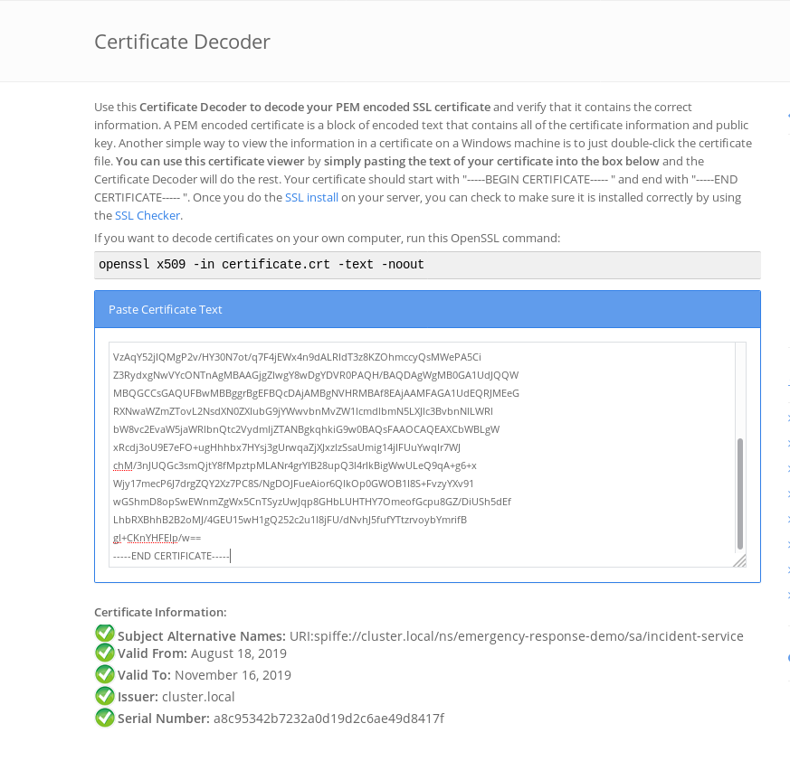

:noaudio:
:scrollbar:
:toc2:
:linkattrs:

== Istio Security: mTLS

NOTE: WIP. At the moment this is an enumeration of tasks to be performed to enable mTLS in the Emergency response Demo, including installation of Red Hat Service Mesh.

.Prerequisites

* Admin access to OpenShift 3.11 cluster
+
NOTE: TODO: test on OCP 4.x
* Emergency Response Demo installed on OpenShift cluster
* `oc` OpenShift CLI tool.
* `istioctl` Istio CLI (download from https://github.com/istio/istio/releases)

.Goals

* Install Red Hat OpenShift Service Mesh on OpenShift
* Enable transport security (mTLS) for inter-service communication in Emergency Response Demo app
* Set authorization policies for inter-service communication in Emergency Response Demo

:numbered:

== Install Red Hat OpenShift Service Mesh

NOTE: Red Hat OpenShift Service Mesh is planned to go GA end of August 19. Until then an early tech preview release, 0.12.TechPreview, is used. 

Red Hat OpenShift Service Mesh offers an operator to install a Istio control plane on OpenShift. +
Red Hat OpenShift Service Mesh differs in some aspects from the upstream Istio project. The modifications in Red Hat OpenShift Service Mesh are necessary to resolve issues, provide additional features, or to handle differences when deploying on OpenShift.

Some differences compared to upstream Istio:

* Multi-tenant installations: allows to install several isolated service mesh instances within one cluster.
* Automatic Injection: opt-in with the the presence of the `sidecar.istio.io/inject` annotation.
* Role Based Access Features: support matching request headers using regular expressions.
* Automatic Route Creation: automatic management of OpenShift Routes for Istio gateways. Incompatible with _multi-tenant_ installations.
* Istio CNI: The CNI plugin is an alternative way to configure application pod networking. When enabled, it replaces init-container based network configuration and eliminates the need for a NET_ADMIN privileged container during application container setup.

=== Red Hat OpenShift Service Mesh operator installation

NOTE: Since Red Hat OpenShift Service Mesh 0.12.TechPreview, the operator is dependent on the Kiali and Jaeger operator, which must be installed first.

. Make sure you are logged in into the OpenShift cluster as cluster admin.
. Create a namespace for the Jaeger operator
+
----
$ oc new-project observability
----
. Deploy the Jaeger CRD:
.. Create a file `jaeger-crd.yml` with the following content:
+
----
apiVersion: apiextensions.k8s.io/v1beta1
kind: CustomResourceDefinition
metadata:
  name: jaegers.jaegertracing.io
spec:
  group: jaegertracing.io
  names:
    kind: Jaeger
    listKind: JaegerList
    plural: jaegers
    singular: jaeger
  scope: Namespaced
  version: v1
----
.. Deploy the Jaeger CRD:
+
----
$ oc create -f jaeger-crd.yml
----
. Deploy the ClusterRole for the Jaeger operator:
.. Create a file `jaeger-operator-clusterrole.yml` with the following content:
+
----
apiVersion: rbac.authorization.k8s.io/v1
kind: ClusterRole
metadata:
  creationTimestamp: null
  name: jaeger-operator
rules:
- apiGroups:
  - ""
  resources:
  - pods
  - services
  - endpoints
  - persistentvolumeclaims
  - events
  - configmaps
  - secrets
  - serviceaccounts
  verbs:
  - '*'
- apiGroups:
  - apps
  resources:
  - deployments
  - daemonsets
  - replicasets
  - statefulsets
  verbs:
  - '*'
- apiGroups:
  - monitoring.coreos.com
  resources:
  - servicemonitors
  verbs:
  - get
  - create
- apiGroups:
  - io.jaegertracing
  resources:
  - '*'
  verbs:
  - '*'
- apiGroups:
  - extensions
  resources:
  - ingresses
  verbs:
  - "*"
- apiGroups:
  - batch
  resources:
  - jobs
  - cronjobs
  verbs:
  - "*"
- apiGroups:
  - route.openshift.io
  resources:
  - routes
  verbs:
  - "*"
- apiGroups:
  - logging.openshift.io
  resources:
  - elasticsearches
  verbs:
  - '*'
- apiGroups:
  - jaegertracing.io
  resources:
  - '*'
  verbs:
  - '*'
----
.. Deploy the ClusterRole:
+
----
$ oc create -f jaeger-operator-clusterrole.yml
----
. Create a ServiceAccount for the Jaeger operator:
+
----
$ oc create serviceaccount jaeger-operator -n observability
----
. Deploy a ClusterRoleBinding object for the Jaeger operator:
.. Create a file called `jaeger-operator-rolebinding.yml` with the following content:
+
----
kind: ClusterRoleBinding
apiVersion: rbac.authorization.k8s.io/v1
metadata:
  name: jaeger-operator
  namespace: observability
subjects:
- kind: ServiceAccount
  name: jaeger-operator
  namespace: observability
roleRef:
  kind: ClusterRole
  name: jaeger-operator
  apiGroup: rbac.authorization.k8s.io
----
.. Deploy the ClusterRoleBinding:
+
----
$ oc create -f jaeger-operator-rolebinding.yml
----
. Deploy the Jaeger operator:
.. Create a file `jaeger.yml` with the following content:
+
----
apiVersion: apps/v1
kind: Deployment
metadata:
  name: jaeger-operator
spec:
  replicas: 1
  selector:
    matchLabels:
      name: jaeger-operator
  template:
    metadata:
      labels:
        name: jaeger-operator
    spec:
      serviceAccountName: jaeger-operator
      containers:
        - name: jaeger-operator
          image: jaegertracing/jaeger-operator:1.13.1
          ports:
          - containerPort: 8383
            name: metrics
          args: ["start"]
          imagePullPolicy: Always
          env:
            - name: WATCH_NAMESPACE
              value: ""
            - name: POD_NAME
              valueFrom:
                fieldRef:
                  fieldPath: metadata.name
            - name: OPERATOR_NAME
              value: "jaeger-operator"
----
.. Deploy the operator:
+
----
$ oc create -f jaeger.yml -n observabillity
----
.. Check that the operator is installed successfully. With `oc`:
+
----
$ oc get deployment jaeger-operator -o template --template='{{.status.readyReplicas}}' -n observability
----
.. The `oc` command returns `1` if the operator is up and running.

. Create a namespace for the Kiali operator
+
----
$ oc new-project kiali-operator
----
. Deploy the Kiali CRD's:
.. Create a file `kiali-crd.yml` with the following content:
+
----
---
apiVersion: apiextensions.k8s.io/v1beta1
kind: CustomResourceDefinition
metadata:
  name: monitoringdashboards.monitoring.kiali.io
spec:
  group: monitoring.kiali.io
  names:
    kind: MonitoringDashboard
    listKind: MonitoringDashboardList
    plural: monitoringdashboards
    singular: monitoringdashboard
  scope: Namespaced
  version: v1alpha1
---
apiVersion: apiextensions.k8s.io/v1beta1
kind: CustomResourceDefinition
metadata:
  name: kialis.kiali.io
spec:
  group: kiali.io
  names:
    kind: Kiali
    listKind: KialiList
    plural: kialis
    singular: kiali
  scope: Namespaced
  subresources:
    status: {}
  version: v1alpha1
  versions:
  - name: v1alpha1
    served: true
    storage: true
----
.. Deploy the CRD's:
+
----
$ oc create -f kiali-crd.yml
----

. Deploy the ClusterRole for the Kiali operator:
.. Create a file `kiali-operator-clusterrole.yml` with the following content:
+
----
---
apiVersion: rbac.authorization.k8s.io/v1
kind: ClusterRole
metadata:
  name: kiali-operator
rules:
- apiGroups: [""]
  resources:
  - configmaps
  - endpoints
  - events
  - persistentvolumeclaims
  - pods
  - serviceaccounts
  - services
  verbs:
  - create
  - delete
  - get
  - list
  - patch
  - update
  - watch
- apiGroups: [""]
  resources:
  - namespaces
  verbs:
  - get
  - list
  - patch
- apiGroups: ["apps"]
  resources:
  - deployments
  - replicasets
  verbs:
  - create
  - delete
  - get
  - list
  - patch
  - update
  - watch
- apiGroups: ["monitoring.coreos.com"]
  resources:
  - servicemonitors
  verbs:
  - create
  - get
- apiGroups: ["apps"]
  resourceNames:
  - kiali-operator
  resources:
  - deployments/finalizers
  verbs:
  - update
- apiGroups: ["kiali.io"]
  resources:
  - '*'
  verbs:
  - create
  - delete
  - get
  - list
  - patch
  - update
  - watch
- apiGroups: ["rbac.authorization.k8s.io"]
  resources:
  - clusterrolebindings
  - clusterroles
  - rolebindings
  - roles
  verbs:
  - create
  - delete
  - get
  - list
  - patch
  - update
  - watch
- apiGroups: ["apiextensions.k8s.io"]
  resources:
  - customresourcedefinitions
  verbs:
  - get
  - list
  - watch
- apiGroups: ["extensions"]
  resources:
  - ingresses
  verbs:
  - create
  - delete
  - get
  - list
  - patch
  - update
  - watch
- apiGroups: ["route.openshift.io"]
  resources:
  - routes
  verbs:
  - create
  - delete
  - get
  - list
  - patch
  - update
  - watch
- apiGroups: ["oauth.openshift.io"]
  resources:
  - oauthclients
  verbs:
  - create
  - delete
  - get
  - list
  - patch
  - update
  - watch
- apiGroups: ["monitoring.kiali.io"]
  resources:
  - monitoringdashboards
  verbs:
  - create
  - delete
  - get
  - list
  - patch
  - update
  - watch
# The permissions below are for Kiali itself; operator needs these so it can escalate when creating Kiali's roles
- apiGroups: [""]
  resources:
  - configmaps
  - endpoints
  - namespaces
  - nodes
  - pods
  - pods/log
  - replicationcontrollers
  - services
  verbs:
  - get
  - list
  - watch
- apiGroups: ["extensions", "apps"]
  resources:
  - deployments
  - replicasets
  - statefulsets
  verbs:
  - get
  - list
  - watch
- apiGroups: ["autoscaling"]
  resources:
  - horizontalpodautoscalers
  verbs:
  - get
  - list
  - watch
- apiGroups: ["batch"]
  resources:
  - cronjobs
  - jobs
  verbs:
  - get
  - list
  - watch
- apiGroups: ["config.istio.io"]
  resources:
  - adapters
  - apikeys
  - bypasses
  - authorizations
  - checknothings
  - circonuses
  - cloudwatches
  - deniers
  - dogstatsds
  - edges
  - fluentds
  - handlers
  - instances
  - kubernetesenvs
  - kuberneteses
  - listcheckers
  - listentries
  - logentries
  - memquotas
  - metrics
  - noops
  - opas
  - prometheuses
  - quotas
  - quotaspecbindings
  - quotaspecs
  - rbacs
  - redisquotas
  - reportnothings
  - rules
  - signalfxs
  - solarwindses
  - stackdrivers
  - statsds
  - stdios
  - templates
  - tracespans
  - zipkins
  verbs:
  - create
  - delete
  - get
  - list
  - patch
  - watch
- apiGroups: ["networking.istio.io"]
  resources:
  - destinationrules
  - gateways
  - serviceentries
  - sidecars
  - virtualservices
  verbs:
  - create
  - delete
  - get
  - list
  - patch
  - watch
- apiGroups: ["authentication.istio.io"]
  resources:
  - meshpolicies
  - policies
  verbs:
  - create
  - delete
  - get
  - list
  - patch
  - watch
- apiGroups: ["rbac.istio.io"]
  resources:
  - clusterrbacconfigs
  - rbacconfigs
  - servicerolebindings
  - serviceroles
  verbs:
  - create
  - delete
  - get
  - list
  - patch
  - watch
- apiGroups: ["authentication.maistra.io"]
  resources:
  - servicemeshpolicies
  verbs:
  - create
  - delete
  - get
  - list
  - patch
  - watch
- apiGroups: ["rbac.maistra.io"]
  resources:
  - servicemeshrbacconfigs
  verbs:
  - create
  - delete
  - get
  - list
  - patch
  - watch
- apiGroups: ["apps.openshift.io"]
  resources:
  - deploymentconfigs
  verbs:
  - get
  - list
  - watch
- apiGroups: ["project.openshift.io"]
  resources:
  - projects
  verbs:
  - get
- apiGroups: ["route.openshift.io"]
  resources:
  - routes
  verbs:
  - get
- apiGroups: ["monitoring.kiali.io"]
  resources:
  - monitoringdashboards
  verbs:
  - get
  - list
----
.. Deploy the ClusterRole:
+
----
$ oc create -f kiali-operator-clusterrole.yml
----
. Create a ServiceAccount for the Kiali operator:
+
----
$ oc create serviceaccount kiali-operator -n kiali-operator
----
. Deploy a ClusterRoleBinding object for the Kiali operator:
.. Create a file called `kiali-operator-rolebinding.yml` with the following content:
+
----
---
apiVersion: rbac.authorization.k8s.io/v1
kind: ClusterRoleBinding
metadata:
  name: kiali-operator
subjects:
- kind: ServiceAccount
  name: kiali-operator
  namespace: kiali-operator
roleRef:
  kind: ClusterRole
  name: kiali-operator
  apiGroup: rbac.authorization.k8s.io
----
.. Deploy the ClusterRoleBinding:
+
----
$ oc create -f kiali-operator-rolebinding.yml
----
. Deploy the Kiali operator:
.. Create a file `kiali.yml` with the following content:
+
----
---
apiVersion: apps/v1
kind: Deployment
metadata:
  name: kiali-operator
spec:
  replicas: 1
  selector:
    matchLabels:
      app: kiali-operator
      version: v1.0.0
  template:
    metadata:
      name: kiali-operator
      labels:
        app: kiali-operator
        version: v1.0.0
    spec:
      serviceAccountName: kiali-operator
      containers:
      - name: ansible
        command:
        - /usr/local/bin/ao-logs
        - /tmp/ansible-operator/runner
        - stdout
        image: quay.io/kiali/kiali-operator:v1.0.0
        imagePullPolicy: IfNotPresent
        volumeMounts:
        - mountPath: /tmp/ansible-operator/runner
          name: runner
          readOnly: true
      - name: operator
        image: quay.io/kiali/kiali-operator:v1.0.0
        imagePullPolicy: IfNotPresent
        volumeMounts:
        - mountPath: /tmp/ansible-operator/runner
          name: runner
        env:
        - name: WATCH_NAMESPACE
          value: ""
        - name: POD_NAME
          valueFrom:
            fieldRef:
              fieldPath: metadata.name
        - name: OPERATOR_NAME
          value: "kiali-operator"
      volumes:
      - name: runner
        emptyDir: {}
----
.. Deploy the operator:
+
----
$ oc create -f kiali.yml -n observabillity
----
.. Check that the operator is installed successfully. With `oc`:
+
----
$ oc get deployment kiali-operator -o template --template='{{.status.readyReplicas}}' -n kiali-operator
----
.. The `oc` command returns `1` if the operator is up and running.

. Create a namespace for the Istio operator:
+
----
$ oc new-project istio-operator
----
. Create a file `istio-operator.yml` with the following content:
+
----
apiVersion: apiextensions.k8s.io/v1beta1
kind: CustomResourceDefinition
metadata:
  name: controlplanes.istio.openshift.com
spec:
  group: istio.openshift.com
  names:
    kind: ControlPlane
    listKind: ControlPlaneList
    plural: controlplanes
    singular: controlplane
  scope: Namespaced
  subresources:
    status: {}
  version: v1alpha3

---

apiVersion: apiextensions.k8s.io/v1beta1
kind: CustomResourceDefinition
metadata:
  name: servicemeshcontrolplanes.maistra.io
spec:
  group: maistra.io
  names:
    kind: ServiceMeshControlPlane
    listKind: ServiceMeshControlPlaneList
    plural: servicemeshcontrolplanes
    singular: servicemeshcontrolplane
    shortNames:
      - smcp
  scope: Namespaced
  subresources:
    status: {}
  version: v1

---

apiVersion: apiextensions.k8s.io/v1beta1
kind: CustomResourceDefinition
metadata:
  name: servicemeshmemberrolls.maistra.io
spec:
  group: maistra.io
  names:
    kind: ServiceMeshMemberRoll
    listKind: ServiceMeshMemberRollList
    plural: servicemeshmemberrolls
    singular: servicemeshmemberroll
    shortNames:
      - smmr
  scope: Namespaced
  subresources:
    status: {}
  version: v1
  additionalPrinterColumns:
  - JSONPath: .spec.members
    description: Namespaces that are members of this Control Plane
    name: Members
    type: string

---

# create role that can be used to grant users permission to create smcp and smmr resources
apiVersion: rbac.authorization.k8s.io/v1
kind: ClusterRole
metadata:
  name: maistra-admin
  labels:
    rbac.authorization.k8s.io/aggregate-to-admin: "true"
rules:
- apiGroups: ["maistra.io"]
  resources: ["*"]
  verbs: ["*"]

---

apiVersion: rbac.authorization.k8s.io/v1
kind: ClusterRoleBinding
metadata:
  name: maistra-admin
roleRef:
  kind: ClusterRole
  apiGroup: rbac.authorization.k8s.io
  name: maistra-admin

---

apiVersion: rbac.authorization.k8s.io/v1
kind: ClusterRole
metadata:
  name: istio-admin
  labels:
    rbac.authorization.k8s.io/aggregate-to-admin: "true"
rules:
- apiGroups: ["config.istio.io"]
  resources: ["*"]
  verbs: ["*"]
- apiGroups: ["networking.istio.io"]
  resources: ["*"]
  verbs: ["*"]
- apiGroups: ["authentication.istio.io"]
  resources: ["*"]
  verbs: ["*"]
- apiGroups: ["rbac.istio.io"]
  resources: ["*"]
  verbs: ["*"]

---

apiVersion: rbac.authorization.k8s.io/v1
kind: ClusterRoleBinding
metadata:
  name: istio-admin
roleRef:
  kind: ClusterRole
  apiGroup: rbac.authorization.k8s.io
  name: istio-admin

---

apiVersion: rbac.authorization.k8s.io/v1
kind: ClusterRole
metadata:
  name: istio-operator
rules:
- apiGroups:
  - ""
  resources:
  - pods
  - services
  - endpoints
  - persistentvolumeclaims
  - events
  - configmaps
  - secrets
  - serviceaccounts
  - namespaces
  - routes
  verbs:
  - '*'
- apiGroups:
  - apps
  resources:
  - deployments
  - daemonsets
  - replicasets
  - statefulsets
  verbs:
  - '*'
- apiGroups:
  - autoscaling
  resources:
  - horizontalpodautoscalers
  verbs:
  - '*'
- apiGroups:
  - extensions
  resources:
  - daemonsets
  - deployments
  verbs:
  - '*'
- apiGroups:
  - batch
  resources:
  - cronjobs
  - jobs
  verbs:
  - '*'
- apiGroups:
  - policy
  resources:
  - poddisruptionbudgets
  verbs:
  - '*'
- apiGroups:
  - admissionregistration.k8s.io
  resources:
  - mutatingwebhookconfigurations
  - validatingwebhookconfigurations
  verbs:
  - '*'
- apiGroups:
  - certmanager.k8s.io
  resources:
  - clusterissuers
  verbs:
  - '*'
- apiGroups:
  - networking.k8s.io
  resources:
  - networkpolicies
  verbs:
  - '*'
- apiGroups:
  - rbac.authorization.k8s.io
  resources:
  - clusterrolebindings
  - clusterroles
  - roles
  - rolebindings
  verbs:
  - '*'
- apiGroups:
  - authentication.istio.io
  resources:
  # for galley, *: get, list, watch
  # for mixer, *: create, get, list, watch
  # for pilot, *: *
  # for istio-admin, *: *
  - '*'
  - meshpolicies
  verbs:
  - '*'
- apiGroups:
  - config.istio.io
  resources:
  # for galley, *: get, list, watch
  # for pilot, *: *
  # for istio-admin, *: *
  - '*'
  - attributemanifests
  - handlers
  - logentries
  - rules
  - metrics
  - kuberneteses
  verbs:
  - '*'
- apiGroups:
  - networking.istio.io
  resources:
  # for galley, *: get, list, watch
  # for pilot, *: *
  # for istio-admin, *: *
  - '*'
  - gateways
  - destinationrules
  - virtualservices
  - envoyfilters
  verbs:
  - '*'
- apiGroups:
  - monitoring.coreos.com
  resources:
  - servicemonitors
  verbs:
  - get
  - create
- apiGroups:
  - maistra.io
  resources:
  # for istio-admin clusterrole
  - '*'
  verbs:
  - '*'
- apiGroups:
  - istio.openshift.com
  resources:
  - controlplanes
  - controlplanes/status
  - controlplanes/finalizers
  verbs:
  - '*'
- apiGroups:
  - jaegertracing.io
  resources:
  - jaegers
  verbs:
  - '*'
- apiGroups:
  - kiali.io
  resources:
  - kialis
  verbs:
  - '*'
- apiGroups:
  - apps.openshift.io
  resources:
  - deploymentconfigs
  verbs:
  - '*'
- apiGroups:
  - network.openshift.io
  resources:
  - clusternetworks
  verbs:
  - 'get'
- apiGroups:
  - network.openshift.io
  resources:
  - netnamespaces
  verbs:
  - 'get'
  - 'list'
  - 'watch'
  - 'update'
- apiGroups:
  - oauth.openshift.io
  resources:
  - oauthclients
  verbs:
  - '*'
- apiGroups:
  - project.openshift.io
  resources:
  - projects
  - projectrequests
  verbs:
  - '*'
- apiGroups:
  - route.openshift.io
  resources:
  - routes
  - routes/custom-host
  verbs:
  - '*'
- apiGroups:
  - security.openshift.io
  resources:
  - securitycontextconstraints
  resourceNames:
  - privileged
  - anyuid
  verbs:
  - 'use'
# for galley (pilot and prometheus also watch nodes)
- apiGroups:
  - ""
  resources:
  - nodes
  verbs:
  - get
  - list
  - watch
- apiGroups:
  - extensions
  resources:
  - ingresses
  verbs:
  - get
  - list
  - watch
- apiGroups:
  - extensions
  - apps
  resources:
  - deployments/finalizers
  resourceNames:
  - istio-galley
  - istio-sidecar-injector
  verbs:
  - update
# for mixer
- apiGroups:
  - apiextensions.k8s.io
  resources:
  - customresourcedefinitions
  verbs:
  - get
  - list
  - watch
- apiGroups:
  - extensions
  resources:
  - replicasets
  verbs:
  - get
  - list
  - watch
- apiGroups:
  - ""
  resources:
  - replicationcontrollers
  verbs:
  - get
  - list
  - watch
# for pilot
# for istio-admin, *: *
- apiGroups:
  - rbac.istio.io
  resources:
  - '*'
  verbs:
  - '*'
  - get
  - list
  - watch
- apiGroups:
  - apiextensions.k8s.io
  resources:
  - customresourcedefinitions
  verbs:
  - '*'
- apiGroups:
  - extensions
  resources:
  - ingresses
  - ingresses/status
  verbs:
  - '*'
# prometheus
- apiGroups:
  - ""
  resources:
  - nodes/proxy
  verbs:
  - get
  - list
  - watch
- nonResourceURLs:
  - "/metrics"
  verbs:
  - get
# citadel and oauth proxy
- apiGroups:
  - authentication.k8s.io
  resources:
  - tokenreviews
  verbs:
  - create
# oauth proxy
- apiGroups:
  - authorization.k8s.io
  resources:
  - subjectaccessreviews
  verbs:
  - create

# cni
- apiGroups: ["k8s.cni.cncf.io"]
  resources:
    - network-attachment-definitions
  verbs:
    - create
    - delete
    - get
    - list
    - patch
    - watch

---

apiVersion: v1
kind: ServiceAccount
metadata:
  name: istio-operator
  namespace: istio-operator

---

kind: ClusterRoleBinding
apiVersion: rbac.authorization.k8s.io/v1beta1
metadata:
  name: istio-operator-account-istio-operator-cluster-role-binding
subjects:
- kind: ServiceAccount
  namespace: istio-operator
  name: istio-operator
roleRef:
  kind: ClusterRole
  name: istio-operator
  apiGroup: rbac.authorization.k8s.io

---

apiVersion: admissionregistration.k8s.io/v1beta1
kind: ValidatingWebhookConfiguration
metadata:
  # this must match what is used inside the operator, which is <operator-namespace>.servicemesh-resources.maistra.io
  name: istio-operator.servicemesh-resources.maistra.io
webhooks:
- name: smcp.validation.maistra.io
  rules:
  - apiGroups:
    - maistra.io
    apiVersions:
    - v1
    operations:
    - CREATE
    - UPDATE
    resources:
    - servicemeshcontrolplanes
  failurePolicy: Fail
  clientConfig:
    caBundle: ""
    service:
      name: admission-controller
      namespace: istio-operator
      path: /validate-smcp
  namespaceSelector: {}
- name: smmr.validation.maistra.io
  rules:
  - apiGroups:
    - maistra.io
    apiVersions:
    - v1
    operations:
    - CREATE
    - UPDATE
    resources:
    - servicemeshmemberrolls
  failurePolicy: Fail
  clientConfig:
    caBundle: ""
    service:
      name: admission-controller
      namespace: istio-operator
      path: /validate-smmr
  namespaceSelector: {}
  
---

apiVersion: v1
kind: Service
metadata:
  name: admission-controller
  namespace: istio-operator
spec:
  ports:
  - port: 443
    protocol: TCP
    targetPort: 11999
  selector:
    name: istio-operator
  type: ClusterIP

---

apiVersion: apps/v1
kind: Deployment
metadata:
  name: istio-operator
  namespace: istio-operator
spec:
  replicas: 1
  selector:
    matchLabels:
      name: istio-operator
  template:
    metadata:
      labels:
        name: istio-operator
    spec:
      serviceAccountName: istio-operator
      volumes:
      - name: discovery-cache
        emptyDir:
          medium: Memory
      containers:
        - name: istio-operator
          image: registry.redhat.io/openshift-istio-tech-preview/istio-operator-rhel8:0.12.0
          ports:
          - containerPort: 60000
            name: metrics
          command:
          - istio-operator
          - --discoveryCacheDir
          - /home/istio-operator/.kube/cache/discovery
          imagePullPolicy: Always
          env:
            - name: WATCH_NAMESPACE
              value: ""
            - name: POD_NAME
              valueFrom:
                fieldRef:
                  fieldPath: metadata.name
            - name: OPERATOR_NAME
              value: "istio-operator"
          volumeMounts:
          - name: discovery-cache
            mountPath: /home/istio-operator/.kube/cache/discovery
----
* The YAML defines CRDs, ClusterRole and ClusterRole binding objects for the Istio operator, as well as the Deployment object for the Red Hat Service Mesh operator.
* The operator image used is `registry.redhat.io/openshift-istio-tech-preview/istio-operator-rhel8:0.12.0`. 

=== Red Hat Service Mesh Control Plane installation

To install the Red Hat Service Mesh control plane, a CustomResource of type `ServiceMeshControlPlane` is deployed in the namespace for the control plane. The CustomResource creation event is picked by the opereator, which installs the different building blocks that make up the Service Mesh control plane.

A Red Hat Service Mesh also requires a CustomeResource object of type `ServiceMeshMemberRoll` which defines which namespaces in the OpenShift cluster are part of the control plane.

. Create a namespace for the Service Mesh control plane:
+
----
$ oc new-project istio-system
----

. Create a file `servicemesh-controlplane.yml` with the following content:
+
----
apiVersion: maistra.io/v1
kind: ServiceMeshControlPlane
metadata:
  name: basic-install
spec:
  istio:
    global:
      # the following lines enable tls across the control and data planes
      hub: registry.redhat.io/openshift-istio-tech-preview
      tag: 0.12.0
      controlPlaneSecurityEnabled: False
      mtls: 
        enabled: False
      disablePolicyChecks: False
      multitenant: True

      proxy:
        # constrain resources for use in smaller environments
        resources:
          requests:
            cpu: 100m
            memory: 128Mi
          limits:
            cpu: 500m
            memory: 128Mi

      proxy_init:
        image: proxy-init

    gateways:
      istio-egressgateway:
        # disable autoscaling for use in smaller environments
        autoscaleEnabled: false
      istio-ingressgateway:
        # disable autoscaling for use in smaller environments
        autoscaleEnabled: false
        # set to true to enable IOR
        ior_enabled: False

    mixer:
      policy:
        # disable autoscaling for use in smaller environments
        autoscaleEnabled: false

      telemetry:
        # disable autoscaling for use in smaller environments
        autoscaleEnabled: false
        # constrain resources for use in smaller environments
        resources:
          requests:
            cpu: 100m
            memory: 1G
          limits:
            cpu: 500m
            memory: 4G

    pilot:
      # disable autoscaling for use in smaller environments
      autoscaleEnabled: false
      # increase random sampling rate for development/testing
      traceSampling: 100.0
      resources:
        limits:
          cpu: 500m
          memory: 3G

    kiali:
      # change to false to disable kiali
      enabled: False
    
      # to use oauth, remove the following 'dashboard' section (note, oauth is broken on OCP 4.0 with kiali 0.16.2)
      # create a secret for accessing kiali dashboard with the following credentials
      dashboard:
        user: admin
        passphrase: admin

    tracing:
      # change to false to disable tracing (i.e. jaeger)
      enabled: False

    threescale:
      enabled: False
----
* Note:
** Since version 0.12.TechPreview, the default is a multi-tenant installation. Specifying `multitenant: true` in the global secyion is no longer required. 
** The 3Scale Istio adapter is disabled. 3Scale is not used in the Emergency Response Demo.
** Kiali and Tracing (Jaeger) are disabled
+
NOTE: At the time of writing there are issues with Kiali and Jaeger. Thee issues should be fixed when Service Mesh GA is released. 
** Mutual TLS (mTLS) is globally disabled. Instead Mutual TLS will be enabled per Service. This allows a gradual migration of the application services to use MTLS for inter-service communication.
** Service Mesh container images are downloaded from `registry.redhat.io/openshift-istio-tech-preview`, tag `0.12.0`
** On RHEL 7 hosts, the Istio proxy-init image should be `proxy-init`. Use `proxy-init-rhel8` (or omit the property) on RHEL8 hosts.

. Create a file with `servicemesh-memberroll.yml` with the following content:
+
----
apiVersion: maistra.io/v1
kind: ServiceMeshMemberRoll
metadata:
  name: default
spec:
  members:
  # a list of namespaces joined into the service mesh
  - emergency-response-demo
----
* The ServiceMeshMemberRoll name should be `default`.
. Deploy the ServiceMeshControlPlane and ServiceMeshMemberRole Custom Resources in the `istio-system` namespace.
+
----
$ oc create -f servicemesh-controlplane.yml -n istio-system
$ oc create -f sevicemesh-memberroll.yml -n istio-system
----
. Observe the `istio-namespace` as the control plane components are being deployed. The whole process can take a while. Expect the following services to be deployed:
* Citadel - `istio-citadel`
* Prometheus
* Grafana
* Galley - `istio-galley`
* Mixer - consisting of `istio-policy` and `istio-telemetry`
* Pilot - `istio-pilot`
* Istio Ingress Gateway - `istio-ingressgateway`
* Istio Egress Gateway- `istio-egressgateway`
* Istio Sidecar Injector - `istio-sidecar-injector`
+
----
$ oc get pods -n istio-system -w
----
. To check if the Service Mesh control plane is installed successfully, use the following `oc` command:
+
----
$ oc get servicemeshcontrolplane/basic-install -n istio-system --template='{{range .status.conditions}}{{printf "%s=%s, reason=%s, message=%s\n\n" .type .status .reason .message}}{{end}}'
----
+
Expect the following output if the control plane is successfully installed:
+
----
Installed=True, reason=InstallSuccessful, message=%!s(<nil>)
----
. As part of the Isto controlplane installation, the Istio Citadel creates a secret for each ServiceAccount in the namespaces which belong to the sevice mesh
.. In the `emergency-response-demo` project, verify that the following secrets have been created: `istio-disster-simulator-service`, `istio.emergency-console`, `istio.incident-piority-service`, `istio.incident-service`, `istio.mission-service`, `istio.process-service`, `istio.process-viewer`, `istio.responder-service`, `istio.responder-simulator-service`
.. With `oc`, visualize the contents of the `istio.incident-service` secret.
+
----
$ oc get secret istio.incident-service -o jsonpath={.data.cert-chain\\.pem} | base64 --decode -n emergency-response-demo
----
+
.Sample Output
----
-----BEGIN CERTIFICATE-----
MIIDNjCCAh6gAwIBAgIRAKjJU0K3IyoNGdLGrknYQX8wDQYJKoZIhvcNAQELBQAw
GDEWMBQGA1UEChMNY2x1c3Rlci5sb2NhbDAeFw0xOTA4MTgxNjE0MjZaFw0xOTEx
MTYxNjE0MjZaMAAwggEiMA0GCSqGSIb3DQEBAQUAA4IBDwAwggEKAoIBAQCvZvwn
0vdDFzfEXnJk4fW9/J2mZNWCyLxltDoUrJnWNI8AZZaIzzkAoj29rDbvIG3ZKPKo
UXSMq5eVv4uavWh8AYOmFeJAUab5I//XdSxCwqonWcjocoiZ4AUjCiyZQ+CwZToV
BR7lysMnbuU+Nk+eC1l92bANYEpAv8cQQ2neHpl8qLhja8w6hrUcGzYKu+brxyhB
qib9r3cueGhmRBN3gnq2XDoQfiQqFBoy3wiptaOxBOHzCyyOroXiV2lOrgdkTiqC
VzAqY52jIQMgP2v/HY30N7ot/q7F4jEWx4n9dALRIdT3z8KZOhmccyQsMWePA5Ci
Z3RydxgNwVYcONTnAgMBAAGjgZIwgY8wDgYDVR0PAQH/BAQDAgWgMB0GA1UdJQQW
MBQGCCsGAQUFBwMBBggrBgEFBQcDAjAMBgNVHRMBAf8EAjAAMFAGA1UdEQRJMEeG
RXNwaWZmZTovL2NsdXN0ZXIubG9jYWwvbnMvZW1lcmdlbmN5LXJlc3BvbnNlLWRl
bW8vc2EvaW5jaWRlbnQtc2VydmljZTANBgkqhkiG9w0BAQsFAAOCAQEAXCbWBLgW
xRcdj3oU9E7eFO+ugHhhbx7HYsj3gUrwqaZjXJxzlzSsaUmig14jIFUuYwqIr7WJ
chM/3nJUQGc3smQjtY8fMpztpMLANr4grYlB28upQ3l4rIkBigWwULeQ9qA+g6+x
Wjy17mecP6J7drgZQY2Xz7PC8S/NgDOJFueAior6QlkOp0GWOB1I8S+FvzyYXv91
wGShmD8opSwEWnmZgWx5CnTSyzUwJqp8GHbLUHTHY7OmeofGcpu8GZ/DiUSh5dEf
LhbRXBhhB2B2oMJ/4GEU15wH1gQ252c2u1l8jFU/dNvhJ5fufYTtzrvoybYmrifB
gl+CKnYHFEIp/w==
-----END CERTIFICATE-----
----
. Copy the text output of the certificate. In a browser window, navigate to https://www.sslshopper.com/certificate-decoder.html, and paste the certificate text into the text box:
+

+
* The certificate subject name is set to `URI:spiffe://cluster.local/ns/emergency-response-demo/sa/incident-service`. This is corresponds to the identity of the service as managed by Istio. As part of client-side verification when using mTLS, this identity is verified against the _secure naming information_ maintained by the service mesh. The secure naming information contains N-to-N mappings from the server identities, which are encoded in certificates, to the service names.
* The certificate validity is 3 months. Istio Citadel automatically rotates certificates when they reach end-of-validity.
+
NOTE: TODO research certificate rotation on demand

=== Istio Ingress Certificates

In a OpenShift environment, a Route is used to specify services that should be exposed outside the cluster. In an Istio service mesh, a better approach is to use a different configuration model, namely Istio Gateway. A Gateway allows Istio features such as monitoring and route rules to be applied to traffic entering the cluster. 

One way to do so is to create an Istio Gateway and a VirtualService for each service exposed outside of the cluster. An alternative is to use one wildcard Gateway for all services. This is the approach taken in this lab.

Services exposed to the outside world should use HTTPS. When using a Ingress Gateway, TLS termination happens at the Istio Ingress Gateway. To achieve this, the TLS key and certificate is mounted into the Ingress Gateway pods with a secret.

NOTE: There are different approaches that can be used to expose several external services outside of the cluster using Istio. One approach could be to have a different Istio gateway, virtualservice and route for every exposed service. However, this does not longer work when using HTTPS. +
Only one certificate/key pair can be mounted into the Ingress gateway. This (wildcard) certificate will be used by the different gateways. However, configuring more than one gateway using the same TLS certificate will cause browsers that leverage HTTP/2 connection reuse (i.e., most browsers) to produce 404 errors when accessing a second host after a connection to another host has already been established. +
For a description of the problem, see https://istio.io/docs/ops/traffic-management/deploy-guidelines/#browser-problem-when-multiple-gateways-configured-with-same-tls-certificate +
The workaround for this problem is to configuring a single wildcard Gateway and bind the different VirtualServices to this single gateway.

. Obtain a wildcard certificate and key for the gateway domain. All services exposed through the Istio Ingress will be part of this domain. The domain should be a subdomain of the global OpenShift cluster domain, for example `erd.<openshift domain>`.
+
NOTE: if your cluster is provisioned through OpenTLC, or RHPDS, and you have access to the bastion host, you can obtain a certificate through _Let's Encrypt_. +
Ssh in to the bastion host, switch to root (`sudo su`), and execute the following command: +
`# /root/acme.sh/acme.sh --issue -d *.erd.apps.<GUID>.openshift.opentlc.com --dns dns_aws`
. Copy the certificate and key to your workstation.
. Create a secret in the `istio-system` namespace with the certificate and key. The name of the secret should be `istio-ingressgateway-certs`.
+
----
$ oc create secret tls istio-ingressgateway-certs --cert cert.tls --key key.tls -n istio-system
----
. Restart the Istio ingress gateway pod:
+
----
$ oc rollout latest istio-ingressgateway -n istio-system
----

NOTE: TODO: Research Service Discovery Agent for certificate management

=== Istio Ingress Wildcard Gateway

. Create a file called `wildcard-gateway.yml` with the following contents (replace `<openshift domain>` with the domain of your cluster):
+
----
---
apiVersion: networking.istio.io/v1alpha3
kind: Gateway
metadata:
  name: erd-wildcard-gateway
spec:
  selector:
    istio: ingressgateway # use istio default controller
  servers:
  - port:
      number: 443
      name: https
      protocol: HTTPS
    tls:
      mode: SIMPLE
      privateKey: /etc/istio/ingressgateway-certs/tls.key
      serverCertificate: /etc/istio/ingressgateway-certs/tls.crt
    hosts:
    - "*.erd.<openshift domain>"
----
. Create the wildcard Gateway:
+
----
$ oc create -f wildcard-gateway.yml -n istio-system
----

== Configure the Emergency Response Demo services for mTLS

=== Incident Service

This involves the following tasks:

* Inject the Envoy proxy sidecar container into the Incident Service pod.
* Create a DestinationRule and Policy to enforce mTLS when calling the Incident Service.
* Create a VirtualService and a Route for external accerss to the Inciden Service through the Istio Ingress Gateway.

{empty} +

. Add required privileges to the Incident Service ServiceAccount:
+
----
$ oc adm policy add-scc-to-user privileged -z incident-service -n emergency-response-demo
$ oc adm policy add-scc-to-user anyuid -z incident-service -n emergency-response-demo
----
. Replace the health checks in the Incident Service DeploymentConfig to use a command based health check with curl rather than a HTTP based health check.
+
----
$ oc edit dc incident-service -o yaml -n emergency-response-demo
----
+
Replace the existing liveness and readiness probes with command based probes:
+
----
[...]
        livenessProbe:
          failureThreshold: 3
          exec:
            command:
              - curl
              - 'http://localhost:8080/actuator/health'
          initialDelaySeconds: 30
          periodSeconds: 30
          timeoutSeconds: 3
[...]
        readinessProbe:
          failureThreshold: 3
          exec:
            command:
              - curl
              - 'http://localhost:8080/actuator/health'
          initialDelaySeconds: 30
          periodSeconds: 30
          timeoutSeconds: 3
[...]
----
* When enforcing strict mTLS when calling the incident service, the HTTP based healthcheck will fail, as it is executed from the kubelet, and is not able to present a suitable certificate. The command based health checks are executed in the container itself, so they are not impacted.
* The Istio sidecar injector service can be configured to rewrite HTTP probes at sidecar injection time, so that the requests will be sent to Pilot, which will then redirect to the application. This global configuration is set in the `istio-sidecar-injector` configmap. However, the Service Mesh operator does not allow edits to the configmap (the operator reverts changes to the original configmap), and there is no way in the current version to configure this setting in the ServiceMeshControlPlane CR.
* The latest versions of upstream Istio also allow to have HTTP probe rewrite per service, by setting an annotation (`sidecar.istio.io/rewriteAppHTTPProbers: "true"`) on the pods. The Red Hat Service Mesh does not yet support this functionality.

. Annotate the Incident Service pods with the `sidecar.istio.io/inject: "true"` annotation.
+
----
oc edit dc incident-service -o yaml -n emergency-response-demo
----
+
In the `.spec.template.metadata` section, add the annotation:
+
----
[...]]
  template:
    metadata:
      annotations:
        sidecar.istio.io/inject: "true"
      labels:
[...]
----
. This forces a redeployment of the Incident Service. Verify that the Envoy proxy sidecar has been injected sucessfully: the new pod consists of two containers, `incident-service` and `istio-proxy`.
+
image::images/incident-service-pod-sidecar.png[]

. Create a _Policy_ for the Incident Service service. 
.. Create a file called `incident-service-policy.yml` with the following content:
+
----
---
apiVersion: authentication.istio.io/v1alpha1
kind: Policy
metadata:
  name: incident-service-strict-mtls
spec:
  peers:
  - mtls:
      mode: PERMISSIVE
  targets:
  - name: incident-service
----
** Note that the policy mode is set to `PERMISSIVE`. This means that the service will accept both HTTP and mutual TLS traffic, so services that are (not yet) part of the service mesh can still call the service. Once all services in the application are part of the mesh, the different policy modes can be switched to `STRICT` mode.
+
.. Create the policy:
+
----
$ oc create -f incident-service-policy.yml -n emergency-response-demo
----

. Create a _DestinationRule_ for the Incident Service. DestinationRule defines policies that apply to traffic intended for a service after routing has occurred. In our case we configure clients of the Incident Service to use mTLS, using the Istio generated certificates.
.. Create a file called `incident-service-mtls-destinationrule.yml` with the following content:
+
----
apiVersion: networking.istio.io/v1alpha3
kind: DestinationRule
metadata:
  name: incident-service-client-mtls
spec:
  host: incident-service.emergency-response-demo.svc.cluster.local
  trafficPolicy:
    tls:
      mode: ISTIO_MUTUAL
----
.. Create the DestinationRule:
+
----
$ oc create -f incident-service-mtls-destinationrule.yml -n emergency-response-demo
----

. Create a _VirtualService_ for the Incident Service. A VirtualService defines a set of traffic routing rules to apply when a host is addressed. Each routing rule defines matching criteria for traffic of a specific protocol. If the traffic is matched, then it is sent to a named destination service.
.. Create a file called `incident-service-virtualservice.yml` with the following content (replace `<openshift domain>` with the domain of your cluster):
+
----
apiVersion: networking.istio.io/v1alpha3
kind: VirtualService
metadata:
  name: incident-service-virtualservice
spec:
  hosts:
  - incident-service.erd.<openshift domain>
  gateways:
  - erd-wildcard-gateway.istio-system.svc.cluster.local
  http:
  - match:
    - uri:
        prefix: /incidents
    route:
    - destination:
        port:
          number: 8080
        host: incident-service
----
.. Create the VirtualService:
+
----
$ oc create -f incident-service-virtualservice.yml -n emergency-response-demo
----

. Create a route for the Incident Service which points to the Istio Ingress Gatewy service.
.. Create a file called `incident-service-gateway.yml` with the following content (replace `<openshift domain>` with the domain of your cluster):
+
----
apiVersion: route.openshift.io/v1
kind: Route
metadata:
  annotations:
    openshift.io/host.generated: "true"
  labels:
    app: incident-service
  name: incident-service-gateway
spec:
  host: incident-service.erd.<openshift domain>
  port:
    targetPort: https
  tls:
    termination: passthrough
  to:
    kind: Service
    name: istio-ingressgateway
    weight: 100
  wildcardPolicy: None
----
.. Create the route in the `istio-system` namespace:
+
----
$ oc create -f incident-service-gateway.yml -n istio-system
----

. Delete the existing Incident Service route
+
----
$ oc delete route incident-service -n emergency-response-demo
----

. Verify that the Incident Service can be reached through the Istio Ingress Gateway:
+
----
$ curl -v https://incident-service.erd.<openshift domain>/incidents
----
+
.Sample Output
----
*   Trying 3.123.56.177:443...                                                                                         
* TCP_NODELAY set                                                                                                      
* Connected to incident-service.erd.apps.7ffc.openshift.opentlc.com (3.123.56.177) port 443 (#0)                       
* ALPN, offering h2                                                                                                    
* ALPN, offering http/1.1                                                                                              
* successfully set certificate verify locations:                                                                       
*   CAfile: /etc/pki/tls/certs/ca-bundle.crt                                                                           
  CApath: none                                                                                                         
* TLSv1.3 (OUT), TLS handshake, Client hello (1):                                                                      
* TLSv1.3 (IN), TLS handshake, Server hello (2):                                                                       
* TLSv1.3 (IN), TLS handshake, Encrypted Extensions (8):                                                               
* TLSv1.3 (IN), TLS handshake, Certificate (11):                                                                       
* TLSv1.3 (IN), TLS handshake, CERT verify (15):                                                                       
* TLSv1.3 (IN), TLS handshake, Finished (20):                                                                          
* TLSv1.3 (OUT), TLS change cipher, Change cipher spec (1):                                                            
* TLSv1.3 (OUT), TLS handshake, Finished (20):                                                                         
* SSL connection using TLSv1.3 / TLS_AES_256_GCM_SHA384                                                                
* ALPN, server accepted to use h2                                                                                      
* Server certificate:                                                                                                  
*  subject: CN=*.erd.apps.7ffc.openshift.opentlc.com                                                                   
*  start date: Aug 18 07:09:22 2019 GMT                                                                                
*  expire date: Nov 16 07:09:22 2019 GMT                                                                               
*  issuer: C=US; O=Let's Encrypt; CN=Let's Encrypt Authority X3                                                        
*  SSL certificate verify result: unable to get local issuer certificate (20), continuing anyway.                      
* Using HTTP2, server supports multi-use                                                                               
* Connection state changed (HTTP/2 confirmed)                                                                          
* Copying HTTP/2 data in stream buffer to connection buffer after upgrade: len=0                                       
* Using Stream ID: 1 (easy handle 0x55e67b400940)                                                                      
> GET /incidents HTTP/2
> Host: incident-service.erd.apps.7ffc.openshift.opentlc.com
> User-Agent: curl/7.65.3
> Accept: */*
> 
* TLSv1.3 (IN), TLS handshake, Newsession Ticket (4):
* TLSv1.3 (IN), TLS handshake, Newsession Ticket (4):
* old SSL session ID is stale, removing
* Connection state changed (MAX_CONCURRENT_STREAMS == 4294967295)!
< HTTP/2 200 
< content-type: application/json;charset=UTF-8
< date: Mon, 19 Aug 2019 21:11:40 GMT
< x-envoy-upstream-service-time: 26
< server: istio-envoy
< 
[]
----

. To check that the traffic between the Istio Ingress Gateway service and the Incident service service uses mTLS, the `istioctl` tool can be used:
+
----
$ ISTIO_INGRESSGATEWAY_POD=$(oc get pod -l app=istio-ingressgateway -o jsonpath={.items..metadata.name} -n istio-system)
$ istioctl -n istio-system authn tls-check ${ISTIO_INGRESSGATEWAY_POD} incident-service.emergency-response-demo.svc.cluster.local
----
+
.Output
----
HOST:PORT                                                           STATUS     SERVER        CLIENT     AUTHN POLICY                                             DESTINATION RULE
incident-service.emergency-response-demo.svc.cluster.local:8080     OK         HTTP/mTLS     mTLS       incident-service-strict-mtls/emergency-response-demo     incident-service-client-mtls/emergency-response-demo
----
* `SERVER` is the mode used on the server. The Incident Service mTLS policy is set to PERMISSIVE, so the status is `HTTP/mtTLS`.
* `CLIENT` is the mode used on the client - the Istio Ingress gateway. The client uses mTLS to call the Incident Service.

. Another way to verify that the traffic between the Istio Ingress Gateway and the Incident Service uses mTLS is to check the Istio Grafana dashboards. +
In a browser window, navigate to the Istio Grafana instance (https://https://grafana-istio-system.<openshift domain>) and log in with your admin OpenShift credentials. Locate the _Istio Workload Dashboard_,. Select the `Incident Service` workload in the `emergency-response-demo` namespace. Scroll down to the _Inbound Workloads_ section. +
Use curl to send some requests to the Incident Service. Observe the graphs and notice a spike in the incoming requests from the Ingress Gateway. Notice that the traffic is marked as mTLS.
+
image::images/istio-grafana-workload-inbound.png[]

. Perform a run of the Emergency Response Demo to validate that the app is still working  as expected.

=== Responder Service

The procedure for enabling mTLS communicaion for the Responder Service and other services in the Emergency Response Demo application is very similar to the Incident Service. Only some differences will be highlighted.

. Add required privileges to the Responder Service ServiceAccount:
+
----
$ oc adm policy add-scc-to-user privileged -z responder-service -n emergency-response-demo
$ oc adm policy add-scc-to-user anyuid -z responder-service -n emergency-response-demo
----
. Replace the health checks in the Responder Service DeploymentConfig to use a command based health check with curl rather than a HTTP based health check.
+
----
$ oc edit dc responder-service -o yaml -n emergency-response-demo
----
+
Replace the existing liveness and readiness probes with command based probes:
+
----
[...]
        livenessProbe:
          failureThreshold: 3
          exec:
            command:
              - curl
              - 'http://localhost:8080/actuator/health'
          initialDelaySeconds: 30
          periodSeconds: 30
          timeoutSeconds: 3
[...]
        readinessProbe:
          failureThreshold: 3
          exec:
            command:
              - curl
              - 'http://localhost:8080/actuator/health'
          initialDelaySeconds: 30
          periodSeconds: 30
          timeoutSeconds: 3
[...]
----

. Annotate the Responder Service pods with the `sidecar.istio.io/inject: "true"` annotation.
. _Policy_ for the Responder Service service. 
+
----
apiVersion: authentication.istio.io/v1alpha1
kind: Policy
metadata:
  name: responder-service-strict-mtls
spec:
  peers:
  - mtls:
      mode: PERMISSIVE
  targets:
  - name: responder-service
----

. _DestinationRule_ for the Responder Service:
+
----
apiVersion: networking.istio.io/v1alpha3
kind: DestinationRule
metadata:
  name: responder-service-client-mtls
spec:
  host: responder-service.emergency-response-demo.svc.cluster.local
  trafficPolicy:
    tls:
      mode: ISTIO_MUTUAL
----

. _VirtualService_ for the Responder Service:
+
----
apiVersion: networking.istio.io/v1alpha3
kind: VirtualService
metadata:
  name: responder-service-virtualservice
spec:
  hosts:
  - "responder-service.erd.<openshift domain>"
  gateways:
  - erd-wildcard-gateway.istio-system.svc.cluster.local
  http:
  - match:
    - uri:
        prefix: /responders
    - uri:
        prefix: /responder
    - uri:
        exact: /stats
    route:
    - destination:
        port:
          number: 8080
        host: responder-service
----

. Route for the Responder Service:
+
----
apiVersion: route.openshift.io/v1
kind: Route
metadata:
  annotations:
    openshift.io/host.generated: 'true'
  labels:
    app: responder-service
  name: responder-service-gateway
spec:
  host: "responder-service.erd.<openshift domain>"
  port:
    targetPort: https
  tls:
    termination: passthrough
  to:
    kind: Service
    name: istio-ingressgateway
    weight: 100
  wildcardPolicy: None
----
. Delete the existing Responder Service route
+
----
$ oc delete route responder-service -n emergency-response-demo
----

=== Disaster Simulator

. Add required privileges to the Disaster Simulator ServiceAccount:
+
----
$ oc adm policy add-scc-to-user privileged -z disaster-simulator-service -n emergency-response-demo
$ oc adm policy add-scc-to-user anyuid -z disaster-simulator-service -n emergency-response-demo
----
. Replace the health checks in the Disaster SimulatorDeploymentConfig to use a command based health check with curl rather than a HTTP based health check.
+
----
$ oc edit dc disaster-simulator -o yaml -n emergency-response-demo
----
+
Replace the existing liveness and readiness probes with command based probes:
+
----
[...]
        livenessProbe:
          failureThreshold: 3
          exec:
            command:
              - curl
              - 'http://localhost:8080'
          initialDelaySeconds: 30
          periodSeconds: 30
          timeoutSeconds: 3
[...]
        readinessProbe:
          failureThreshold: 3
          exec:
            command:
              - curl
              - 'http://localhost:8080'
          initialDelaySeconds: 30
          periodSeconds: 30
          timeoutSeconds: 3
[...]
----

. Annotate the Disaster Simulator pods with the `sidecar.istio.io/inject: "true"` annotation.
. _Policy_ for the Disaster Simulator service. 
+
----
apiVersion: authentication.istio.io/v1alpha1
kind: Policy
metadata:
  name: disaster-simulator-strict-mtls
spec:
  peers:
  - mtls:
      mode: PERMISSIVE
  targets:
  - name: disaster-simulator
----

. _DestinationRule_ for the Responder Service:
+
----
apiVersion: networking.istio.io/v1alpha3
kind: DestinationRule
metadata:
  name: disaster-simulator-client-mtls
spec:
  host: disaster-simulator.emergency-response-demo.svc.cluster.local
  trafficPolicy:
    tls:
      mode: ISTIO_MUTUAL
----

. _VirtualService_ for the Responder Service:
+
----
apiVersion: networking.istio.io/v1alpha3
kind: VirtualService
metadata:
  name: disaster-simulator-virtualservice
spec:
  hosts:
  - disaster-simulator.erd.<openshift domain>
  gateways:
  - erd-wildcard-gateway.istio-system.svc.cluster.local
  http:
  - match:
    - uri:
        prefix: /
    route:
    - destination:
        port:
          number: 8080
        host: disaster-simulator
----

. Route for the Responder Service:
+
----
apiVersion: route.openshift.io/v1
kind: Route
metadata:
  annotations:
    openshift.io/host.generated: 'true'
  labels:
    app: disaster-simulator
  name: disaster-simulator-gateway
spec:
  host: disaster-simulator.erd.<oopenshift domain>
  port:
    targetPort: https
  tls:
    termination: passthrough
  to:
    kind: Service
    name: istio-ingressgateway
    weight: 100
  wildcardPolicy: None
----
. Delete the existing Disaster Simulator route
+
----
$ oc delete route disaster-simulator -n emergency-response-demo
----

=== Incident Priority Service

. Add required privileges to the Incident Priority Service ServiceAccount:
+
----
$ oc adm policy add-scc-to-user privileged -z incident-priority-service -n emergency-response-demo
$ oc adm policy add-scc-to-user anyuid -z incident-priority-service -n emergency-response-demo
----
. Replace the health checks in the Incident Priority Service DeploymentConfig to use a command based health check with curl rather than a HTTP based health check.
+
----
$ oc edit dc responder-service -o yaml -n emergency-response-demo
----
+
Replace the existing liveness and readiness probes with command based probes:
+
----
[...]
        livenessProbe:
          failureThreshold: 3
          exec:
            command:
              - curl
              - 'http://localhost:8080/health'
          initialDelaySeconds: 30
          periodSeconds: 30
          timeoutSeconds: 3
[...]
        readinessProbe:
          failureThreshold: 3
          exec:
            command:
              - curl
              - 'http://localhost:8080/health'
          initialDelaySeconds: 10
          periodSeconds: 30
          timeoutSeconds: 3
[...]
----

. Annotate the Incident Priority Service pods with the `sidecar.istio.io/inject: "true"` annotation.
. _Policy_ for the Incident Priority Service service. 
+
----
apiVersion: authentication.istio.io/v1alpha1
kind: Policy
metadata:
  name: incident-priority-service-strict-mtls
spec:
  peers:
  - mtls:
      mode: PERMISSIVE
  targets:
  - name: incident-priority-service
----

. _DestinationRule_ for the Incident Priority Service:
+
----
apiVersion: networking.istio.io/v1alpha3
kind: DestinationRule
metadata:
  name: incident-priority-service-client-mtls
spec:
  host: incident-priority-service.emergency-response-demo.svc.cluster.local
  trafficPolicy:
    tls:
      mode: ISTIO_MUTUAL
----

. _VirtualService_ for the Incident Priority Service:
+
----
apiVersion: networking.istio.io/v1alpha3
kind: VirtualService
metadata:
  name: incident-priority-service-virtualservice
spec:
  hosts:
  - incident-priority-service.erd.<openshift domain>
  gateways:
  - erd-wildcard-gateway.istio-system.svc.cluster.local
  http:
  - match:
    - uri:
        prefix: /priority
    - uri:
        exact: /reset
    route:
    - destination:
        port:
          number: 8080
        host: incident-priority-service
----

. Route for the Incident Priority Service:
+
----
apiVersion: route.openshift.io/v1
kind: Route
metadata:
  annotations:
    openshift.io/host.generated: 'true'
  labels:
    app: incident-priority-service
  name: incident-priority-service-gateway
spec:
  host: incident-priority-service.erd.<openshift domain>
  port:
    targetPort: https
  tls:
    termination: passthrough
  to:
    kind: Service
    name: istio-ingressgateway
    weight: 100
  wildcardPolicy: None
----
. Delete the existing Incient Priority Service route
+
----
$ oc delete route incident-priority-service -n emergency-response-demo
----

=== Process Service

The process service is not exposed outside of the cluster, so there is no need for a VirtualService and route. 

. Add required privileges to the Process Service ServiceAccount:
+
----
$ oc adm policy add-scc-to-user privileged -z process-service -n emergency-response-demo
$ oc adm policy add-scc-to-user anyuid -z process-service -n emergency-response-demo
----
. Replace the health checks in the Process Service DeploymentConfig to use a command based health check with curl rather than a HTTP based health check.
+
----
$ oc edit dc process-service -o yaml -n emergency-response-demo
----
+
Replace the existing liveness and readiness probes with command based probes:
+
----
[...]
        livenessProbe:
          failureThreshold: 3
          exec:
            command:
              - curl
              - 'http://localhost:8080/actuator/health'
          initialDelaySeconds: 60
          periodSeconds: 30
          timeoutSeconds: 3
[...]
        readinessProbe:
          failureThreshold: 3
          exec:
            command:
              - curl
              - 'http://localhost:8080/actuator/health'
          initialDelaySeconds: 45
          periodSeconds: 30
          timeoutSeconds: 3
[...]
----

. Annotate the Process Service pods with the `sidecar.istio.io/inject: "true"` annotation.
. _Policy_ for the Responder Service service. 
+
----
apiVersion: authentication.istio.io/v1alpha1
kind: Policy
metadata:
  name: process-service-strict-mtls
spec:
  peers:
  - mtls:
      mode: PERMISSIVE
  targets:
  - name: process-service
----

. _DestinationRule_ for the Responder Service:
+
----
apiVersion: networking.istio.io/v1alpha3
kind: DestinationRule
metadata:
  name: process-service-client-mtls
spec:
  host: process-service.emergency-response-demo.svc.cluster.local
  trafficPolicy:
    tls:
      mode: ISTIO_MUTUAL
----

=== Mission Service

. Add required privileges to the Mission Service ServiceAccount:
+
----
$ oc adm policy add-scc-to-user privileged -z mission-service -n emergency-response-demo
$ oc adm policy add-scc-to-user anyuid -z mission-service -n emergency-response-demo
----
. Replace the health checks in the Mission Service DeploymentConfig to use a command based health check with curl rather than a HTTP based health check.
+
----
$ oc edit dc mission-service -o yaml -n emergency-response-demo
----
+
Replace the existing liveness and readiness probes with command based probes:
+
----
[...]
        livenessProbe:
          failureThreshold: 3
          exec:
            command:
              - curl
              - 'http://localhost:8080/health'
          initialDelaySeconds: 10
          periodSeconds: 10
          timeoutSeconds: 1
[...]
        readinessProbe:
          failureThreshold: 3
          exec:
            command:
              - curl
              - 'http://localhost:8080/health'
          initialDelaySeconds: 10
          periodSeconds: 10
          timeoutSeconds: 1
[...]
----

. Annotate the Mission Service pods with the `sidecar.istio.io/inject: "true"` annotation.
. _Policy_ for the Mission Service service. 
+
----
apiVersion: authentication.istio.io/v1alpha1
kind: Policy
metadata:
  name: mission-service-strict-mtls
spec:
  peers:
  - mtls:
      mode: PERMISSIVE
  targets:
  - name: mission-service
----

. _DestinationRule_ for the Mission Service:
+
----
apiVersion: networking.istio.io/v1alpha3
kind: DestinationRule
metadata:
  name: mission-service-client-mtls
spec:
  host: mission-service.emergency-response-demo.svc.cluster.local
  trafficPolicy:
    tls:
      mode: ISTIO_MUTUAL
----

. _VirtualService_ for the Mission Service:
+
----
apiVersion: networking.istio.io/v1alpha3
kind: VirtualService
metadata:
  name: mission-service-virtualservice
spec:
  hosts:
  - mission-service.erd.<openshift-domain>
  gateways:
  - erd-wildcard-gateway.istio-system.svc.cluster.local
  http:
  - match:
    - uri:
        prefix: /api/missions
    - uri:
        prefix: /m/console
    route:
    - destination:
        port:
          number: 8080
        host: mission-service
----

. Route for the Mission Service:
+
----
apiVersion: route.openshift.io/v1
kind: Route
metadata:
  annotations:
    openshift.io/host.generated: 'true'
  labels:
    app: mission-service
  name: mission-service-gateway
spec:
  host: mission-service.erd.<openshift domain>
  port:
    targetPort: https
  tls:
    termination: passthrough
  to:
    kind: Service
    name: istio-ingressgateway
    weight: 100
  wildcardPolicy: None
----
. Delete the existing Mission Service route
+
----
$ oc delete route mission-service -n emergency-response-demo
----

=== Responder Simulator

. Add required privileges to the Responder Simulator ServiceAccount:
+
----
$ oc adm policy add-scc-to-user privileged -z responder-simulator -n emergency-response-demo
$ oc adm policy add-scc-to-user anyuid -z responder-simulator -n emergency-response-demo
----
. Replace the health checks in the Responder Simulator DeploymentConfig to use a command based health check with curl rather than a HTTP based health check.
+
----
$ oc edit dc responder-simulator -o yaml -n emergency-response-demo
----
+
Replace the existing liveness and readiness probes with command based probes:
+
----
[...]
        livenessProbe:
          failureThreshold: 3
          exec:
            command:
              - curl
              - 'http://localhost:8080/health'
          initialDelaySeconds: 10
          periodSeconds: 10
          timeoutSeconds: 1
[...]
        readinessProbe:
          failureThreshold: 3
          exec:
            command:
              - curl
              - 'http://localhost:8080/health'
          initialDelaySeconds: 10
          periodSeconds: 10
          timeoutSeconds: 1
[...]
----

. Annotate the Responder Simulator pods with the `sidecar.istio.io/inject: "true"` annotation.
. _Policy_ for the Responder Simulator service. 
+
----
apiVersion: authentication.istio.io/v1alpha1
apiVersion: authentication.istio.io/v1alpha1
kind: Policy
metadata:
  name: responder-simulator-strict-mtls
spec:
  peers:
  - mtls:
      mode: PERMISSIVE
  targets:
  - name: responder-simulator
----

. _DestinationRule_ for the Responder Simulator:
+
----
apiVersion: networking.istio.io/v1alpha3
kind: DestinationRule
metadata:
  name: responder-simulator-client-mtls
spec:
  host: responder-simulator.emergency-response-demo.svc.cluster.local
  trafficPolicy:
    tls:
      mode: ISTIO_MUTUAL
----

. _VirtualService_ for the Responder Simulator:
+
----
apiVersion: networking.istio.io/v1alpha3
kind: VirtualService
metadata:
  name: responder-simulator-virtualservice
spec:
  hosts:
  - responder-simulator.erd.<openshift-domain>
  gateways:
  - erd-wildcard-gateway.istio-system.svc.cluster.local
  http:
  - match:
    - uri:
        prefix: /
    route:
    - destination:
        port:
          number: 8080
        host: responder-simulator
----

. Route for the Responder Simulator:
+
----
apiVersion: route.openshift.io/v1
kind: Route
metadata:
  annotations:
    openshift.io/host.generated: 'true'
  labels:
    app: responder-simulator
  name: responder-simulator-gateway
spec:
  host: responder-simulator.erd.<openshit domain>
  port:
    targetPort: https
  tls:
    termination: passthrough
  to:
    kind: Service
    name: istio-ingressgateway
    weight: 100
  wildcardPolicy: None
----
. Delete the existing Responder Simulator route
+
----
$ oc delete route responder-simulator -n emergency-response-demo
----

=== Process Viewer

. Add required privileges to the Process Viewer ServiceAccount:
+
----
$ oc adm policy add-scc-to-user privileged -z process-viewer -n emergency-response-demo
$ oc adm policy add-scc-to-user anyuid -z process-viewer -n emergency-response-demo
----
. Replace the health checks in the Process Viewer DeploymentConfig to use a command based health check with curl rather than a HTTP based health check.
+
----
$ oc edit dc process-viewer -o yaml -n emergency-response-demo
----
+
Replace the existing liveness and readiness probes with command based probes:
+
----
[...]
        livenessProbe:
          failureThreshold: 3
          exec:
            command:
              - curl
              - 'http://localhost:8080/health'
          initialDelaySeconds: 15
          periodSeconds: 30
          timeoutSeconds: 3
[...]
        readinessProbe:
          failureThreshold: 3
          exec:
            command:
              - curl
              - 'http://localhost:8080/health'
          initialDelaySeconds: 5
          periodSeconds: 30
          timeoutSeconds: 3
[...]
----

. Annotate the Process Viewer pods with the `sidecar.istio.io/inject: "true"` annotation.
. _Policy_ for the Process Viewer service. 
+
----
apiVersion: authentication.istio.io/v1alpha1
kind: Policy
metadata:
  name: process-viewer-strict-mtls
spec:
  peers:
  - mtls:
      mode: PERMISSIVE
  targets:
  - name: process-viewer
----

. _DestinationRule_ for Process Viewer:
+
----
apiVersion: networking.istio.io/v1alpha3
kind: DestinationRule
metadata:
  name: process-viewer-client-mtls
spec:
  host: process-viewer.emergency-response-demo.svc.cluster.local
  trafficPolicy:
    tls:
      mode: ISTIO_MUTUAL
----

. _VirtualService_ for Process Viewer:
+
----
apiVersion: networking.istio.io/v1alpha3
kind: VirtualService
metadata:
  name: process-viewer-virtualservice
spec:
  hosts:
  - process-viewer.erd.<openshift domain>
  gateways:
  - erd-wildcard-gateway.istio-system.svc.cluster.local
  http:
  - match:
    - uri:
        prefix: /image
    - uri:
        prefix: /data
    route:
    - destination:
        port:
          number: 8080
        host: process-viewer
----

. Route for Process Viewer:
+
----
apiVersion: route.openshift.io/v1
kind: Route
metadata:
  annotations:
    openshift.io/host.generated: 'true'
  labels:
    app: process-viewer
  name: process-viewer-gateway
spec:
  host: process-viewer.erd.<openshift-domain>
  port:
    targetPort: https
  tls:
    termination: passthrough
  to:
    kind: Service
    name: istio-ingressgateway
    weight: 100
  wildcardPolicy: None
----
. Delete the existing Process Viewer route
+
----
$ oc delete route process-viewer -n emergency-response-demo
----

=== Emergency Console

. Add required privileges to the Emergency Console ServiceAccount:
+
----
$ oc adm policy add-scc-to-user privileged -z emergency-console -n emergency-response-demo
$ oc adm policy add-scc-to-user anyuid -z emergency-console -n emergency-response-demo
----
. Replace the health checks in the Emergency Console DeploymentConfig to use a command based health check with curl rather than a HTTP based health check.
+
----
$ oc edit dc emergency-console -o yaml -n emergency-response-demo
----
+
Replace the existing liveness and readiness probes with command based probes:
+
----
[...]
        livenessProbe:
          failureThreshold: 3
          exec:
            command:
              - curl
              - 'http://localhost:8080'
          initialDelaySeconds: 30
          periodSeconds: 30
          timeoutSeconds: 3
[...]
        readinessProbe:
          failureThreshold: 3
          exec:
            command:
              - curl
              - 'http://localhost:8080'
          initialDelaySeconds: 30
          periodSeconds: 30
          timeoutSeconds: 3
[...]
----

. Annotate the Emergency Console pods with the `sidecar.istio.io/inject: "true"` annotation.
. _Policy_ for the Emergency Console service. 
+
----
apiVersion: authentication.istio.io/v1alpha1
kind: Policy
metadata:
  name: emergency-console-strict-mtls
spec:
  peers:
  - mtls:
      mode: PERMISSIVE
  targets:
  - name: emergency-console
----

. _DestinationRule_ for Emergency Console:
+
----
apiVersion: networking.istio.io/v1alpha3
kind: DestinationRule
metadata:
  name: emergency-console-client-mtls
spec:
  host: emergency-console.emergency-response-demo.svc.cluster.local
  trafficPolicy:
    tls:
      mode: ISTIO_MUTUAL
----

. _VirtualService_ for Emergency Console:
+
----
apiVersion: networking.istio.io/v1alpha3
kind: VirtualService
metadata:
  name: emergency-console-virtualservice
spec:
  hosts:
  - emergency-console.erd.<jopenshift domain>
  gateways:
  - erd-wildcard-gateway.istio-system.svc.cluster.local
  http:
  - match:
    - uri:
        prefix: /
    route:
    - destination:
        port:
          number: 8080
        host: emergency-console
----

. Route for Emergency Console:
+
----
apiVersion: route.openshift.io/v1
kind: Route
metadata:
  annotations:
    openshift.io/host.generated: 'true'
  labels:
    app: emergency-console
  name: emergency-console-gateway
spec:
  host: emergency-console.erd.<openshift domain>
  port:
    targetPort: https
  tls:
    termination: passthrough
  to:
    kind: Service
    name: istio-ingressgateway
    weight: 100
  wildcardPolicy: None
----
. Delete the existing Emergency Console route
+
----
$ oc delete route emergency-console -n emergency-response-demo
----

. The redirect URL in the `emergency-realm` in the SSO service needs to be changed. +
Log in into the Red Hat SSO instance administration console, and navigate to the `emergency realm` realm, and then to the `js` client. In the _Valid Redirect URIs_ section, remove the existing redirect URL for Emergency Console, and add the new URL for the Emergency Console:
+
----
https://emergency-console.erd.<openshift domain>/*
----

=== PostgreSQL

Istio mTLS can also be enabled for TCP traffic.

. Scale down the Incident Service and Responder Service pods to 0 pods
. Add required privileges to the PostgreSQL ServiceAccount:
+
----
$ oc adm policy add-scc-to-user privileged -z postgresql -n emergency-response-demo
$ oc adm policy add-scc-to-user anyuid -z postgresql -n emergency-response-demo
----

. Annotate the PostgreSQL pods with the `sidecar.istio.io/inject: "true"` annotation.

. _Policy_ for the PostgresQL service. 
+
----
apiVersion: authentication.istio.io/v1alpha1
kind: Policy
metadata:
  name: postgresql-strict-mtls
spec:
  peers:
  - mtls:
      mode: PERMISSIVE
  targets:
  - name: postgresql
----

. _DestinationRule_ for PostgreSQL:
+
----
apiVersion: authentication.istio.io/v1alpha1
kind: Policy
metadata:
  name: postgresql-strict-mtls
spec:
  peers:
  - mtls:
      mode: PERMISSIVE
  targets:
  - name: postgresql
----

. After successful redeployment of the PostgreSQL pods, scale up the Incident Service and Responder Service.

=== Process Service PostgreSQL

. Scale down the Process Service to 0 pods
. Add required privileges to the PostgreSQL ServiceAccount:
+
----
$ oc adm policy add-scc-to-user privileged -z postgresql -n emergency-response-demo
$ oc adm policy add-scc-to-user anyuid -z postgresql -n emergency-response-demo
----

. Annotate the PostgreSQL pods with the `sidecar.istio.io/inject: "true"` annotation.

. _Policy_ for the PostgresQL service. 
+
----
apiVersion: authentication.istio.io/v1alpha1
kind: Policy
metadata:
  name: postgresql-strict-mtls
spec:
  peers:
  - mtls:
      mode: PERMISSIVE
  targets:
  - name: postgresql
----

. _DestinationRule_ for PostgreSQL:
+
----
apiVersion: authentication.istio.io/v1alpha1
kind: Policy
metadata:
  name: postgresql-strict-mtls
spec:
  peers:
  - mtls:
      mode: PERMISSIVE
  targets:
  - name: postgresql
----

. After successful redeployment of the PostgreSQL pod, scale up the Process Service.

=== Strict mTLS Policy

. Test the Emergency Response Demo application. Everything should work as expected.
. Edit the different Policy objects, set the mTLS mode to `STRICT`:
+
----
spec:
  peers:
  - mtls:
      mode: STRICT
----
. Test the application again. Everything should still be working as expected.

With strict mTLS enforced, the Prometheus pod in the `emergency-response-monitoring` cannot longer scrape metric data from the pods in the `emergency-response-demo` namespace. +
Adding the `emergency-response-monitoring` namespace to the service mesh and injecting the Envoy proxy in the prometheus pod does not work: scraping targets for Prometheus are pod IPs, not service names. The Envoy proxy does not process the traffic properly when directed to a pod IP instead of a service URL. +
Possible solutions: +
- Applications expose Prometheus metrics on a separate port, and TLS is disabled for that port in the DestinationRule. +
- Applications expose Prometheus metrics on a separate port,  and that port is configured for pass through for pass-through in the init-container. This is a mesh-wide setting, so all appication services must use the same port. Also it seems not possible to configure the init-container settings using the Service Mesh CR.

NOTE: When using mTLS to the Postgresql database, the Process Service does not always start correctly, and frequently shows database errors in the logs: +
`org.postgresql.util.PSQLException: An I/O error occurred while sending to the backend.` +
`org.postgresql.util.PSQLException: Connection has been closed automatically because a new connection was opened for the same PooledConnection or the PooledConnection has been closed.`

NOTE: Communication beween the Mission Service and datagrid is not managed by the service mesh. TODO: investigate if this can work. There are several bug reports about Istio mTLS not working with StatefulSets.

NOTE: Communication beween the services and Kafka is not managed by the service mesh. Strimzi/kafka has its own security mechanisms, including transport security and authentication/authorization.
