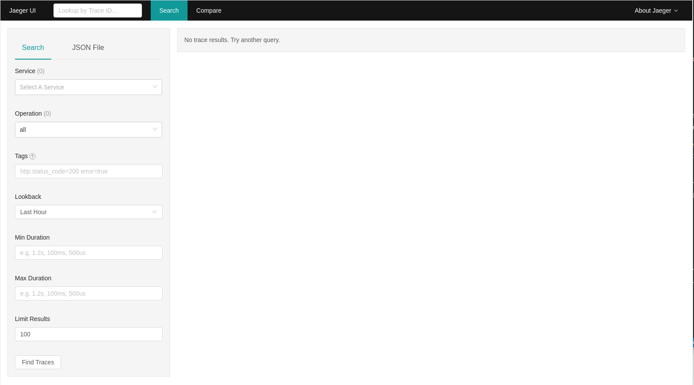
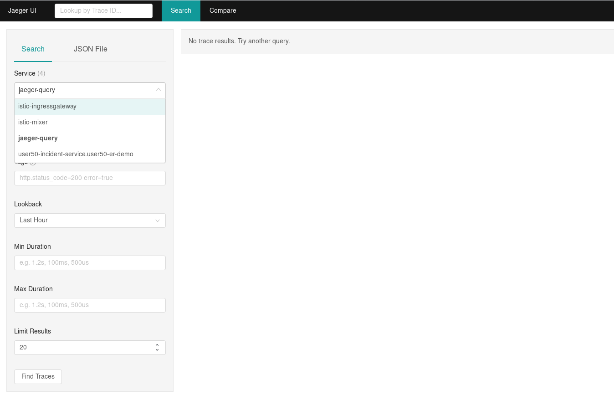
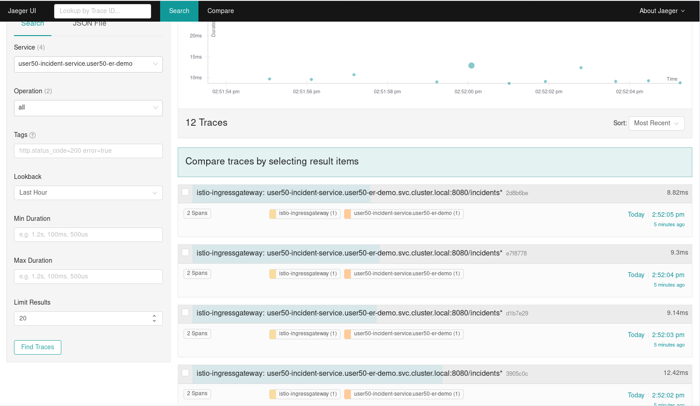
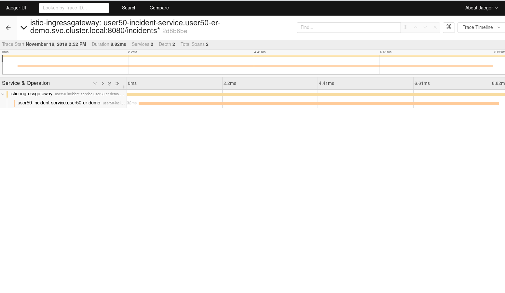
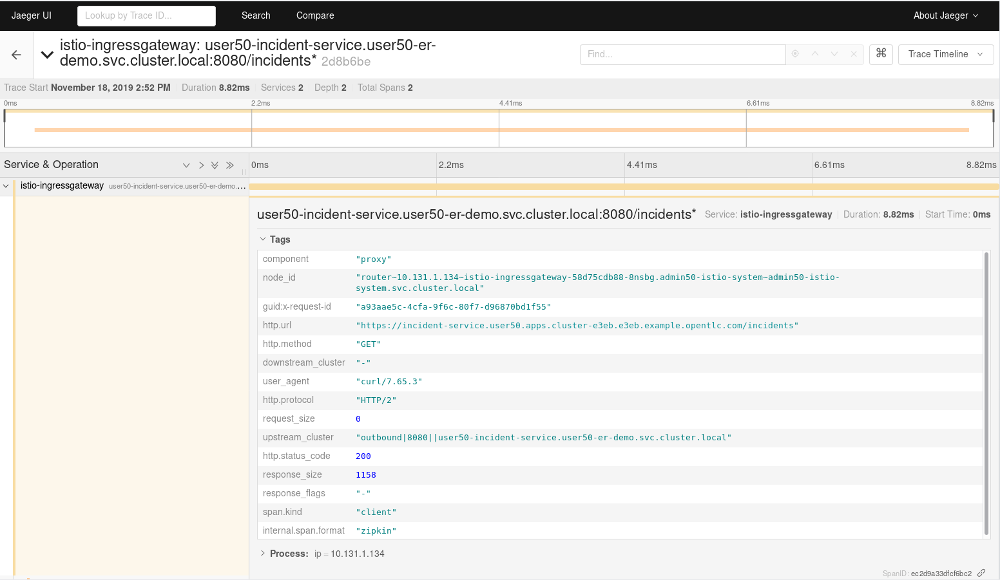
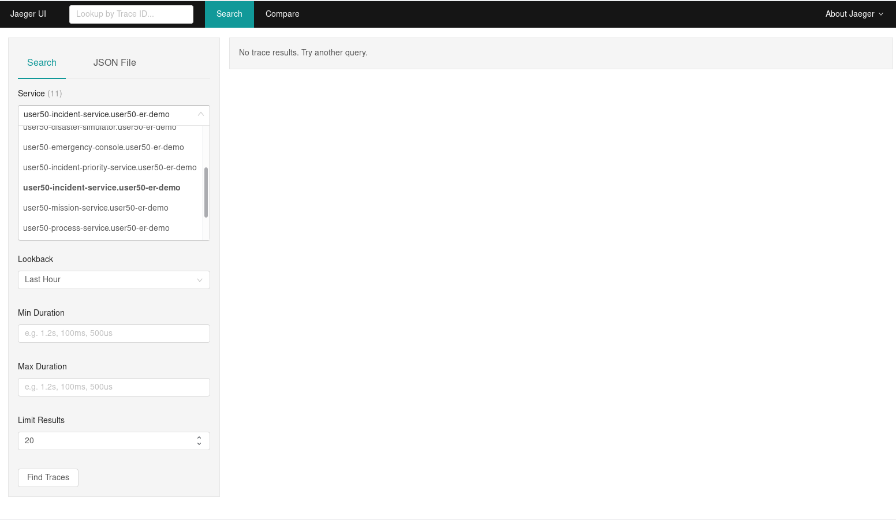
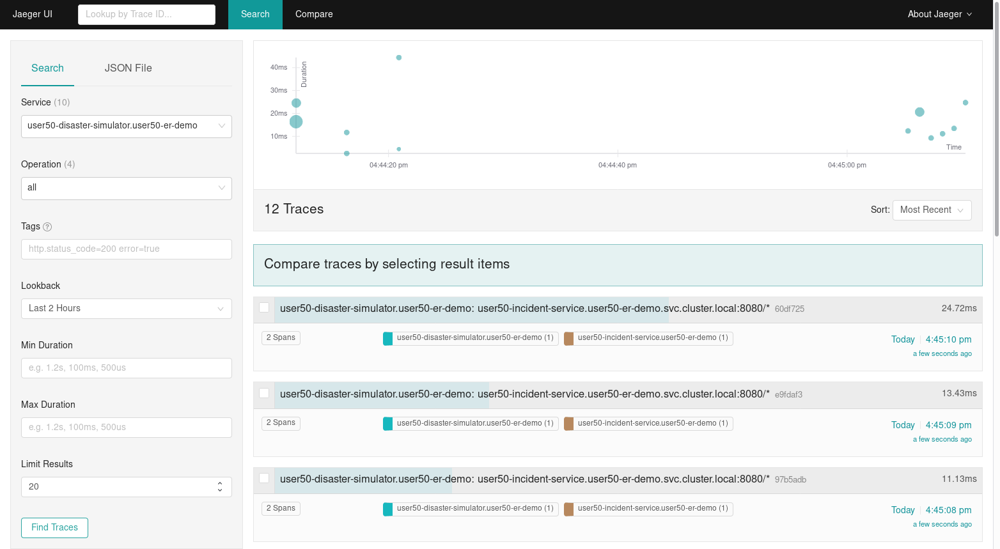
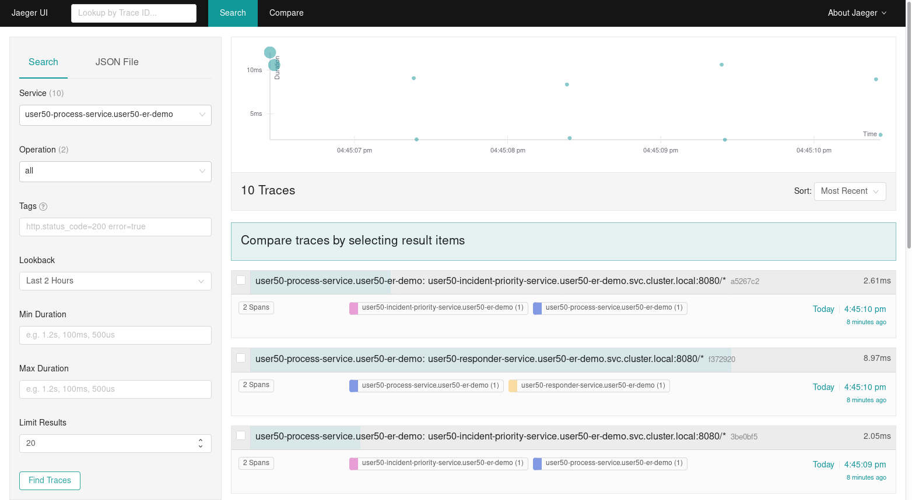
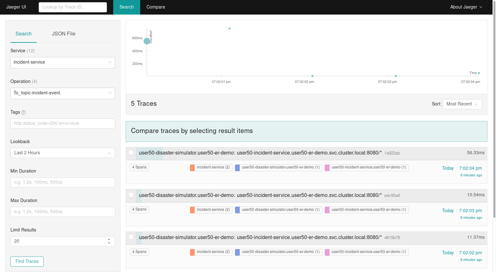
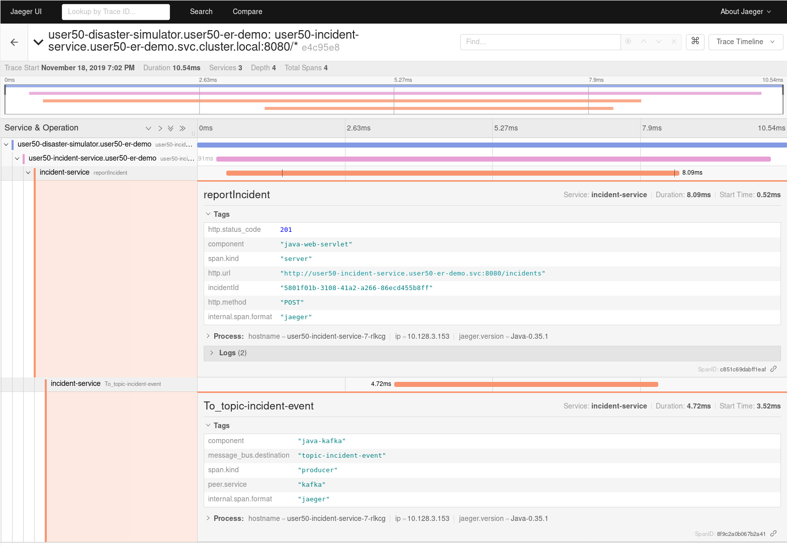

:noaudio:
:scrollbar:
:toc2:
:linkattrs:
:data-uri:

== Observability: Distributed Tracing Lab

.Goals
* Understand distributed tracing
* Explore the integration of Red Hat^(R)^ OpenShift^(R)^ Service Mesh with Jaeger distributed tracing
* Use instrumented application code to correlate traces

:numbered:

== Review Distributed Tracing

Distributed tracing is a method used to profile and monitor applications, especially those built using a microservices architecture. With distributed tracing, an application administrator can trace the path of a request as it travels across a complex system, discover the latency of the components along that path, and know which component in the path is creating a bottleneck.

The _span_ is the primary building block of a distributed trace, representing an individual unit of work done in a distributed system.
Each component of the distributed system contributes a span--a named, timed operation representing a piece of the workflow.
Spans can (and generally do) contain _references_ to other spans, which allows multiple spans to be assembled into one complete _trace_&#8212;a visualization of the life of a request as it moves through a distributed system.

_Tracers_ live in your applications and record timing and metadata about operations that took place. Tracers often use instrumented libraries, so that their use is transparent to application code. For example, an instrumented web server creates a span when it receives a request and completes the span when the response is sent.

Individual traces are sent to a _collector_ for storage. To minimize overhead for the application, this is typically done out-of-band.

Popular open source implementations of distributed tracing systems include Zipkin and Jaeger.

The _OpenTracing API_ is a project hosted at the Cloud Native Computing Foundation (CNCF) whose aim is to create more standardized APIs and instrumentation for distributed tracing.
OpenTracing is comprised of an API specification, frameworks and libraries that have implemented the specification, and documentation for the project. Both Zipkin and Jaeger implement the OpenTracing API specification.

== Explore Service Mesh and Distributed Tracing

OpenShift Service Mesh includes Jaeger. When the service mesh operator creates the `ServiceMeshControlPlane` resource, it also creates the `Jaeger` resource. The Jaeger operator then uses this resource to create Jaeger instances.

. Make sure you are logged in to OpenShift as the control plane admin user:
+
----
$ oc login $LAB_MASTER_API -u $SM_CP_ADMIN -p $OCP_PASSWD
----
. Review the `Tracing` section of the `ServiceMeshControlPlane` custom resource:
+
----
$ oc describe servicemeshcontrolplane.v1.maistra.io full-install -n $SM_CP_NS
----
+
.Sample Output (Truncated)
----
Name:         full-install
Namespace:    admin50-istio-system
Labels:       <none>
[...]]
Spec:
  Istio:
    [...]
    Tracing:
      Enabled:   true
      Provider:  jaeger
Status:
  [...]
  Last Applied Configuration:
    Istio:
      [...]
      Tracing:
        Enabled:  true
        Ingress:
          Enabled:  true
        Jaeger:
          Template:  all-in-one
        Provider:    jaeger
[...]
----
* Distributed tracing is enabled by setting `Tracing.Enabled` to `True`.
* The tracing implementation used by OpenShift Service Mesh is Jaeger. Upstream Istio also supports Zipkin.
* The default template for Jaeger is `all-in-one`. This is a minimal installation that uses in-memory storage. As such, it is recommended only for development and testing purposes, and should not be used in a production environment.
* For production environments, the value of `Jaeger.Template` needs to be set to `production-elasticsearch`. This template uses Elasticsearch for Jaeger’s storage needs.
* The Jaeger architecture consists of several components: agent, collector, ingester, query, UI, and storage. For the `all-in-one` strategy, all of these components are bundled in the same image.

. Obtain the URL to the Jaeger UI:
+
----
$ echo -en "\n\nhttps://$(oc get route jaeger -o template --template={{.spec.host}} -n $SM_CP_NS)\n\n"
----
. In a browser window, navigate to the Jaeger UI and log in with the username and password of the control plane admin user.
Expect to see the Jaeger UI home page:
+

+
[TIP]
====
You may see services and traces in the Jaeger UI belonging to previous interactions with the Emergency Response Demo application. If you want to reset the Jaeger storage, use the following command to force a redeployment of the Jaeger pod:

----
$ oc patch deployment jaeger -p '{"spec":{"template":{"metadata":{"annotations":{"kubectl.kubernetes.io/restartedAt": "'`date +%FT%T%z`'"}}}}}' -n $SM_CP_NS
----
The Jaeger `all-in-one` image uses in-memory storage, which is cleared when the pod restarts.
====

== Work with Distributed Tracing

=== Review Envoy Functionality
The service proxy, Envoy, is responsible for generating the initial traces and propagating existing traces for inbound and outbound traffic.
Some things to take note of:

* Envoy tracing is limited to HTTP and gRPC traffic.
* Tracing information is encoded as Zipkin-compatible B3 HTTP headers (`x-b3-traceid`, `x-b3-spanid`, `x-b3-parentspanid`, `x-b3-sampled`, and `x-b3-flags`).
* It is up to the application to propagate the HTTP headers to outgoing calls and to handle tracing for non-HTTP traffic.
* Envoy propagates the traces to the Jaeger collector in the service mesh control plane.
* For incoming HTTP traffic, Envoy generates a new span.
** If the incoming call includes B3 HTTP headers, the newly generated span is marked as a child of the span on the incoming request.
** The span is closed when the response is sent back to the client.
* Traces generated by the Envoy proxy contain the following information:
** Originating service cluster set via `--service-cluster`
** Start time and duration of the request
** Originating host
** Downstream cluster set via the `x-envoy-downstream-service-cluster` header
** HTTP request URL, method, protocol, and user-agent
** HTTP response status code
** gRPC response status and message (if available)
** Error tag when HTTP status is 5xx or gRPC status is not “OK”
** Tracing system-specific metadata

=== Explore Distributed Tracing

. Using `curl`, create a couple of requests to the incident service's `/incidents` endpoint:
+
----
$ curl -v -k https://incident-service.$ERDEMO_USER.apps.$SUBDOMAIN_BASE/incidents
----
. Refresh the Jaeger UI home page, click the *Service* list, and look for `$ERDEMO_USER-incident-service.$ERDEMO_NS`:
+

. Select `$ERDEMO_USER-incident-service.$ERDEMO_NS` and click *Find Traces* to list the traces generated for the requests to the incident service:
+

* Note the graph at the top of the screen that maps the timestamp of the traces to their duration.
* Note that every recorded trace consists of two spans.
. Click one of the traces to see the details:
+

+
* The top trace is generated by the Istio ingress gateway.
* The child trace corresponds to the call to the incident service from the Istio ingress gateway.
. Click the top span to open the span details, and then expand the *Tags* section to see the information contained in the span:
+

. Note the following tags:
* `component`: The name of the component or service that generated the span. In this case, the value is `proxy` because the Istio ingress gateway is a standalone Envoy proxy.
* `node_id`: The ID of the node where the trace is generated.
* `guid:x-request-id`: The generated unique ID of the trace. This value is propagated to sibling and child spans. It is also added to the request as an `x-request-id` HTTP header. This allows the application to use the value as an identifier--for example, in logging.
* `http.url`, `http.method`, `user_agent`, `http.protocol`, `http.status_code`, and `response_size`: Information pertaining to the HTTP request.
* `downstream_cluster`, `upstream_cluster`: Information about the incoming (downstream) and outgoing (upstream) requests as recorded by the Envoy proxy.
* `internal_span_format`: The value here is `zipkin` because Envoy uses a Zipkin-compatible format.

. Obtain the URL to the Emergency Response Demo Console:
+
----
$ echo -en "\n\nhttps://emergency-console.$ERDEMO_USER.apps.$SUBDOMAIN_BASE\n\n"
----

. In a browser window, navigate to the Emergency Response Demo Console.

. Perform a run of the Emergency Response Demo application.
* Expect this to generate traces for all HTTP-based calls.
. Refresh the Jaeger UI, click the *Service* list, and expect to see a number of services belonging to the Emergency Response Demo application:
+

. Confirm that the different traces are not correlated to each other--for example, find the traces for `$ERDEMO_USER-disaster-simulator.$ERDEMO_NS`:
+

* Expect to see a number of traces, each consisting of two spans.
+
[NOTE]
====
These traces correspond to the HTTP POST calls from the disaster simulator application to the incident service when creating incidents.
Within the incident service, when an incident is created, a message is sent to a Kafka topic and consumed by the process service.
The process service, among other things, performs a REST call to the responder service and the incident priority service.
====

. Find traces for `$ERDEMO_USER-process-service.$ERDEMO_NS`:
+

* Note that these traces are not correlated to each other. So while each individual trace gives some information about HTTP calls happening in the system, the fact that the different traces belonging to one request are not correlated greatly reduces the value of having distributed tracing functionality in the first place.

=== Correlate Traces
To be able to correlate traces generated during a request spanning several services, the tracing information needs to be propagated with the service calls.
This is something that the Envoy proxy cannot do, so it is the responsibility of the application to include the tracing information in outbound calls to other services and systems.
This requires instrumenting the application code. The specifics of doing this are beyond the scope of this training class. Depending on the particular application runtime and frameworks, it can be a matter of adding specific libraries to the application. In other cases, it requires changes in the application code itself.

In this exercise, you deploy a version of the incident service that has been instrumented to propagate tracing information through outgoing Kafka messages and extract tracing information from incoming Kafka messages. In the steps that follow, you add the required properties to the instrumented version of the incident service.

. Edit the ConfigMap of the incident service:
+
----
$ oc edit configmap incident-service -n $ERDEMO_NS
----

. Add the following lines to the `application.properties` file in the configmap, replacing `<admin user>` with the name of the control plane admin user:
+
----
quarkus.jaeger.endpoint=http://jaeger-collector.<admin user>-istio-system.svc:14268/api/traces
quarkus.jaeger.service-name=incident-service
quarkus.jaeger.propagation=b3
quarkus.jaeger.sampler-type=probabilistic
quarkus.jaeger.sampler-param=1
----
* `jaeger.endpoint` is the service that exposes the collector in the Jaeger `all-in-one` image. It listens on port 14268.
* `jaeger.propagation=b3` is the property that enables compatibility between Jaeger and HTTP headers in Zipkin format.
. Patch the incident service DeploymentConfig to point to the `sm-tracing` tag of the incident service image:
+
----
$ oc patch dc $ERDEMO_USER-incident-service -p "{\"spec\":{\"triggers\":[{\"type\": \"ConfigChange\"},{\"type\": \"ImageChange\",\"imageChangeParams\": {\"automatic\": true, \"containerNames\":[\"$ERDEMO_USER-incident-service\"], \"from\": {\"kind\": \"ImageStreamTag\", \"namespace\": \"$ERDEMO_NS\", \"name\": \"$ERDEMO_USER-incident-service:sm-tracing\"}}}]}}" -n $ERDEMO_NS
----
* This forces a redeployment of the incident service.

. Wait until the new deployment is up and running.
. Perform a run of the Emergency Response Demo application.
. In the Jaeger UI, find traces where the *Service* is `incident-service` and the *Operation* is `To_topic-incident-event`:
+

* Expect to find traces consisting of four spans, including a span for the HTTP post message recorded by  the instrumented web servlet layer of the incident service application and a span recording the sending of a Kafka message to the `topic-incident-event` Kafka topic:
+

[NOTE]
Tracing a request through all of the services requires instrumented versions of all of the application's services. This is beyond the scope of this lab.

This concludes the lab. You learned about distributed tracing with Jaeger and explored correlating traces through the instrumentation of application code.
