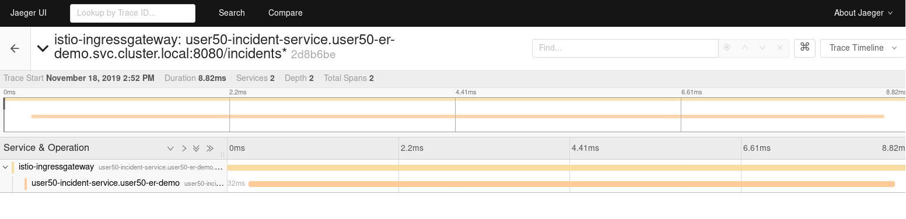

:noaudio:
:scrollbar:
:toc2:
:linkattrs:
:data-uri:

== Observability Lab: Distributed Tracing

.Goals
* Understand Distributed Tracing
* Explore integration of Service Mesh with Jaeger Distributed Tracing
* Instrumentation of application code

:numbered:

== Distributed Tracing

Distributed tracing is a method used to profile and monitor applications, especially those built using a microservices architecture. With distributed tracing, an application administrator can trace the path of a request as it travels across a complex system, discover the latency of the components along that path and know which component in the path is creating a bottleneck.

The _Span_ is the primary building block of a distributed trace, representing an individual unit of work done in a distributed system. +
Each component of the distributed system contributes a span - a named, timed operation representing a piece of the workflow. +
Spans can (and generally do) contain _References_ to other spans, which allows multiple Spans to be assembled into one complete _Trace_ - a visualization of the life of a request as it moves through a distributed system.

_Tracers_ live in your applications and record timing and metadata about operations that took place. Tracers often use instrumented libraries, so that their use is transparent to application code. For example, an instrumented web server creates a span when it receives a request and completes the span when the response is sent.

Individual traces are sent to a _Collector_ for storage. To minimize overhead for the application, this is typically done out-of-band.

Popular open source implementation of Distributed Tracing systems include Zipkin and Jaeger.

The _OpenTracing API_ is an project hosted at the CNCF (Cloud Native Computing Foundation) whose aim is to create more standardized APIs and instrumentation for distributed tracing. +
OpenTracing is comprised of an API specification, frameworks and libraries that have implemented the specification, and documentation for the project. Both Zipkin as Jaeger implement the OpenAPI specification.

== Service Mesh and Distributed Tracing

Red Hat Service Mesh includes Jaeger. When the Service Mesh Operator creates the _ServiceMeshControlPlane_ resource it also creates the _Jaeger_ resource. The Jaeger Operator then uses this resource to create Jaeger instances.

. Ensure you're logged into OpenShift as the control plane admin user.
+
----
$ oc login $LAB_MASTER_API -u $SM_CP_ADMIN -p $OCP_PASSWD
----
. Review the _Tracing_ section of the _ServiceMeshControlPlane_ custom resource:
+
----
$ oc describe servicemeshcontrolplane full-install -n $RHSM_CONTROL_PLANE_NS 
----
+
.Output (truncated)
----
Name:         full-install
Namespace:    admin50-istio-system
Labels:       <none>
[...]]
Spec:
  Istio:
    [...]
    Tracing:
      Enabled:  true
Status:
  [...]
  Last Applied Configuration:
    Istio:
      [...]
      Tracing:
        Enabled:  true
        Ingress:
          Enabled:  true
        Jaeger:
          Template:  all-in-one
[...]
----
* Distributed tracing is enabled by setting `Tracing.Enabled` to `True`.
* The tracing implementation used by Red Hat Service Mesh is Jaeger. Upstream Istio also supports Zipkin.
* The default template for Jaeger is `all-in-one`. This is a minimal installation that uses in-memory storage. As such it is only recommended for development and testing purposes, and should not be used in a production environment.
* For production environments, the value of `Jaeger.Template` should be set to `production-elasticsearch`. This template uses Elasticsearch for Jaeger’s storage needs.
* The Jaeger architecture consists of several components: Agent, Collector, Ingester, Query, UI, Storage. In case of `all-in-one` strategy, all these components are bundled in the same image.

. Obtain the URL to the Jaeger UI:
+
----
$ echo -en "\n\n$(oc get route jaeger -o template --template={{.spec.host}} -n $RHSM_CONTROL_PLANE_NS)\n\n"
----
. In a browser window, navigate to the Jaeger UI - use HTTPS scheme - and log in with the username and password of the control plane admin user. +
Expect to see the Jaeger UI home page:
+

+
[NOTE]
==== 
You might see services and traces in the Jaeger UI belonging to previous interactions with the Emergency Response Demo application. If you want to reset the Jaeger storage, you can force a redeploy of the Jaeger pod - the Jaeger all-in-one image uses in-memory storage, which is cleared when restarting the pod.

----
$ oc patch deployment jaeger -p '{"spec":{"template":{"metadata":{"annotations":{"kubectl.kubernetes.io/restartedAt": "'`date -Iseconds`'"}}}}}' -n $RHSM_CONTROL_PLANE_NS
----
====

== Distributed Tracing in Action

The service proxy, Envoy, is responsible for generating the initial traces, and propagate existing traces for inbound and outbound traffic. +
Some things to take note of:

* Envoy tracing functionality is limited to HTTP and gRPC traffic. 
* Tracing information is encoded as HTTP headers as Zipkin-compatible B3 HTTP headers ( `x-b3-traceid`, `x-b3-spanid`, `x-b3-parentspanid`, `x-b3-sampled`, and `x-b3-flags`).
* It is up to the application itself to propagate the HTTP headers to outgoing calls.
* The application is also responsible for handling tracing in the case of non-HTTP traffic.
* Envoy takes care of propagating the traces to the Jaeger collector in the Service Mesh control plane.
* For incoming HTTP traffic, the Envoy will generate a new span. If the incoming call includes B3 HTTP headers, the newly generated span will be marked as a child of the span on the incoming request. The span is closed when the respoonse is sent back to the client.,
* Traces generated by the Envoy proxy contain the following information:
** Originating service cluster set via `--service-cluster`.
** Start time and duration of the request.
** Originating host.
** Downstream cluster set via the `x-envoy-downstream-service-cluster` header.
** HTTP request URL, method, protocol and user-agent.
** HTTP response status code.
** GRPC response status and message (if available).
** An error tag when HTTP status is 5xx or GRPC status is not “OK”
** Tracing system-specific metadata.

{nbsp}

. Using `curl`, create a couple of requests to the Incident Service `/incidents` endpoint:
+
----
$ curl -v -k https://incident-service.$ERDEMO_USER.apps.$SUBDOMAIN_BASE/incidents
----
. Refresh the jaeger UI home page. Expect to see `$ERDEMO_USER-incident-service.$ER_DEMO_NS` listed in the _Service_ drop down box.
+
image::images/jaeger-ui-incident-service.png[]
. Select `$ERDEMO_USER-incident-service.$ER_DEMO_NS` in the _Service_ list, and click _Find Traces_ to list the traces generated for the request to the Incident Service.
+

+
* Note the graph at the top of the screen which maps the timestamp of the traces to their duration. 
* Note that every recorded trace consists of two spans.
. Click on one of the traces to see the details for the trace:
+

+
* The top trace is generated by the Istio Ingress Gateway.
* The child trace corresponds to the call to the Incident Service from the Istio Ingress Gateway.
. Click on the top span to open the span details, and expand the _Tags_ section to see the information contained in the span.
+
image::images/jaeger-ui-incident-service-trace-tags.png[]
+
* `component`: the name of the component or service which generated the span. In this case this is the Istio Ingress Gateway, which is a standalone Envoy proxy, hence the value `proxy`.
* `node_id`: the id of the node where the trace is generated.
* `guid:x-request-id`: the generated unique id of the trace. This value is propagated to sibling and child spans. It is also added to the request as `x-request-id` HTTP header. This allows the application to use the value as an identifier in e.g. logging.
* `http.url`, `http.method`, `http.protocol`, `http.status_code`, `user_agent`, `response_size`: information pertaining to the HTTP request.
* `upstream_cluster`, `downstream_cluster`: information about the incoming (downstream) and outgoing (upstream) request as recorded by the Envoy proxy.
* `internal_span_format`: Envoy uses Zipkin compatible format, hence the value `zipkin`.

. Perform a run of the Emergence Response Demo. This will generate traces for all HTTP based calls.
. Refresh the Jaeger UI. Expect to see a number of services belonging to the Emergency Response Demo in the _Service_ drop-down box.
+
image::images/jaeger-ui-er-services.png[]
. Note that the different traces are not correlated to each other. For example, query for traces for `$ERDEMO_USER-disaster-simulator.$ER_DEMO_NS`. You should find a number of traces, consisting of two spans:
+
image::images/jaeger-ui-disaster-simulator-traces.png[]
+
These traces correspond to the HTTP POST calls from the Disaster Simulator application to the Incident Service when creating incidents. +
Within the Incident Service, as a result of creating an incident, a message is sent to a Kafka topic and consumed by the Process service. +
The Process service performs amongst other things a REST call to the Responder Service and the Incident Priority Service. +
You can find these traces by querying for `$ERDEMO_USER-process-service.$ER_DEMO_NS` trace:
+
image::images/jaeger-ui-process-service-traces.png[]
+
Note all these traces are not correlated to each other. So while each individual trace gives some information about HTTP calls going on in the system, the fact that the different traces belonging to one request are not correlated greatly reduces the value of having distributed tracing functionality in the first place.

. To be able to correlate traces generated during a request spanning several services, the tracing information needs to be propagated with the service calls. +
This is something that the Envoy proxy cannot do, so it is the responsability of the application to include the tracing information in outbound calls to other services and systems. +
This requires to instrument the application code. How exactly to do this is beyond the scope of this training class. Depending on the particular application runtime and frameworks this can be a matter of adding specific libraries to the application. In other cases it will require changes in the application code itself. +
In this lab, you will deploy an instrumented version of the Incident Service, which has been instrumented to propagate tracing information through outgoing Kafka messages, and extract tracing information from incoming Kafka messages.
.. Edit the ConfigMap of the Incident Service. The instrumented version of tyhe Incident Service requires some additional properties:
+
----
$ oc edit configmap incident-service -n $ER_DEMO_NS
----
+
Add the following lines to the `application.properties` file in the configmap - replace <admin user> with the name of the control plane admin user:
+
----
opentracing.jaeger.enabled=true
opentracing.jaeger.service-name=incident-service
opentracing.jaeger.http-sender.url=http://jaeger-collector.<admin user>-istio-system.svc:14268/api/traces
opentracing.jaeger.probabilistic-sampler.sampling-rate=1
opentracing.jaeger.enable-b3-propagation=true
----
* `jaeger-collector` is the name of the service which exposes the collector in the Jaeger all-in-one image. The service listens on port 14268.
* `opentracing.jaeger.enable-b3-propagation`: this property enables compatibility between Jaeger and HTTP headers in Zipkin format.
.. Patch the Incident Service DeploymentConfig resource to point to the `1.0.0-jaeger` tag of the Incident Service image:
+
----
$ oc patch dc $ERDEMO_USER-incident-service -p "{\"spec\":{\"triggers\":[{\"type\": \"ConfigChange\"},{\"type\": \"ImageChange\",\"imageChangeParams\": {\"automatic\": true, \"containerNames\":[\"$ERDEMO_USER-incident-service\"], \"from\": {\"kind\": \"ImageStreamTag\", \"namespace\": \"$ER_DEMO_NS\", \"name\": \"$ERDEMO_USER-incident-service:1.0.0-jaeger\"}}}]}}" -n $ER_DEMO_NS
----
+
This will force a redeployment of the Incident Service. +
Wait until the new deployment is up and running.
.. Perform a run of the Emergence Response Demo.
.. In the Jaeger UI, query for traces for Service `incident-service` and Operation `To_topic-incident-event`:
+

.. Expect to find traces consisting of 4 spans. The spans include a span for the HTTP post message recorded by  the instrumented web servlet layer of the Incident Service application, as well as a span recording the sending of a Kafka message to the `topic-incident-event` Kafka topic.
+
image::images/jaeger-ui-incident-service-trace-details-1.png[]
.. To trace a request throughout all services would require instrumented versions of all the services of the application. This is beyond the scope of this lab. 