:noaudio:
:scrollbar:
:toc2:
:linkattrs:
:data-uri:

== Observability Lab: Metrics and Monitoring

.Goals
* Understand Metrics and Monitoring in Red Hat Service Mesh.
* Create and collect custom metrics.
* Define alerts in Prometheus.

:numbered:

== Red Hat Service Mesh Metrics and Monitoring

One of the core features of the Red Hat Service Mesh is the observability of network traffic. Because all service-to-service communication is going through Envoy proxies, and the Service Mesh control plane is able to gather logs and metrics from these proxies, the Service Mesh can give deep insights about mesh network.

The Mixer component of the Control Plane is responsible for telemetry collection (In fact, Mixer is two different deployments in Openshift. One is called _istio-policy_, the other is called _istio-telemetry_. The _istio-policy_ component is responsible for providing policy controls, _istio-telemetry_ handles metric collection).

The Envoy sidecars from the application pods call _istio-policy_ before each request to perform precondition policy checks, and after each request they call _istio-policy_ to report telemetry. Note that the sidecar has local caching such that a large percentage of precondition checks can be performed from cache. Additionally, the sidecar buffers outgoing telemetry such that it only calls Mixer infrequently.

Mixer comes standard with a mixer adapter for Prometheus, allowing a Prometheus instance to scrape metrics from Mixer.

The Service Mesh instance of Prometheus is configured with a number of scraping targets. As such the Prometheus instance will collect metrics not only from Mixer, but also from the other control plane components and from each sidecar.

All these metric are aggregated an visualized in a Grafana Dashboard.

. Ensure you're logged into OpenShift as the control plane admin user.
+
----
$ oc login $LAB_MASTER_API -u $SM_CP_ADMIN -p $OCP_PASSWD
----
. Obtain the URL of the Prometheus UI:
+
----
$ echo -en "\n\nhttps://$(oc get route prometheus -o template --template={{.spec.host}} -n $SM_CP_NS)\n\n"
----
. In a browser window, navigate to the Prometheus UI. Navigate to  the _Status -> Targets_ page. This page shows al the scraping targets discovered by the Prometheus server:
+
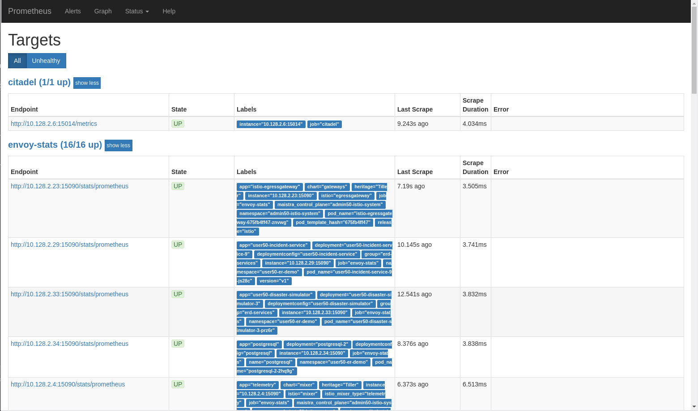
+
These targets include:
+
* `envoy-stats`: the different envoy proxies.
* `istio-mesh`: scraping target for service mesh metrics through the Mixer Prometheus adapter
* `citadel`, `pilot`, `galley`, `istio-telemetry`, `istio-policy`: metrics exposed by the control plane components about themselves.
* `kubernetes-service-endpoints`: service endpoints which do not necessarily belong to the mesh. They are discovered automatically because the Service resource has Prometheus annotations. This is the case for the ZooKeeper and Kafka pods in the Emergency Response Demo namespace.

. Navigate to the _Graph_ of the Prometheus UI. Click on the _insert metric at cursor_ dropdown to see which metrics are scraped by this Prometheus instance:
+
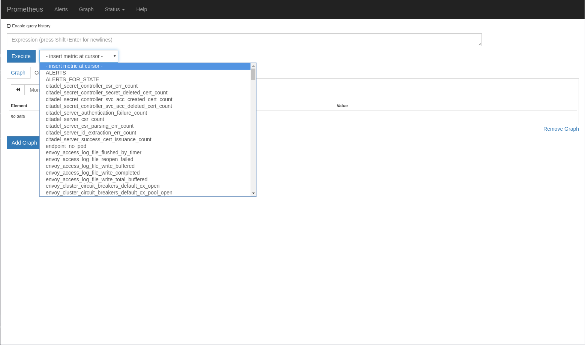
+
The metrics are prefixed according to their source:
+
* `envoy_`: metrics exposed by the Envoy proxy.
* `istio_`: metrics exposed through the Prometheus Mixer adapter. These metrics include:
** `istio_requests_total` is a counter that aggregates request totals. Can be used to calculate for example the number of requests per second, grouped by source, destination, protocol and response code.
** `istio_request_duration_seconds` is a histogram that collects latency for requests between workloads.
** `istio_request_bytes` and `istio_response_bytes`: histograms that collect the ingoing and outgoing bytes per request and response.

. Internally, the metrics exposed through Mixer are configured with a combination of _metric_, _handler_ and _rule_ resources.
** The `metric` resources will be translated into Prometheus metrics. To see the list of default metrics:
+
----
$ oc get metric -n $SM_CP_NS
----
+
.Output
----
NAME                   AGE
requestcount           9d
requestduration        9d
requestsize            9d
responsesize           9d
tcpbytereceived        9d
tcpbytesent            9d
tcpconnectionsclosed   9d
tcpconnectionsopened   9d
----
+
----
$ oc get rule requestcount -o yaml -n $SM_CP_NS
----
+
.Output (truncated)
----
apiVersion: config.istio.io/v1alpha2
kind: metric
metadata:
  [...]
spec:
spec:
  dimensions:
    connection_security_policy: conditional((context.reporter.kind | "inbound") ==
      "outbound", "unknown", conditional(connection.mtls | false, "mutual_tls", "none"))
    destination_app: destination.labels["app"] | "unknown"
    destination_principal: destination.principal | "unknown"
    destination_service: destination.service.host | "unknown"
    destination_service_name: destination.service.name | "unknown"
    destination_service_namespace: destination.service.namespace | "unknown"
    destination_version: destination.labels["version"] | "unknown"
    destination_workload: destination.workload.name | "unknown"
    destination_workload_namespace: destination.workload.namespace | "unknown"
    permissive_response_code: rbac.permissive.response_code | "none"
    permissive_response_policyid: rbac.permissive.effective_policy_id | "none"
    reporter: conditional((context.reporter.kind | "inbound") == "outbound", "source",
      "destination")
    request_protocol: api.protocol | context.protocol | "unknown"
    response_code: response.code | 200
    response_flags: context.proxy_error_code | "-"
    source_app: source.labels["app"] | "unknown"
    source_principal: source.principal | "unknown"
    source_version: source.labels["version"] | "unknown"
    source_workload: source.workload.name | "unknown"
    source_workload_namespace: source.workload.namespace | "unknown"
  monitored_resource_type: '"UNSPECIFIED"'
  value: "1"    
----
** The `prometheus` handler describes the Prometheus metrics and references the metric custom resources in the instance_name fields. It also defines the name that can be used in Prometheus queries later (with the `istio` prefix), like `requests_total`, and the labels used to group the metrics:
+
----
$ oc get handler prometheus -o yaml -n $SM_CP_NS
----
+
.Output (truncated)
----
apiVersion: config.istio.io/v1alpha2
kind: handler
metadata:
  [...]
spec:
  compiledAdapter: prometheus
  params:
    metrics:
    - instance_name: requestcount.metric.admin50-istio-system
      kind: COUNTER
      label_names:
      - reporter
      - source_app
      - source_principal
      - source_workload
      - source_workload_namespace
      - source_version
      - destination_app
      - destination_principal
      - destination_workload
      - destination_workload_namespace
      - destination_version
      - destination_service
      - destination_service_name
      - destination_service_namespace
      - request_protocol
      - response_code
      - response_flags
      - permissive_response_code
      - permissive_response_policyid
      - connection_security_policy
      name: requests_total
    [...]
----
** Finally, the _Rule_ resources bind the metrics to the handlers.
+
----
$ oc get rule -n $SM_CP_NS
----
+
.Output
----
NAME                      AGE
kubeattrgenrulerule       9d
promhttp                  9d
promtcp                   9d
promtcpconnectionclosed   9d
promtcpconnectionopen     9d
tcpkubeattrgenrulerule    9d
----
+
----
$ oc get rule promhttp -o yaml -n $SM_CP_NS
----
+
.Output (truncated)
----
apiVersion: config.istio.io/v1alpha2
kind: rule
metadata:
  [...]
spec:
  actions:
  - handler: prometheus
    instances:
    - requestcount.metric
    - requestduration.metric
    - requestsize.metric
    - responsesize.metric
  match: (context.protocol == "http" || context.protocol == "grpc") && (match((request.useragent
    | "-"), "kube-probe*") == false) && (match((request.useragent | "-"), "Prometheus*")
    == false)  
----

. Prometheus is essentially a time-series database, and as such has very limited functionality for displaying metric data in graphs and dashboards. That's why Prometheus is often deployed together which Grafana. Grafana can use the Prometheus time-series as data source for graphics and dashboards. The default installation of Service mesh includes Grafana, and pre-built dashboards for the different metric groups obtained from Prometheus.
.. Obtain the URL for the Grafana instance:
+
----
$ echo -en "\n\nhttps://$(oc get route grafana -o template --template={{.spec.host}} -n $SM_CP_NS)\n\n"
----
.. In a browser window, navigate to the Grafana home page. Log in with the control plane admin username and password.
+
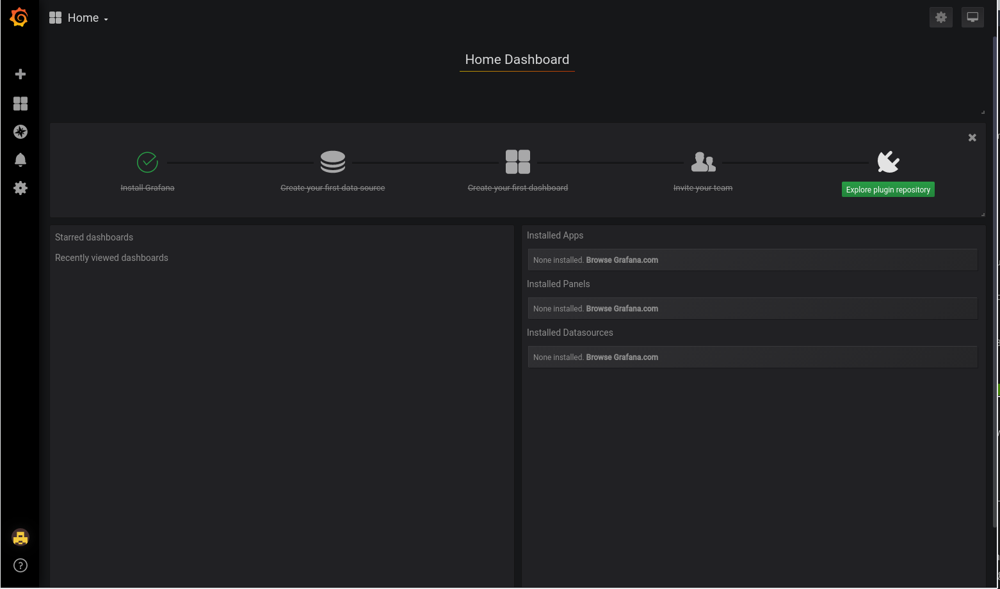
.. Click on the _Home_ drop-down, and on the _Istio_ folder to see the different default dasboards:
+
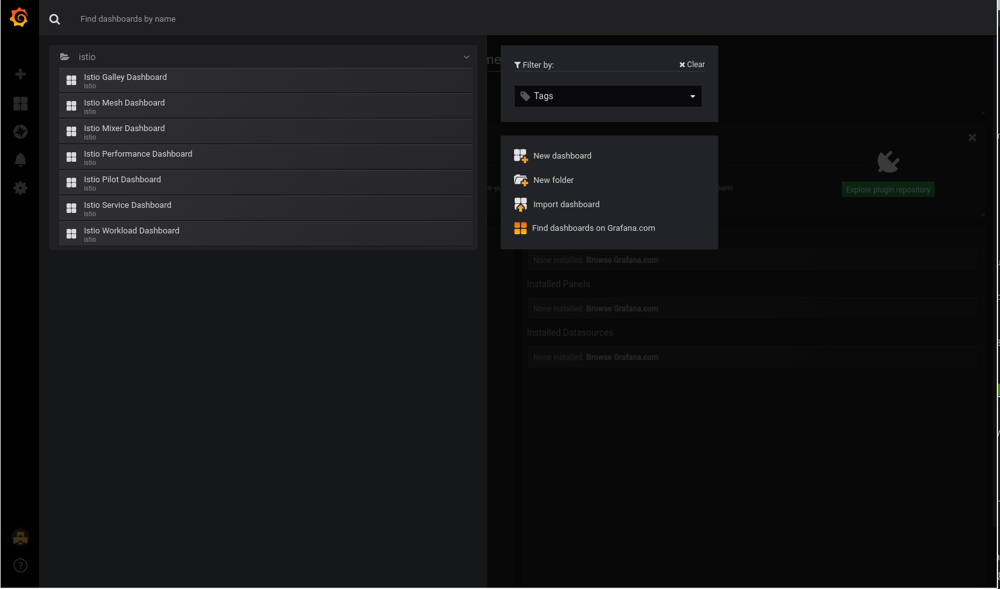
.. The _Istio Workload Dashboard_ groups the dashboards for the different metric groups obtained through the Prometheus Mixer Adapter. In the selection bar at the top, you can select the namespace and workload you want to see, and further filter on inbound workload namespace, inbound workload and destination service.
+
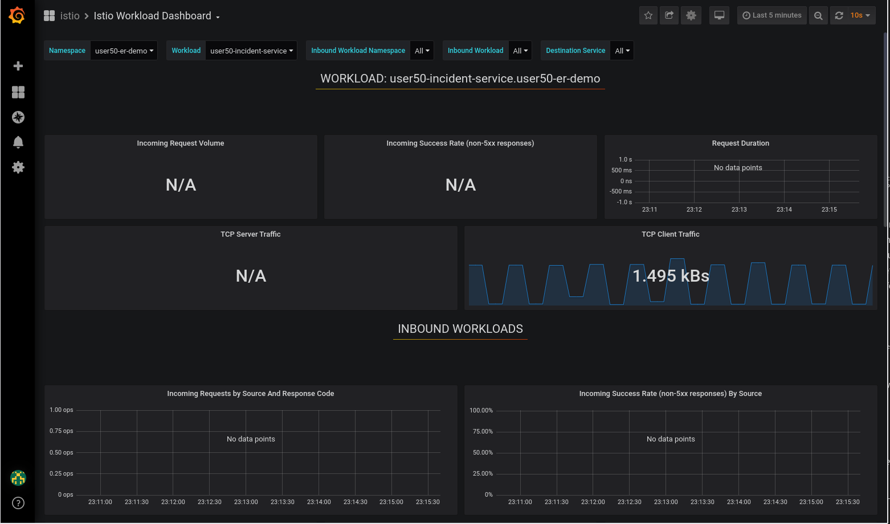

== Create and Collect Custom Metrics

The default metrics generated by the Service Mesh will often be sufficient. But in some cases, one can imagine a need for specific metrics which are not readily generated by the Service Mesh.

The Service Mesh allows to define additional metrics through a combination of _Instance_, _Handler_ and _Rule_ resources. These metrics will be made available by Mixer for scraping by Prometheus.

In this section of the lab, you will create a custom metric which will count the number of requests per version of the Incident Service. You will first deploy a new version of the Incident Service, and distribute traffic beween these two versions. The new metric will reflect the distribution of the requests between the two versions.

. Label the deployed version of the Incident Service as `v1`:
+
----
$ oc patch dc $ERDEMO_USER-incident-service -p '{"spec":{"template":{"metadata":{"labels":{"version":"v1"}}}}}' -n $ERDEMO_NS
----
+
This will force a redeployment of the Incident Service pods.
. Deploy version `v2` of the Incident Service:
+
----
$ echo "---
apiVersion: apps.openshift.io/v1
kind: DeploymentConfig
metadata:
  labels:
    app: $ERDEMO_USER-incident-service
  name: $ERDEMO_USER-incident-service-v2
spec:
  replicas: 1
  revisionHistoryLimit: 2
  selector:
    app: $ERDEMO_USER-incident-service
    group: erd-services
  strategy:
    activeDeadlineSeconds: 21600
    resources: {}
    rollingParams:
      intervalSeconds: 1
      maxSurge: 25%
      maxUnavailable: 25%
      timeoutSeconds: 3600
      updatePeriodSeconds: 1
    type: Rolling
  template:
    metadata:
      annotations:
        sidecar.istio.io/inject: \"true\"
      creationTimestamp: null
      labels:
        app: $ERDEMO_USER-incident-service
        group: erd-services
        version: v2
    spec:
      containers:
      - env:
        - name: KUBERNETES_NAMESPACE
          valueFrom:
            fieldRef:
              apiVersion: v1
              fieldPath: metadata.namespace
        imagePullPolicy: IfNotPresent
        livenessProbe:
          exec:
            command:
            - curl
            - http://127.0.0.1:8080/actuator/health
          failureThreshold: 3
          initialDelaySeconds: 30
          periodSeconds: 30
          successThreshold: 1
          timeoutSeconds: 3
        name: $ERDEMO_USER-incident-service
        ports:
        - containerPort: 8080
          name: http
          protocol: TCP
        readinessProbe:
          exec:
            command:
            - curl
            - http://127.0.0.1:8080/actuator/health
          failureThreshold: 3
          initialDelaySeconds: 30
          periodSeconds: 30
          successThreshold: 1
          timeoutSeconds: 3
        resources:
          limits:
            cpu: 500m
            memory: 500Mi
          requests:
            cpu: 100m
            memory: 200Mi
        securityContext:
          privileged: false
          procMount: Default
        terminationMessagePath: /dev/termination-log
        terminationMessagePolicy: File
        volumeMounts:
        - mountPath: /app/logging
          name: logging
      dnsPolicy: ClusterFirst
      restartPolicy: Always
      schedulerName: default-scheduler
      securityContext: {}
      serviceAccount: incident-service
      serviceAccountName: incident-service
      terminationGracePeriodSeconds: 30
      volumes:
      - configMap:
          defaultMode: 420
          name: incident-service-logging
        name: logging
  test: false
  triggers:
  - type: ConfigChange
  - imageChangeParams:
      automatic: true
      containerNames:
      - $ERDEMO_USER-incident-service
      from:
        kind: ImageStreamTag
        name: $ERDEMO_USER-incident-service:1.0.0-jaeger
        namespace: $ERDEMO_NS
    type: ImageChange
" | oc create -f - -n $ERDEMO_NS 
----
+
* Note that for the sake of simplicity we are deploying the same image of the Incident Service. Only the value of the _version_ label marks the difference between the two versions.
* Note that both deployments are bound to the same service. The _Selector_ of the service matches the labels `app=$ERDEMO_USER-incident-service` and `group=erd-services`:
+
----
$ oc get service $ERDEMO_USER-incident-service -o custom-columns=NAME:.metadata.name,SELECTOR:.spec.se
lector
----
+
.Sample Output
----
NAME                      SELECTOR
user50-incident-service   map[app:user50-incident-service group:erd-services] 
----

. Verify that the Incident Service service has two endpoints:
+
----
$ oc describe service $ERDEMO_USER-incident-service | grep Endpoints
----
+
.Sample output
----
Endpoints:         10.128.3.245:8080,10.128.3.247:8080
----

. The traffic directed to the Incident Service will be more or less equally distributed beteen the two versions. To make things a bit more interesting, you can give a weight to the different services. +
This can be achived by defining subsets of the service in the Incident Service _DestinationRule_ and configuring routing weights in the Incident Service _VirtualService_ resource.
.. Define the Incident Service subsets in the DestinationRule:
+
----
$ echo "---
apiVersion: networking.istio.io/v1alpha3
kind: DestinationRule
metadata:
  name: incident-service-client-mtls
spec:
  host: $ERDEMO_USER-incident-service.$ERDEMO_NS.svc.cluster.local
  trafficPolicy:
    tls:
      mode: ISTIO_MUTUAL
  subsets:
  - name: v1
    labels:
      version: v1
  - name: v2
    labels:
      version: v2
" | oc apply -f - -n $ERDEMO_NS
----
.. Add routing instructions to the VirtualService.
+
----
$ echo "---
apiVersion: networking.istio.io/v1alpha3
kind: VirtualService
metadata:
  name: incident-service-virtualservice
spec:
  hosts:
  - incident-service.$ERDEMO_USER.apps.$SUBDOMAIN_BASE
  gateways:
  - erd-wildcard-gateway.$SM_CP_NS.svc.cluster.local
  http:
    - match:
        - uri:
            prefix: /incidents
      route:
        - destination:
            host: $ERDEMO_USER-incident-service.$ERDEMO_NS.svc.cluster.local
            port:
              number: 8080
            subset: v1
          weight: 20
        - destination:
            host: $ERDEMO_USER-incident-service.$ERDEMO_NS.svc.cluster.local
            port:
              number: 8080
            subset: v2
          weight: 80
" | oc apply -f - -n $ERDEMO_NS
----
* In the example above, roughly 80% of the requests will be routed to version v2 of the Incident Service.
.. Create some traffic to the Incident Service:
+
----
$ while :; do curl -k https://incident-service.$ERDEMO_USER.apps.$SUBDOMAIN_BASE/incidents; sleep 1; done
----
.. In the _Istio Workload Dashboard_ in Grafana, select the application namespace and the Incident Service workload to verify that some traffic reaches the `v1` version of the Incident Service:
+
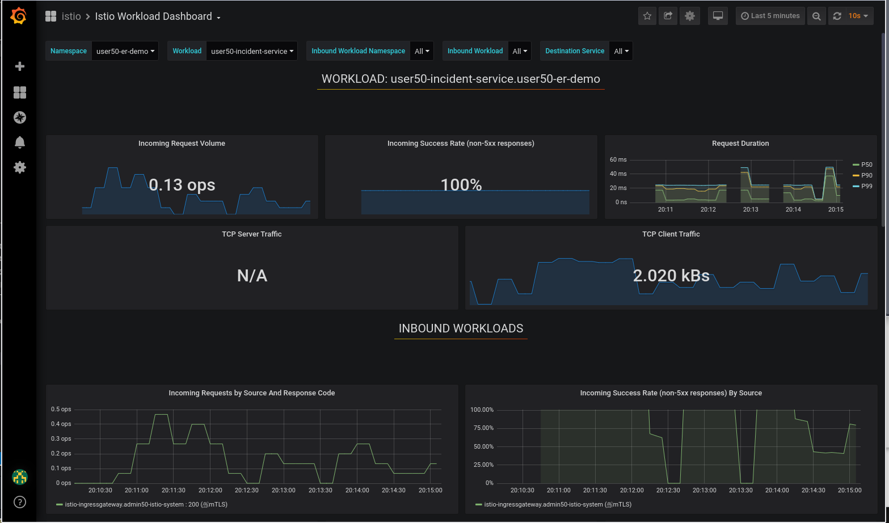
+
Verify that the `v2` version of the service gets a lot more traffic:
+
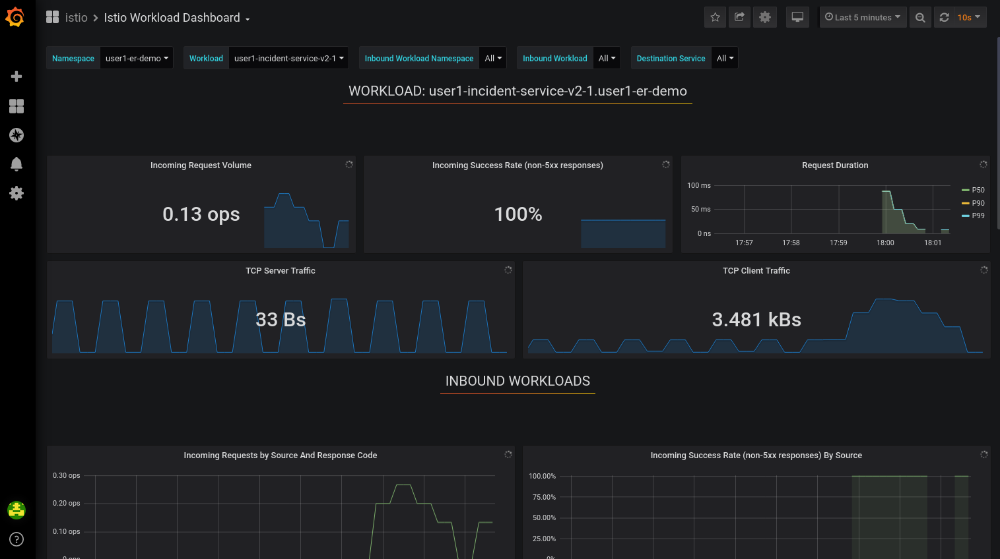

. The requirement for the custom metric is to count the number of invocations that hit each version of the service. +
First you create the _Instance_ resource, which defines an instance of the metric to be sent from the Envoy proxy to the Mixer:
+
----
$ echo "---
apiVersion: config.istio.io/v1alpha2
kind: instance
metadata:
  name: version-count
spec:
  compiledTemplate: metric
  params:
    value: \"1\"
    dimensions:
      source: source.workload.name | \"unknown\"
      version: destination.labels[\"version\"] | \"unknown\"
      destination: destination.service.name | \"unknown\"
    monitored_resource_type: '\"UNSPECIFIED\"'
"  | oc create -f - -n $ERDEMO_NS
----
* For each instance of `version-count`, the configuration directs Mixer to supply a value of 1 for the instance. Because Envoy generates an instance for each request, this means that this metric records the total number of requests received.
* A set of dimensions are specified for each `version-count` instance. Dimensions provide a way to slice, aggregate, and analyze metric data according to different needs and directions of inquiry. For instance, it may be desirable to only consider requests for a certain destination service when troubleshooting application behavior.
* One of the dimensions used for the new metric is the value of the version label on the destination pod - `destination.labels["version"]`
* The configuration instructs Mixer to populate values for these dimensions based on attribute values and literal values. For instance, for the source dimension, the new configuration requests that the value be taken from the `source.workload.name` attribute. If that attribute value is not populated, the rule instructs Mixer to use a default value of "unknown".

. Create the _Handler_, which specifies how the Prometheus adapter code translates received metric instances into Prometheus-formatted values that can be processed by a Prometheus backend.
+
----
$ echo "---
apiVersion: config.istio.io/v1alpha2
kind: handler
metadata:
  name: version-count-handler
spec:
  compiledAdapter: prometheus
  params:
    metrics:
    - name: version_count
      instance_name: version-count.instance.$ERDEMO_NS
      kind: COUNTER
      label_names:
      - source
      - version
      - destination
" | oc create -f - -n $ERDEMO_NS
----
+
* This configuration specifies a new Prometheus metric named `version_count`. 
* The Prometheus adapter prepends the `istio_` namespace to all metric names, therefore this metric will show up in Prometheus as `istio_version_count`. 
* The metric has three labels matching the dimensions configured for `version-count` instances.
* The kind of metric is a _Counter_, which is a monotonically increasing value.
. Create a _Rule_ resource to bind the Instance to the Handler:
+
----
$ echo "---
apiVersion: \"config.istio.io/v1alpha2\"
kind: rule
metadata:
  name: version-count-prometheus
spec:
  match: (context.protocol == \"http\") && (destination.service.host == \"$ERDEMO_USER-incident-service.$ERDEMO_NS.svc.cluster.local\")
  actions:
  - handler: version-count-handler
    instances:
    - version-count
" | oc create -f - -n $ERDEMO_NS
----
* _Match_ is an attribute based predicate. When Mixer receives a request it evaluates the match expression and executes all the associated actions if the match evaluates to true.
* In this example, the `version-count` metric will only be generated when the request is a HTTP request and the destination service is the Incident Service.

. Generate some traffic to the Incident Service:
+
----
$ while :; do curl -k https://incident-service.$ERDEMO_USER.apps.$SUBDOMAIN_BASE/incidents; sleep 1; done
----
. In a browser window, navigate to the Prometheus home page. In the metric drop-down box, locate the `istio-version-count` metric. If the metric does not show up, try refreshing the page. +
Select the `istio-version-count` metric, and click on _Execute_. Select the _Graph_ tab to display a graph of the metric. +
Expect to see a counter of the requests to the Incident Service, sliced according to the version:
+
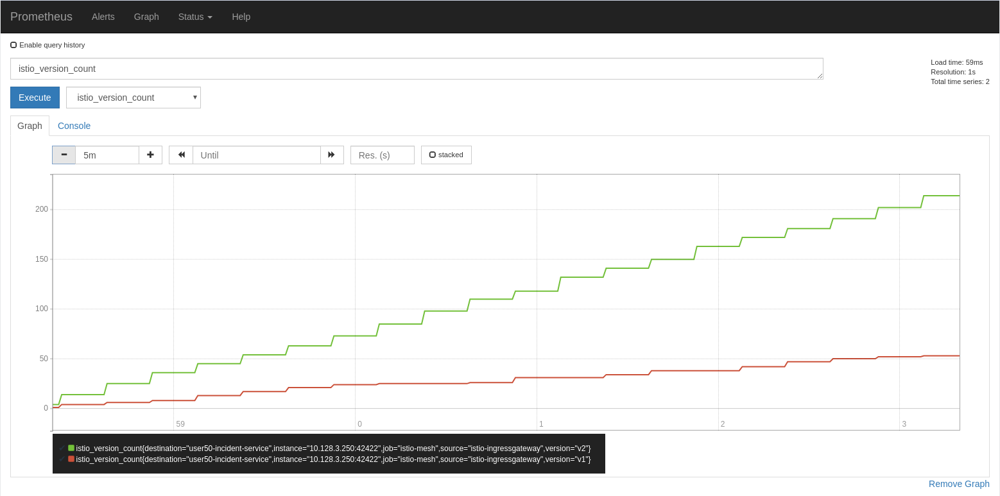

== Alerting in Prometheus

Prometheus allows you to define alerts on metrics. The Prometheus server alert functionality is limited to generating the alerts, so in order to do something useful with them you need an additional component of the Prometheus ecosystem, the _Alertmanager_. +
The Alertmanager handles alerts sent by client applications such as the Prometheus server. It takes care of deduplicating, grouping, and routing them to the correct receiver integration such as email, PagerDuty, or OpsGenie. It also takes care of silencing and inhibition of alerts.

NOTE: The default installation of Red Hat Service Mesh does include the Prometheus server, but not the AlertManager component. 

In this section of the lab, you will define a _Recording Rule_, and define alerts based on the rule.

Recording rules allow you to precompute frequently needed or computationally expensive expressions and save their result as a new set of time series.

Recording and alerting rules exist in a rule group. Rules within a group are run sequentially at a regular interval. Recording and alerting rules are configured in their own files, which are referenced from the general Prometheus configuration file.

. The Service Mesh Prometheus main configuration file is managed by the `prometheus` ConfigMap in the control plane namespace. The ConfigMap is mounted into the `/etc/prometheus` directory of the Prometheus pod. +
The recording and alerting rules need to be added to the ConfigMap.
.. Extract the current Prometheus configuration from the ConfigMap to your local system:
+
----
$ oc extract cm/prometheus -n $SM_CP_NS --to=. --keys=prometheus.yml
----
.. Open the `prometheus.yml` file with your favourite text editor and make the following changes:
... In the `global` section, add the evaluation interval for recording and alerting rules:
+
----
global:
  scrape_interval: 15s
  evaluation_interval: 15s

[...]
----
... Under the `global` section, add the configuration for the rules file location:
+
----
global:
  scrape_interval: 15s
  evaluation_interval: 15s

rule_files:
- "*.rules"

[...]
----
+
Save the file.
.. Create a new file `ingress.rules` for the recording rule. In this example you create a recording rule for the 0.5, 0.9 and 0.99 quantiles of the request duration for all request which have the Istio Ingress Gateway as source workload:
+
----
$ echo "
groups:
  - name: ingress_gateway
    rules:
      - record: ingress:request_duration_seconds:histogram_quantile
        expr: histogram_quantile(0.5 ,sum(irate(istio_request_duration_seconds_bucket{source_workload=\"istio-ingressgateway\"} [1m])) by (destination_workload, le))
        labels:
          quantile: \"0.5\"
      - record: ingress:request_duration_seconds:histogram_quantile
        expr: histogram_quantile(0.9, sum(irate(istio_request_duration_seconds_bucket{source_workload=\"istio-ingressgateway\"} [1m])) by (destination_workload, le))
        labels:
          quantile: \"0.9\"
      - record: ingress:request_duration_seconds:histogram_quantile
        expr: histogram_quantile(0.99,sum(irate(istio_request_duration_seconds_bucket{source_workload=\"istio-ingressgateway\"} [1m])) by (destination_workload, le))
        labels:
          quantile: \"0.99\"
" > ingress.rules
----
.. Create another file `ingress-alert.rules` to define an alert based on the histogram calculated by the recording rule. +
As an example, let's say you want to fire an alert whenever 90% of the requests to the Incident Service have a response time higher than 1 second, for more than 30 seconds.
+
----
$ echo "
groups:
  - name: ingress_gateway_alerts
    rules:
      - alert: IncidentServiceHighResponseTime 
        expr:  ingress:request_duration_seconds:histogram_quantile{quantile=\"0.9\",destination_workload=~\"^$ERDEMO_USER-incident-service.*\"} > 1
        for: 30s
        labels:
          severity: high
        annotations:
          message: The Incident Service has a 90th percentile response time of {{ \$value }} seconds for destination {{ \$labels.destination_workload }}.
" > ingress-alert.rules
----
.. Delete the `prometheus` ConfigMap in the control plane namespace and create a new one from the configuration and rule files.
+
----
$ oc delete configmap prometheus -n $SM_CP_NS
$ oc create configmap prometheus -n $SM_CP_NS --from-file=prometheus.yml --from-file=ingress.rules --from-file=ingress-alert.rules --save-config=true
$ oc label configmap prometheus -n $SM_CP_NS app=prometheus app.kubernetes.io/component=prometheus app.kubernetes.io/instance=$SM_CP_NS app.kubernetes.io/managed-by=maistra-istio-operator app.kubernetes.io/name=prometheus app.kubernetes.io/part-of=istio app.kubernetes.io/version=1.0.1-8.el8-1 chart=prometheus heritage=Tiller maistra.io/owner=$SM_CP_NS release=istio
----
. Restart the Prometheus pod in the control plane namespace:
+
----
$ oc patch deployment prometheus -p '{"spec":{"template":{"metadata":{"annotations":{"kubectl.kubernetes.io/restartedAt": "'`date -Iseconds`'"}}}}}' -n $SM_CP_NS
----
. In the Prometheus UI, navigate to the _Status->Rules_ page, and verify that the recording and alerting rules are present.
+
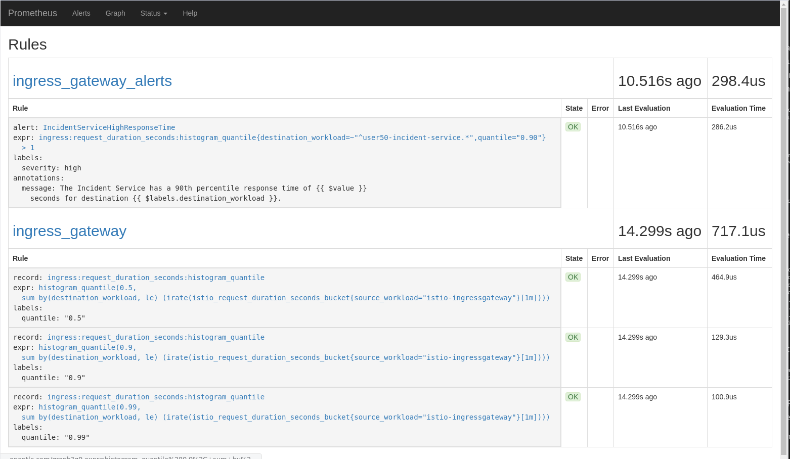 
. Generate traffic to the Incident Service:
+
----
$ while :; do curl -k https://incident-service.$ERDEMO_USER.apps.$SUBDOMAIN_BASE/incidents; sleep 1; done
----
. In the Prometheus UI, navigate to the _Graph_ page. +
Paste the following expression in the _Expression_ box: `ingress:request_duration_seconds:histogram_quantile{destination_workload=~"^$ERDEMO_USER-incident-service.*"}`. Click _Execute_. +
Expect to see values for the histogram quantiles of the response times of ingress traffic to the Incident Service:
+
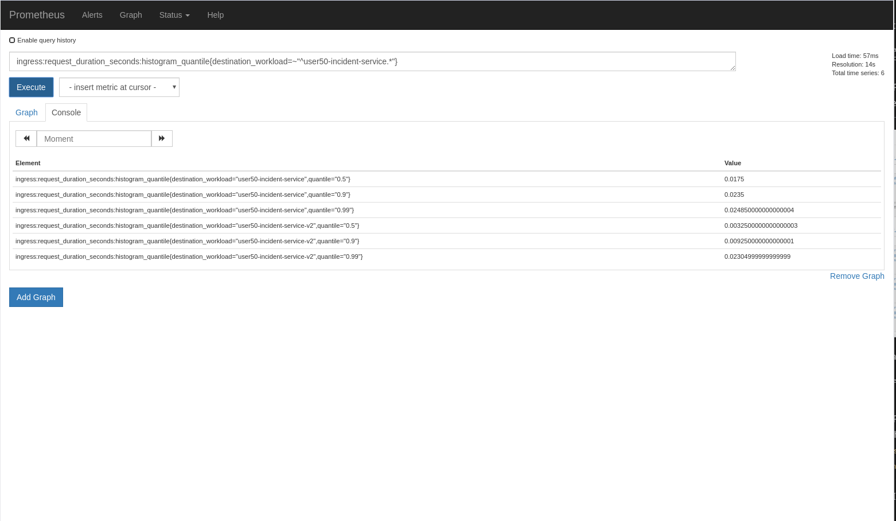
+
image::images/prometheus-quantiles-graph.png[]
. In the Prometheus UI, navigate to the Alerts_ page. Note that the `IncidentServiceHighResponseTime` is present, and has zero activations.
+
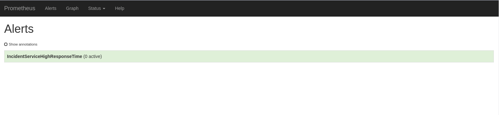

. To trigger the alert, you can use the fault injection mechanism from Service Mesh. This functionality allows to inject HTTP delays or HTTP error codes into requests to services. This is often used to test the resiliency of an application. Fault injection rules are defined in _VirtualService_ resources. +
Add the fault injection definition to the Incident Service VirtualService: 
+
----
$ echo "---
apiVersion: networking.istio.io/v1alpha3
kind: VirtualService
metadata:
  name: incident-service-virtualservice
spec:
  gateways:
    - erd-wildcard-gateway.$SM_CP_NS.svc.cluster.local
  hosts:
    - incident-service.$ERDEMO_USER.apps.$SUBDOMAIN_BASE
  http:
    - match:
        - uri:
            prefix: /incidents
      route:
        - destination:
            host: $ERDEMO_USER-incident-service.$ERDEMO_NS.svc.cluster.local
            port:
              number: 8080
            subset: v1
          weight: 20
        - destination:
            host: $ERDEMO_USER-incident-service.$ERDEMO_NS.svc.cluster.local
            port:
              number: 8080
            subset: v2
          weight: 80
      fault:
        delay:
          fixedDelay: 2s
          percentage:
            value: 30 
" | oc apply -f - $ERDEMO_NS
----
+
* In this case a delay of 2 seconds will be injected in 30% of the requests to the Incident Service.
. Generate traffic to the Incident Service:
+
----
$ while :; do curl -k https://incident-service.$ERDEMO_USER.apps.$SUBDOMAIN_BASE/incidents; sleep 1; done
----
. In the Prometheus UI, navigate to the _Alerts_ page. Refresh the page regularly, until you see one or two alerts activated. Click on the alert bar to see the details of the alert:
+
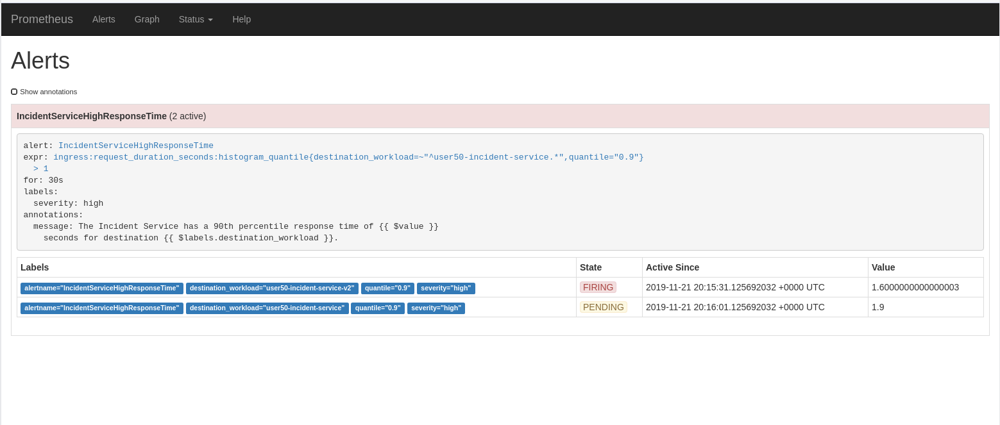
+
Once the condition in the alert expression evaluates to true, the alert will be put in _pending_ state. If the alert continues to be active for each evaluation during the period specified in the optional _for_ clause of the alert definition, the alert will be _fired_. Once fired, the alert is cleared.
