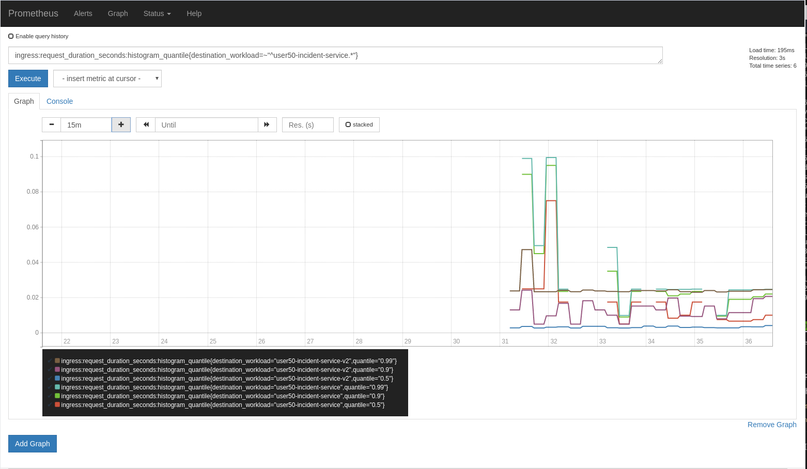

:noaudio:
:scrollbar:
:toc2:
:linkattrs:
:data-uri:

== Observability: Metrics and Monitoring Lab

.Goals
* Understand metrics and monitoring in Red Hat^(R)^ OpenShift^(R)^ Service Mesh
* Create and collect custom metrics
* Define alerts in Prometheus

:numbered:

== Explore OpenShift Service Mesh Metrics and Monitoring

One of the core features of OpenShift Service Mesh is the observability of network traffic. Because all service-to-service communication goes through Envoy proxies, and the service mesh control plane is able to gather logs and metrics from these proxies, the service mesh can give deep insights about the mesh network.

The Mixer component of the control plane is responsible for telemetry collection. In fact, Mixer is two different deployments in OpenShift Container Platform: `istio-policy` and `istio-telemetry`. `istio-policy` is responsible for providing policy controls and `istio-telemetry` handles metrics collection.

The Envoy sidecars from the application pods call `istio-policy` before each request to perform precondition policy checks and `istio-telemetry` after each request to report telemetry. Note that the sidecar has local caching so that a large percentage of precondition checks can be performed from the cache. Additionally, the sidecar buffers outgoing telemetry to reduce the frequency of Mixer calls.

=== Explore Prometheus
Mixer comes standard with a Mixer adapter for Prometheus, allowing a Prometheus instance to scrape metrics from Mixer.

The service mesh instance of Prometheus is configured with a number of scraping targets, which means it collects metrics not only from Mixer, but also from the other control plane components and from each sidecar. All of these metrics are aggregated and visualized in a Grafana dashboard.

. Make sure you are logged in to OpenShift Container Platform as the control plane admin user:
+
----
$ oc login $LAB_MASTER_API -u $SM_CP_ADMIN -p $OCP_PASSWD
----
. Obtain the URL of the Prometheus UI:
+
----
$ echo -en "\n\nhttps://$(oc get route prometheus -o template --template={{.spec.host}} -n $SM_CP_NS)\n\n"
----
. In a browser window, navigate to the Prometheus UI.
. Navigate to *Status -> Targets* to view all of the scraping targets discovered by the Prometheus server:
+

* These targets include:

** `envoy-stats`: The different envoy proxies.
** `istio-mesh`: The scraping target for service mesh metrics through Mixer's Prometheus adapter.
** `citadel`, `pilot`, `galley`, `istio-telemetry`, `istio-policy`: The metrics exposed by the control plane components about themselves.
** `kubernetes-service-endpoints`: Service endpoints that do not necessarily belong to the mesh. They are discovered automatically because the service resources--for example, the ZooKeeper and Kafka pods in the Emergency Response Demo namespace--have Prometheus annotations.

. Click *Graph* and then click the *insert metric at cursor* list to see which metrics are scraped by this Prometheus instance:
+
image::images/prometheus-metrics.png[]

* The metrics are prefixed according to their source:

** `envoy_`: The metrics exposed by the Envoy proxy.
** `istio_`: The metrics exposed through the Mixer's Prometheus adapter, including the following:
*** `istio_requests_total`: A counter that aggregates request totals. For example, it can be used to calculate the number of requests per second grouped by source, destination, protocol, and response code.
*** `istio_request_duration_seconds`: A histogram that collects latency for requests between workloads.
*** `istio_request_bytes` and `istio_response_bytes`: Histograms that collect the ingoing and outgoing bytes per request and response.

. Internally, the metrics exposed through Mixer are configured with a combination of `instance`, `handler`, and `rule` resources.
.. Get a list of the default metrics:
+
----
$ oc get instance -n $SM_CP_NS
----
+
.Sample Output
----
NAME                   AGE
attributes             2d4h
requestcount           2d4h
requestduration        2d4h
requestsize            2d4h
responsesize           2d4h
tcpbytereceived        2d4h
tcpbytesent            2d4h
tcpconnectionsclosed   2d4h
tcpconnectionsopened   2d4h
----
* The `instance` resources are translated into Prometheus metrics.
.. View details of an `instance` resource:
+
----
$ oc get instance requestcount -o yaml -n $SM_CP_NS
----
+
.Sample Output (truncated)
----
apiVersion: config.istio.io/v1alpha2
kind: instance
metadata:
  [...]
spec:
  compiledTemplate: metric
  params:
    dimensions:
      connection_security_policy: conditional((context.reporter.kind | "inbound")
        == "outbound", "unknown", conditional(connection.mtls | false, "mutual_tls",
        "none"))
      destination_app: destination.labels["app"] | "unknown"
      destination_principal: destination.principal | "unknown"
      destination_service: destination.service.host | conditional((destination.service.name
        | "unknown") == "unknown", "unknown", request.host)
      destination_service_name: destination.service.name | "unknown"
      destination_service_namespace: destination.service.namespace | "unknown"
      destination_version: destination.labels["version"] | "unknown"
      destination_workload: destination.workload.name | "unknown"
      destination_workload_namespace: destination.workload.namespace | "unknown"
      grpc_response_status: response.grpc_status | ""
      reporter: conditional((context.reporter.kind | "inbound") == "outbound", "source",
        "destination")
      request_protocol: api.protocol | context.protocol | "unknown"
      response_code: response.code | 200
      response_flags: context.proxy_error_code | "-"
      source_app: source.labels["app"] | "unknown"
      source_principal: source.principal | "unknown"
      source_version: source.labels["version"] | "unknown"
      source_workload: source.workload.name | "unknown"
      source_workload_namespace: source.workload.namespace | "unknown"
    monitored_resource_type: '"UNSPECIFIED"'
    value: "1"
----
.. View a `handler` resource:
+
----
$ oc get handler prometheus -o yaml -n $SM_CP_NS
----
+
.Sample Output (Truncated)
----
apiVersion: config.istio.io/v1alpha2
kind: handler
metadata:
  [...]
spec:                                                                                                                
  compiledAdapter: prometheus                                                                                        
  params:                                                                                                            
    metrics:                                                                                                         
    - instance_name: requestcount.instance.admin50-istio-system                                                       
      kind: COUNTER                                                                                                  
      label_names:                                                                                                   
      - reporter                                                                                                     
      - source_app                                                                                                   
      - source_principal                                                                                             
      - source_workload                                                                                              
      - source_workload_namespace                                                                                    
      - source_version                                                                                               
      - destination_app                                                                                              
      - destination_principal 
      - destination_workload
      - destination_workload_namespace
      - destination_version
      - destination_service
      - destination_service_name
      - destination_service_namespace
      - request_protocol
      - response_code
      - grpc_response_status
      - response_flags
      - connection_security_policy
      name: requests_total
    [...]
----
** The `prometheus` handler describes the Prometheus metrics and references the metric custom resources in the `instance_name` fields. It also defines the name that can be used in Prometheus queries later (with the `istio` prefix)--such as `requests_total`&#8212;and the labels used to group the metrics.

.. View the `rule` resources, which bind the metrics to the handlers:
+
----
$ oc get rule -n $SM_CP_NS
----
+
.Sample Output
----
NAME                      AGE
kubeattrgenrulerule       9d
promhttp                  9d
promtcp                   9d
promtcpconnectionclosed   9d
promtcpconnectionopen     9d
tcpkubeattrgenrulerule    9d
----
.. View the details of a `rule` resource:
+
----
$ oc get rule promhttp -o yaml -n $SM_CP_NS
----
+
.Sample Output (Truncated)
----
apiVersion: config.istio.io/v1alpha2
kind: rule
metadata:
  [...]
spec:
  actions:
  - handler: prometheus
    instances:
    - requestcount.metric
    - requestduration.metric
    - requestsize.metric
    - responsesize.metric
  match: (context.protocol == "http" || context.protocol == "grpc") && (match((request.useragent
    | "-"), "kube-probe*") == false) && (match((request.useragent | "-"), "Prometheus*")
    == false)
----

=== Explore Grafana
Prometheus is essentially a time-series database, and as such has limited functionality for displaying metric data in graphs and dashboards. That is why Prometheus is often deployed together with Grafana. Grafana uses the Prometheus time-series as a data source for graphics and dashboards. The default installation of service mesh includes Grafana and prebuilt dashboards for the different metric groups obtained from Prometheus.

. Obtain the URL for the Grafana instance:
+
----
$ echo -en "\n\nhttps://$(oc get route grafana -o template --template={{.spec.host}} -n $SM_CP_NS)\n\n"
----
. In a browser window, navigate to the Grafana home page and log in with the control plane admin username and password:
+
image::images/grafana-homepage.png[]
. Click *Home* and select the *Istio* folder to see the different default dashboards:
+
image::images/grafana-dashboards.png[]
. Select *Istio Workload Dashboard*:
+

* This dashboard groups the dashboards for the different metric groups obtained through the Mixer's Prometheus adapter.
* In the selection bar at the top, you can select the namespace and workload you want to see, then filter further on inbound workload namespace, inbound workload, and destination service.

== Create and Collect Custom Metrics

The default metrics generated by the service mesh are usually sufficient. But in some cases, you can imagine a need for specific metrics that are not readily generated by the service mesh.

The service mesh allows you to define additional metrics through a combination of `instance`, `handler`, and `rule` resources. These metrics are made available by Mixer for scraping by Prometheus.

In this section of the lab, you create a custom metric that counts the number of requests per version of the incident service. First, you deploy a second version of the incident service and distribute traffic between the two versions.

. Label the deployed version of the incident service as `v1`:
+
----
$ oc patch dc $ERDEMO_USER-incident-service -p '{"spec":{"template":{"metadata":{"labels":{"version":"v1"}}}}}' -n $ERDEMO_NS
----
* This forces a redeployment of the incident service pods.
. Deploy version `v2` of the incident service:
+
----
$ echo "---
apiVersion: apps.openshift.io/v1
kind: DeploymentConfig
metadata:
  labels:
    app: $ERDEMO_USER-incident-service
  name: $ERDEMO_USER-incident-service-v2
spec:
  replicas: 1
  revisionHistoryLimit: 2
  selector:
    app: $ERDEMO_USER-incident-service
    group: erd-services
  strategy:
    type: Recreate
    recreateParams:
      timeoutSeconds: 600
    resources: {}
    activeDeadlineSeconds: 21600
  template:
    metadata:
      annotations:
        sidecar.istio.io/inject: 'true'
        sidecar.istio.io/rewriteAppHTTPProbers: 'true'
      creationTimestamp: null
      labels:
        app: $ERDEMO_USER-incident-service
        group: erd-services
        version: v2
    spec:
      containers:
      - env:
        - name: KUBERNETES_NAMESPACE
          valueFrom:
            fieldRef:
              apiVersion: v1
              fieldPath: metadata.namespace
        imagePullPolicy: IfNotPresent
        livenessProbe:
          httpGet:
            path: /health/live
            port: 8080
            scheme: HTTP
          initialDelaySeconds: 10
          timeoutSeconds: 3
          periodSeconds: 30
          successThreshold: 1
          failureThreshold: 3
        name: $ERDEMO_USER-incident-service
        ports:
        - name: http
          containerPort: 8080
          protocol: TCP
        readinessProbe:
          httpGet:
            path: /health/ready
            port: 8080
            scheme: HTTP
          initialDelaySeconds: 3
          timeoutSeconds: 3
          periodSeconds: 10
          successThreshold: 1
          failureThreshold: 3
        resources:
          limits:
            cpu: 500m
            memory: 500Mi
          requests:
            cpu: 100m
            memory: 200Mi
        securityContext:
          privileged: false
          procMount: Default
        terminationMessagePath: /dev/termination-log
        terminationMessagePolicy: File
        volumeMounts:
        - name: config
          mountPath: /deployments/config
      dnsPolicy: ClusterFirst
      restartPolicy: Always
      schedulerName: default-scheduler
      securityContext: {}
      serviceAccount: incident-service
      serviceAccountName: incident-service
      terminationGracePeriodSeconds: 30
      volumes:
      - name: config
        configMap:
          name: incident-service
          defaultMode: 420
  test: false
  triggers:
  - type: ConfigChange
  - type: ImageChange
    imageChangeParams:
      automatic: true
      containerNames:
      - $ERDEMO_USER-incident-service
      from:
        kind: ImageStreamTag
        name: $ERDEMO_USER-incident-service:sm-tracing
        namespace: $ERDEMO_NS
" | oc create -f - -n $ERDEMO_NS
----

* Note that for the sake of simplicity, you are deploying the same image of the incident service. Only the value of the `version` label marks the difference between the two.
. Observe that both deployments are bound to the same service:
+
----
$ oc get service $ERDEMO_USER-incident-service -o custom-columns=NAME:.metadata.name,SELECTOR:.spec.selector -n $ERDEMO_NS
----
+
.Sample Output
----
NAME                      SELECTOR
user50-incident-service   map[app:user50-incident-service group:erd-services]
----
* The `Selector` of the service matches the labels `app=$ERDEMO_USER-incident-service` and `group=erd-services`.
. Verify that the incident service has two endpoints:
+
----
$ oc describe service $ERDEMO_USER-incident-service -n $ERDEMO_NS | grep Endpoints
----
+
.Sample Output
----
Endpoints:         10.128.3.245:8080,10.128.3.247:8080
----

* The traffic directed to the incident service will be more or less equally distributed between the two versions.
. To make things a bit more interesting, give a weight to each service by defining subsets of the service in the incident service DestinationRule and configuring routing weights in the incident service VirtualService:
.. Define the incident service subsets in the DestinationRule:
+
----
$ echo "---
apiVersion: networking.istio.io/v1alpha3
kind: DestinationRule
metadata:
  name: incident-service-client-mtls
spec:
  host: $ERDEMO_USER-incident-service.$ERDEMO_NS.svc.cluster.local
  trafficPolicy:
    tls:
      mode: ISTIO_MUTUAL
  subsets:
  - name: v1
    labels:
      version: v1
  - name: v2
    labels:
      version: v2
" | oc apply -f - -n $ERDEMO_NS
----
.. Add routing instructions to the VirtualService:
+
----
$ echo "---
apiVersion: networking.istio.io/v1alpha3
kind: VirtualService
metadata:
  name: incident-service-virtualservice
spec:
  hosts:
  - incident-service.$ERDEMO_USER.apps.$SUBDOMAIN_BASE
  gateways:
  - erd-wildcard-gateway.$SM_CP_NS.svc.cluster.local
  http:
    - match:
        - uri:
            prefix: /incidents
      route:
        - destination:
            host: $ERDEMO_USER-incident-service.$ERDEMO_NS.svc.cluster.local
            port:
              number: 8080
            subset: v1
          weight: 20
        - destination:
            host: $ERDEMO_USER-incident-service.$ERDEMO_NS.svc.cluster.local
            port:
              number: 8080
            subset: v2
          weight: 80
" | oc apply -f - -n $ERDEMO_NS
----
* In the example above, roughly 80% of the requests are to be routed to version `v2` of the incident service.
. Create some traffic to the incident service:
+
----
$ while :; do curl -k https://incident-service.$ERDEMO_USER.apps.$SUBDOMAIN_BASE/incidents; sleep 1; done
----
. In the *Istio Workload Dashboard* in Grafana, select the application namespace and the incident service workload to verify that some traffic reaches the original version (`v1`) of the incident service:
+
image::images/grafana-workload-1.png[]

. Verify that the `v2` version of the service gets a lot more traffic:
+
image::images/grafana-workload-2.png[]

. The requirement for the custom metric is to count the number of invocations that hit each version of the service, so first create the `instance` resource, which defines an instance of the metric to be sent from the Envoy proxy to the Mixer:
+
----
$ echo "---
apiVersion: config.istio.io/v1alpha2
kind: instance
metadata:
  name: version-count
spec:
  compiledTemplate: metric
  params:
    value: \"1\"
    dimensions:
      source: source.workload.name | \"unknown\"
      version: destination.labels[\"version\"] | \"unknown\"
      destination: destination.service.name | \"unknown\"
    monitored_resource_type: '\"UNSPECIFIED\"'
"  | oc create -f - -n $ERDEMO_NS
----
* For each instance of `version-count`, the configuration directs Mixer to supply a value of `1` for the instance. Because Envoy generates an instance for each request, this means that this metric records the total number of requests received.
* A set of dimensions are specified for each `version-count` instance. Dimensions provide a way to slice, aggregate, and analyze metric data according to different needs and directions of inquiry. For instance, it may be desirable to only consider requests for a certain destination service when troubleshooting application behavior.
* One of the dimensions used for the new metric is the value of the version label on the destination pod: `destination.labels["version"]`.
* The configuration instructs Mixer to populate values for these dimensions based on attribute values and literal values. For instance, for the source dimension, the new configuration requests that the value be taken from the `source.workload.name` attribute. If that attribute value is not populated, the rule instructs Mixer to use a default value of `"unknown"`.

. Create the `handler` resource, which specifies how the Prometheus adapter code translates received metric instances into Prometheus-formatted values that can be processed by a Prometheus back end:
+
----
$ echo "---
apiVersion: config.istio.io/v1alpha2
kind: handler
metadata:
  name: version-count-handler
spec:
  compiledAdapter: prometheus
  params:
    metrics:
    - name: version_count
      instance_name: version-count.instance.$ERDEMO_NS
      kind: COUNTER
      label_names:
      - source
      - version
      - destination
" | oc create -f - -n $ERDEMO_NS
----

* This configuration specifies a new Prometheus metric named `version_count`.
* The Prometheus adapter prepends the `istio_` namespace to all metric names, therefore this metric appears in Prometheus as `istio_version_count`.
* The metric has three labels matching the dimensions configured for `version-count` instances.
* The kind of metric is a _counter_, which is a monotonically increasing value.
. Create a `rule` resource to bind the instance to the handler:
+
----
$ echo "---
apiVersion: \"config.istio.io/v1alpha2\"
kind: rule
metadata:
  name: version-count-prometheus
spec:
  match: (context.protocol == \"http\") && (destination.service.host == \"$ERDEMO_USER-incident-service.$ERDEMO_NS.svc.cluster.local\")
  actions:
  - handler: version-count-handler
    instances:
    - version-count
" | oc create -f - -n $ERDEMO_NS
----
* `match` is an attribute-based predicate. When Mixer receives a request, it evaluates the match expression and executes all of the associated actions if the match evaluates to true.
* In this example, the `version-count` metric is only generated when the request is an HTTP request and the destination service is the incident service.

. Generate some traffic to the incident service:
+
----
$ while :; do curl -k https://incident-service.$ERDEMO_USER.apps.$SUBDOMAIN_BASE/incidents; sleep 1; done
----
. In a browser window, navigate to the Prometheus home page and locate the `istio-version-count` metric in the *Metric* list. If the metric does not show up, try refreshing the page.
. Select the `istio-version-count` metric and click *Execute*.
. Select the *Graph* tab to display a graph of the metric:
+
image::images/prometheus-custom-metric.png[]
* Expect to see a counter of the requests to the incident service, sliced according to the version.

== Define Alerts in Prometheus

Prometheus allows you to define alerts on metrics. The Prometheus server alert functionality is limited to generating the alerts, so in order to do something useful with them, you need an additional component of the Prometheus ecosystem--the _Alertmanager_.
The Alertmanager handles alerts sent by client applications such as the Prometheus server. It takes care of deduplicating, grouping, and routing them to the correct receiver integration such as email, PagerDuty, or OpsGenie. It also takes care of silencing and inhibiting alerts.

NOTE: The default installation of OpenShift Service Mesh includes the Prometheus server, but not the Alertmanager component.

In this section of the lab, you define a _recording rule_ and alerts based on the rule.
Recording rules allow you to precompute frequently needed or computationally expensive expressions and save their results as a new time series set.

Recording and alerting rules exist in a rule group. Rules within a group are run sequentially at a regular interval. Recording and alerting rules are configured in their own files, which are referenced from the general Prometheus configuration file.

The main configuration file for the service mesh Prometheus adapter is managed by the `prometheus` ConfigMap in the control plane namespace. The ConfigMap is mounted into the `/etc/prometheus` directory of the Prometheus pod.
The recording and alerting rules need to be added to the ConfigMap.

. Extract the current Prometheus configuration from the ConfigMap to your local system:
+
----
$ oc extract cm/prometheus -n $SM_CP_NS --to=. --keys=prometheus.yml
----
. Open the `prometheus.yml` file with your favorite text editor and make the following changes:
.. In the `global` section, add the evaluation interval for recording and alerting rules:
+
----
global:
  scrape_interval: 15s
  evaluation_interval: 15s

[...]
----
.. Under the `global` section, add the configuration for the rules file location:
+
----
global:
  scrape_interval: 15s
  evaluation_interval: 15s

rule_files:
- "*.rules"

[...]
----
+
. Save the file.
. Create a new `ingress.rules` file for the recording rule. In this example, you create a recording rule for the `0.5`, `0.9`, and `0.99` quantiles of the request duration for all requests that have the Istio ingress gateway as the source workload:
+
----
$ echo "
groups:
  - name: ingress_gateway
    rules:
      - record: ingress:request_duration_seconds:histogram_quantile
        expr: histogram_quantile(0.5 ,sum(irate(istio_request_duration_seconds_bucket{source_workload=\"istio-ingressgateway\"} [1m])) by (destination_workload, le))
        labels:
          quantile: \"0.5\"
      - record: ingress:request_duration_seconds:histogram_quantile
        expr: histogram_quantile(0.9, sum(irate(istio_request_duration_seconds_bucket{source_workload=\"istio-ingressgateway\"} [1m])) by (destination_workload, le))
        labels:
          quantile: \"0.9\"
      - record: ingress:request_duration_seconds:histogram_quantile
        expr: histogram_quantile(0.99,sum(irate(istio_request_duration_seconds_bucket{source_workload=\"istio-ingressgateway\"} [1m])) by (destination_workload, le))
        labels:
          quantile: \"0.99\"
" > ingress.rules
----
. Create an `ingress-alert.rules` file to define an alert based on the histogram calculated by the recording rule.
In this example, assume you want to fire an alert whenever 90% of the requests to the incident service have a response time higher than one second, for more than 30 seconds:
+
----
$ echo "
groups:
  - name: ingress_gateway_alerts
    rules:
      - alert: IncidentServiceHighResponseTime
        expr:  ingress:request_duration_seconds:histogram_quantile{quantile=\"0.9\",destination_workload=~\"^$ERDEMO_USER-incident-service.*\"} > 1
        for: 30s
        labels:
          severity: high
        annotations:
          message: The Incident Service has a 90th percentile response time of {{ \$value }} seconds for destination {{ \$labels.destination_workload }}.
" > ingress-alert.rules
----
. Delete the `prometheus` ConfigMap in the control plane namespace and create a new one from the configuration and rule files:
+
----
$ oc delete configmap prometheus -n $SM_CP_NS
$ oc create configmap prometheus -n $SM_CP_NS --from-file=prometheus.yml --from-file=ingress.rules --from-file=ingress-alert.rules --save-config=true
$ oc label configmap prometheus -n $SM_CP_NS app=prometheus app.kubernetes.io/part-of=istio app.kubernetes.io/instance=$SM_CP_NS release=istio app.kubernetes.io/version=1.1.1-5.el8-1 app.kubernetes.io/component=prometheus maistra-version=1.1.1 app.kubernetes.io/managed-by=maistra-istio-operator maistra.io/owner=$SM_CP_NS app.kubernetes.io/name=prometheus chart=prometheus heritage=Tiller
----
. Restart the Prometheus pod in the control plane namespace:
+
----
$ oc patch deployment prometheus -p '{"spec":{"template":{"metadata":{"annotations":{"kubectl.kubernetes.io/restartedAt": "'`date -Iseconds`'"}}}}}' -n $SM_CP_NS
----
. In the Prometheus UI, navigate to *Status -> Rules* and verify that the recording and alerting rules are present:
+

. Generate traffic to the incident service:
+
----
$ while :; do curl -k https://incident-service.$ERDEMO_USER.apps.$SUBDOMAIN_BASE/incidents; sleep 1; done
----
. In the Prometheus UI, navigate to the *Graph* page and paste the following expression in the *Expression* box: `ingress:request_duration_seconds:histogram_quantile{destination_workload=~"^$ERDEMO_USER-incident-service.*"}`.
. Click *Execute*.
* Expect to see values for the histogram quantiles of the response times of ingress traffic to the incident service:
+

+

. In the Prometheus UI, navigate to the *Alerts* page and observe that the `IncidentServiceHighResponseTime` is present and has zero activations:
+
image::images/prometheus-alert.png[]

. Use the fault injection mechanism from OpenShift Service Mesh to trigger the alert. This functionality allows to inject HTTP delays or HTTP error codes into requests to services. This is often used to test the resiliency of an application. Fault injection rules are defined in `VirtualService` resources.
.. Add the fault injection definition to the incident service VirtualService:
+
----
$ echo "---
apiVersion: networking.istio.io/v1alpha3
kind: VirtualService
metadata:
  name: incident-service-virtualservice
spec:
  gateways:
    - erd-wildcard-gateway.$SM_CP_NS.svc.cluster.local
  hosts:
    - incident-service.$ERDEMO_USER.apps.$SUBDOMAIN_BASE
  http:
    - match:
        - uri:
            prefix: /incidents
      route:
        - destination:
            host: $ERDEMO_USER-incident-service.$ERDEMO_NS.svc.cluster.local
            port:
              number: 8080
            subset: v1
          weight: 20
        - destination:
            host: $ERDEMO_USER-incident-service.$ERDEMO_NS.svc.cluster.local
            port:
              number: 8080
            subset: v2
          weight: 80
      fault:
        delay:
          fixedDelay: 2s
          percentage:
            value: 30
" | oc apply -f - -n $ERDEMO_NS
----

** In this case, a delay of two seconds will be injected in 30% of the requests to the incident service.
. Generate traffic to the incident service:
+
----
$ while :; do curl -k https://incident-service.$ERDEMO_USER.apps.$SUBDOMAIN_BASE/incidents; sleep 1; done
----
. From the *Alerts* page, refresh regularly until you see one or two alerts activated.
. Click the alert bar to see the details of the alert:
+
image::images/prometheus-alert-fired.png[]

* Once the condition in the alert expression evaluates to true, the alert is put in a `PENDING` state. If the alert continues to be active for each evaluation during the period specified in the optional `for` clause of the alert definition, the alert is _fired_. Once fired, the alert is cleared.

This concludes the lab. You learned about metrics and monitoring in OpenShift Service Mesh, created and collected custom metrics, and defined alerts in Prometheus.
