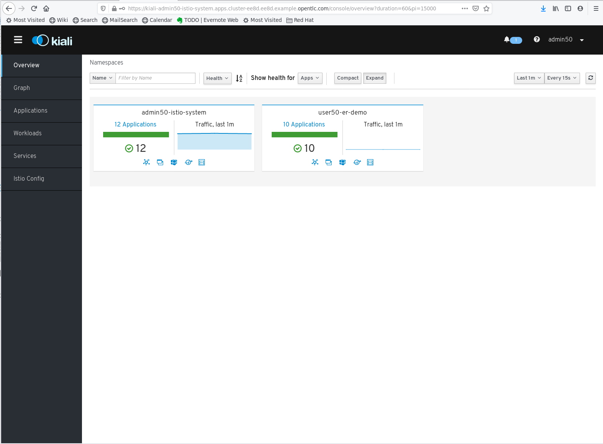
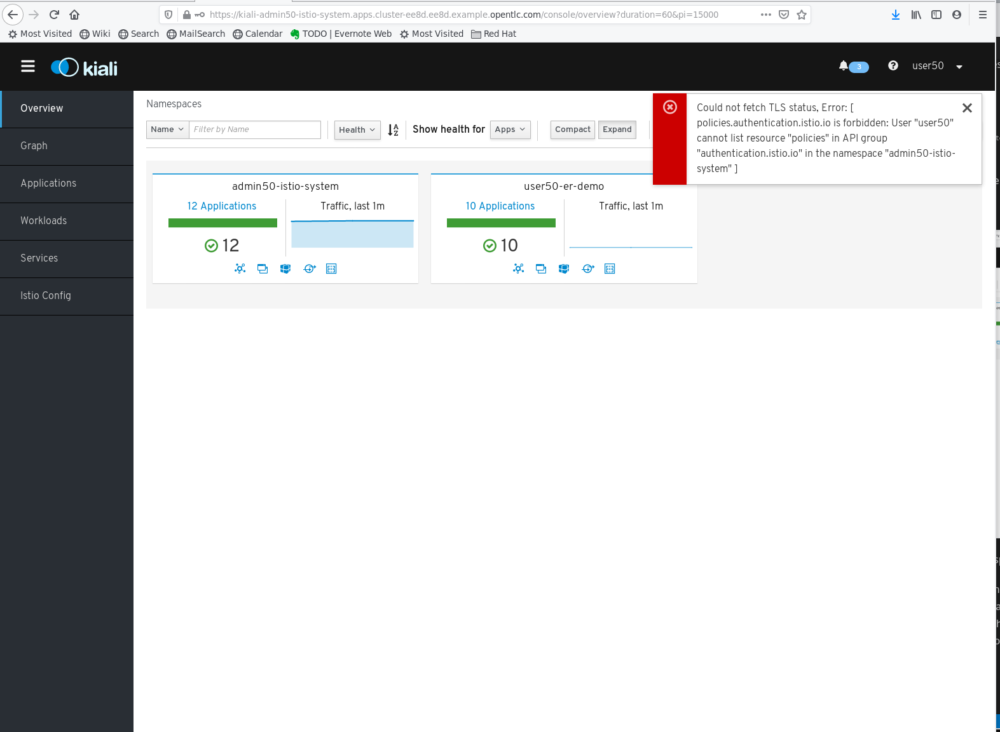
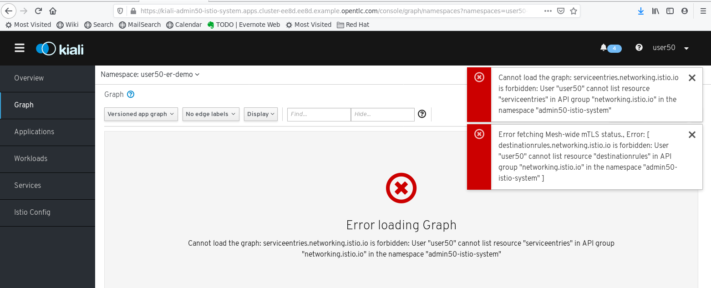
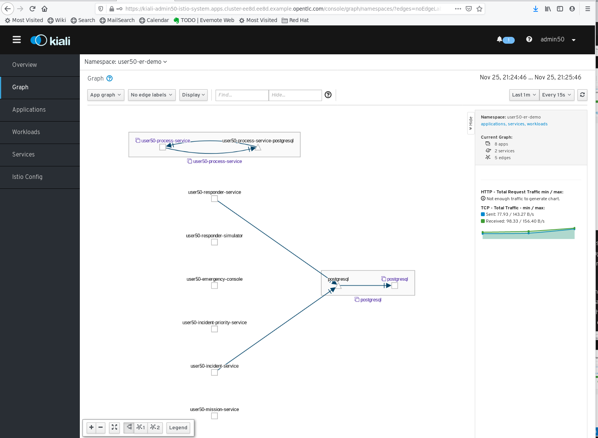
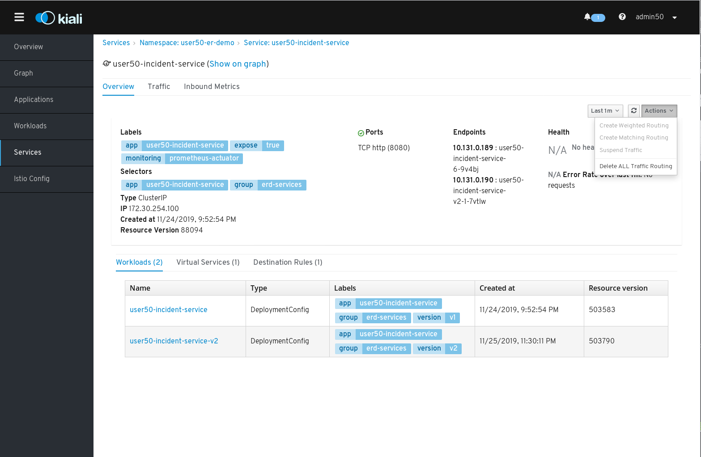
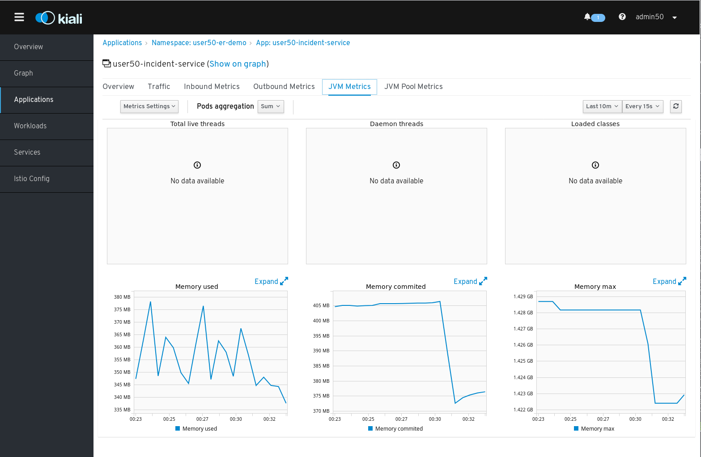
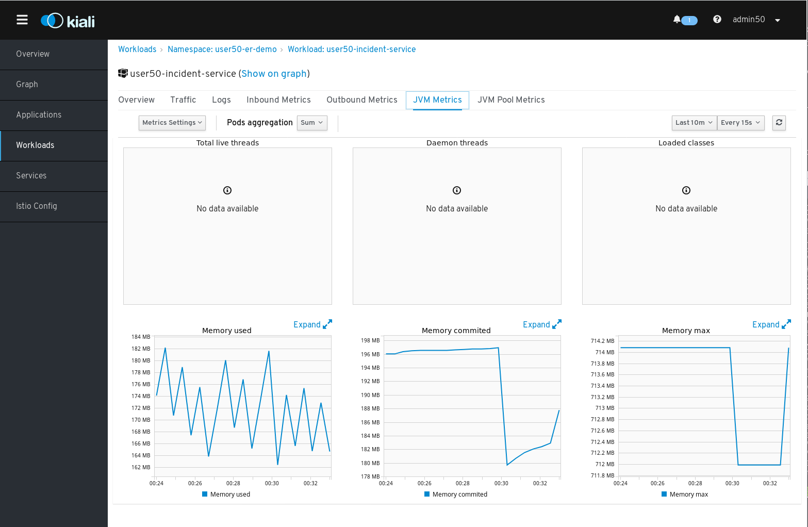
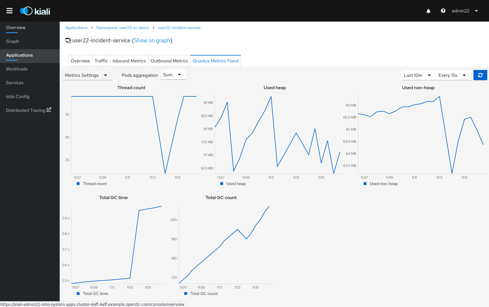

:noaudio:
:scrollbar:
:toc2:
:linkattrs:
:data-uri:

== Observability: Kiali Lab

.Goals
* Understand the Kiali console in Red Hat^(R)^ OpenShift^(R)^ Service Mesh

:numbered:

== Open Kiali Console

Kiali is the OpenShift Service Mesh console. Kiali helps you define, validate, and observe the connections and microservices of the service mesh. It visualizes the service mesh topology and provides visibility into features such as request routing, circuit breakers, request rates, latency and more. Kiali offers insights about the mesh components at different levels, from abstract applications to services and workloads.

. Obtain the URL of the Kiali console:
+
----
$ echo -en "\n\nhttps://$(oc get route kiali -o template --template={{.spec.host}} -n $SM_CP_NS)\n\n"
----
. In a browser window, navigate to the Kiali home page and log in with the control plane admin credentials:
+

* Expect to see the Kiali home page, which shows an overview of the namespaces that form the service mesh. From here you can navigate to the different pages in the application by clicking items in the left menu, or by clicking the icons in the namespace overview box.
+
[NOTE]
====
If you log in as the application owner, expect to see several errors related to the fact that the application owner has insufficient rights to resources in the control plane namespace that are required for the Kiali console to work well.

====

== Explore Console Features

The graph provides a powerful way to visualize the topology of the service mesh. It shows which services communicate with each other and the traffic rates and latencies between them, which helps to visually identify problem areas and quickly pinpoint issues. Kiali provides graphs that show a high-level view of service interactions, a low-level view of workloads, or a logical view of applications.

The graph also shows which services are configured with virtual services and circuit breakers. It identifies security issues by identifying traffic that is not configured as expected. The traffic flow between components can be observed by watching the animation or viewing the metrics.

. Click *Graph* in the left-hand menu and select the Emergency Response Demo namespace.
* Note that the topology graph of the service mesh is based on real-time traffic. Links between applications, services, or workloads are only shown when there is actual traffic detected between these components. When the Emergency Response Demo application is at rest, the graph looks like this:
+

. Generate some traffic into the applications using any of the following methods:
.. REST calls to the incident service:
+
----
$ while :; do curl -k https://incident-service.$ERDEMO_USER.apps.$SUBDOMAIN_BASE/incidents; sleep 1; done
----
.. REST calls to the responder service:
+
----
$ while :; do curl -k https://incident-service.$ERDEMO_USER.apps.$SUBDOMAIN_BASE/responders/available; sleep 1; done
----
.. Emergency Response Demo application runs.
. Observe how the graph changes when traffic hits the services of the application:
.. Click around in the graph menu to discover the different possibilities of graph visualization and traffic animation.
.. Click the traffic line between two services to discover traffic details.

. Explore *Applications*, *Workloads*, and *Services* to see details about the different components of the service mesh.
* *Applications* groups the services and workloads that share the same `app` label.
* *Services* are organized around Kubernetes services.
* *Workloads* represent DeploymentConfig and Deployment resources.
* For every one of these levels, the *Metrics* tab shows metric dashboards for inbound and outbound traffic. These metrics are the equivalent to those in the Grafana dashboards in OpenShift Service Mesh and they are obtained from the Prometheus instance.
+
[NOTE]
====
In order to see all of the `DeploymentConfigs` in the _Workloads_ list, you must modify the *Kiali* Custom Resource in the `$SM_CP_NS` namespace.

----
$ oc edit kiali kiali -n $SM_CP_NS
----

Add the following at the end of the `spec` section, under the `version` setting:

----
  version: v1.12
  kubernetes_config:
    excluded_workloads:
      - CronJob
      - Job
      - ReplicationController
      - StatefulSet
----

Save the Custom Resource. This will cause a redeployment of the Kiali pod.
====

. Explore *Istio Config* to see the different service mesh configuration resources such as gateways, VirtualServices, and DestinationRules. Kiali provides inline editions of the YAML representation of these resources, as well as powerful semantic validation.

. Click *Actions* on the Services *Overview* page to see the Istio wizards. Kiali provides these actions for creating, updating, and deleting Istio configuration resources--all driven by wizards:
+

* Note that the wizards are grayed out, as you have already defined traffic resources for the application's services.

== Explore Kiali Runtimes Monitoring

Kiali can display custom dashboards to monitor application metrics for applications and workloads.

The Kiali runtimes monitoring feature works with Prometheus, so Prometheus must be configured correctly to pull application metrics. For OpenShift Service Mesh, the Prometheus instance is configured to discover targets based on annotations on the application pods.

Kiali comes with a set of default dashboards for various runtimes, including Go, Node.js, Spring Boot, Quarkus, Vert.x, and Thorntail.

. Annotate the application pods by adding the following to the DeploymentConfig resources of the incident service (`$ERDEMO_USER-incident-service` and `$ERDEMO_USER-incident-service-v2`):
+
----
spec:
  template:
    metadata:
      annotations:
        kiali.io/runtimes: 'springboot-jvm,springboot-jvm-pool'
        prometheus.io/path: /actuator/prometheus
        prometheus.io/port: '8080'
        prometheus.io/scheme: https
        prometheus.io/scrape: 'true'
        sidecar.istio.io/inject: 'true'
----

* The `prometheus.io` annotations are for discovery by Prometheus.
* The `kiali.io/runtimes` is a comma-separated list of runtimes that tell Kiali which kind of runtime the pod represents. This annotation is optional, as Kiali automatically tries to discover dashboards that are relevant for a given application or workload.
. Wait until the incident service pods are redeployed, then generate traffic to the incident service:
+
----
$ while :; do curl -k https://incident-service.$ERDEMO_USER.apps.$SUBDOMAIN_BASE/incidents; sleep 1; done
----
. In the Kiali console, click *Applications* and open the page for the `$ERDEMO_USER-incident-service` application:
+

* Note that the page shows two extra tabs: *JVM Metrics* and *JVM Pool Metrics*.
. Click *Workloads* and select either the `$ERDEMO_USER-incident-service` or the `$ERDEMO_USER-incident-service-v2` workload:
+

* Note the application metric dashboards here as well.

. Kiali allows to define and integrate custom dashboards with the `MonitoringDashboard` custom resource. We can use this feature to fix the Quarkus dashboard.
* Create a custom Kiali dashboard:
+
----
$ echo "
apiVersion: monitoring.kiali.io/v1alpha1
kind: MonitoringDashboard
metadata:
  name: quarkus-fixed
spec:
  discoverOn: base_thread_count
  items:
  - chart:
      dataType: raw
      metricName: base_thread_count
      name: Thread count
      spans: 4
  - chart:
      dataType: raw
      metricName: base_memory_usedHeap_bytes
      name: Used heap
      spans: 4
      unit: bytes
  - chart:
      dataType: raw
      metricName: vendor_memory_usedNonHeap_bytes
      name: Used non-heap
      spans: 4
      unit: bytes
  - chart:
      dataType: raw
      metricName: 'base_gc_time_total_seconds'
      name: Total GC time
      spans: 3
      unit: seconds
  - chart:
      dataType: raw
      metricName: 'base_gc_total'
      name: Total GC count
      spans: 3
  runtime: Quarkus
  title: Quarkus Metrics Fixed
" > kiali-custom-dashboard.yml
----
+
----
$ oc create -f kiali-custom-dashboard.yml -n $SM_CP_NS
----
* Annotate the application pods by adding the `kiali.io/dashboards: quarkus-fixed` annotation to the DeploymentConfig resources of the incident service (`$ERDEMO_USER-incident-service` and `$ERDEMO_USER-incident-service-v2`):
+
----
      annotations:
        kiali.io/runtimes: quarkus
        kiali.io/dashboards: quarkus-fixed
        prometheus.io/path: /metrics
        prometheus.io/port: '8080'
        prometheus.io/scheme: https
        prometheus.io/scrape: 'true'
        sidecar.istio.io/inject: 'true'
        sidecar.istio.io/rewriteAppHTTPProbers: 'true'
----
* In the Kiali console, click *Applications* and open the page for the `$ERDEMO_USER-incident-service` application:
+

* Note that the page shows an extra tabs: *Quarkus Metrics Fixed*.

This concludes the lab. You learned about the features of the Kiali console in OpenShift Service Mesh.
