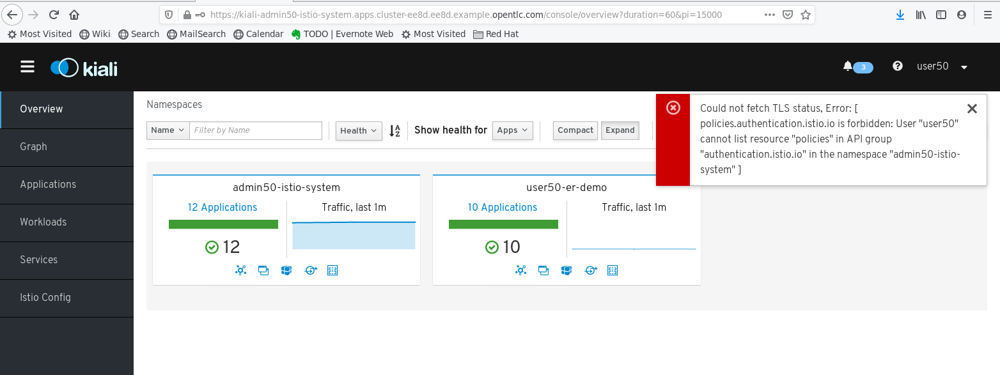

:noaudio:
:scrollbar:
:toc2:
:linkattrs:
:data-uri:

== Observability Lab: Kiali

.Goals
* Understand Kiali Service Mesh console

:numbered:

== Kiali Features

Kiali is the Red Hat Service Mesh console. Kiali helps you define, validate, and observe the connections and microservices of the service mesh. It visualizes the service mesh topology and provides visibility into features like request routing, circuit breakers, request rates, latency and more. Kiali offers insights about the mesh components at different levels, from abstract Applications to Services and Workloads.

. Obtain the URL of the Kiali console:
+
----
$ echo -en "\n\nhttps://$(oc get route kiali -o template --template={{.spec.host}} -n $RHSM_CONTROL_PLANE_NS)\n\n"
----
. In a browser window, navigate to the Kiali homepage. Login with the control plane admin user and credentials. +
Expect to see the Kiali home page:
+

+
The home page shows an overview of the namespaces that form the service mesh. From here you can navigate to the different pages in the application by clicking on the desired tab in the left menu, or by clicking on the icons in the namespace overview box.
+
[NOTE] 
====
If you log in as the application owner user, you will notice several errors, related to the fact that the application owner user has insufficient rights to resources in the control plane namespace which are required for the good working of the Kiali console. 

image::images/kiali-homepage-app-owner-graph.png[]
====

. The graph provides a powerful way to visualize the topology of the service mesh. It shows which services communicate with each other and the traffic rates and latencies between them, which can  helps to visually identify problem areas and quickly pinpoint issues. Kiali provides graphs that show a high-level view of service interactions, a low level view of workloads, or a logical view of applications. +
The graph also shows which services are configured with virtual services and circuit breakers. It identifies security issues by identifying traffic not configured as expected. The traffic flow between components can be observed by watching the animation or viewing the metrics.
* Click on the _Graph_ link in the left-hand menu. In the graph window, be sure to select the Emergency Response Demo namespace.
* Note that the topology graph of the service mesh is based on real-time traffic. Links between applications, services or workloads are only shown when there is actual traffic detected between these components. When the Emergency Response Demo is at rest, the graph looks like:
+
image::images/kiali-graph.png[]
* Generate some traffic into the applications. For example:
** REST calls to the Incident Service:
+
----
$ while :; do curl -k https://incident-service.$ERDEMO_USER.apps.$SUBDOMAIN_BASE/incidents; sleep 1; done
----
** REST calls to the Responder Service:
+
----
$ while :; do curl -k https://incident-service.$ERDEMO_USER.apps.$SUBDOMAIN_BASE/responders/available; sleep 1; done
----
** Emergency Response Demo run.
* Observe how the graph changes when traffic hits the services of the application. Click around in the graph menu to discover the different possibilities of graph visualization and traffic animation. Click on the traffic line between two services to discover traffic details.

. Applications, Workloads, Services: these pages show details about the different components of the service mesh.
* _Applications_ groups Services and Workloads that share the same `app` label.
* _Services_ are organized around Kubernetes Services.
* _Workloads_ represent DeploymentConfig and Deployment resources.
* For every one of these levels, the _Metrics_ tab shows metric dashboards for inbound and outbound traffic. These metrics are the equivalent as those in the Service Mesh Grafana dashboards - they are also obtained fom the Service Mesh Prometheus instance.

. Istio Config: lists the different Service Mesh configuration resources such as Gateways, VirtualServices and DestinationRules. Kiali provides inline edition of the YAML representation of these resources, as well powerful semantic validation.

. Istio wizards: Kiali provides different actions to create, update and delete Istio configuration resources, driven by wizards. These are located in the _Actions_ menu on the Service Details page. +
Note that the wizards are greyed out, as you have already defined traffic resources for the different services of the application.
+

== Kiali Runtimes Monitoring

Kiali can display custom dashboards to monitor application metrics. They are available for Applications and Workloads.

The Kiali runtimes monitoring feature works with Prometheus, so Prometheus must be configured correctly to pull application metrics. In the case of the Service Mesh Prometheus instance, the Prometheus instance is configured to discover targets based on annotations on the application pods.

Kiali comes with a set of default dashboards for various runtimes. Currently supported runtimes include Go, Node.js, Spring Boot, Quarkus, Vert.x, Thorntail. 

. Application pods must be annotated to be discovered by Prometheus. +
Add the following annotations to the DeploymentConfig resources of the Incident Service ($ERDEMO_USER-incident-service and $ERDEMO_USER-incident-service-v2):
+
----
spec:
  template:
    metadata:
      annotations:
        kiali.io/runtimes: 'springboot-jvm,springboot-jvm-pool'
        prometheus.io/path: /actuator/prometheus
        prometheus.io/port: '8080'
        prometheus.io/scheme: https
        prometheus.io/scrape: 'true'
        sidecar.istio.io/inject: 'true'
----
+
* The `prometheus.io` annotations are for discovery by prometheus.
* The `kiali.io/runtimes` is a comma separated list of runtimes which tell Kiali which kind of runtime the pod represents. This annotation is optional, as Kiali will try to discover automatically dashboards that are relevant for a given Application or Workload.
. Wait until The Incident Service pods are redeployed, and generate traffic to the Incident Service:
+
----
$ while :; do curl -k https://incident-service.$ERDEMO_USER.apps.$SUBDOMAIN_BASE/incidents; sleep 1; done
----
. In the Kiali console, navigate to the Applications page, and open the page for the _$ERDEMO_USER-incident-service_ Application. +
Note that the page shows two extra tabs, for _JVM Metrics_ and _JVM Pool Metrics_.
+
image::images/kiali-runtimes-metrics.png[]
. Navigate to the Workloads page, and select the _$ERDEMO_USER-incident-service_ or _$ERDEMO_USER-incident-service-v2_ workload. Note here as well the application metric dashboards.
+
image::images/kiali-runtimes-metrics-2.png[]