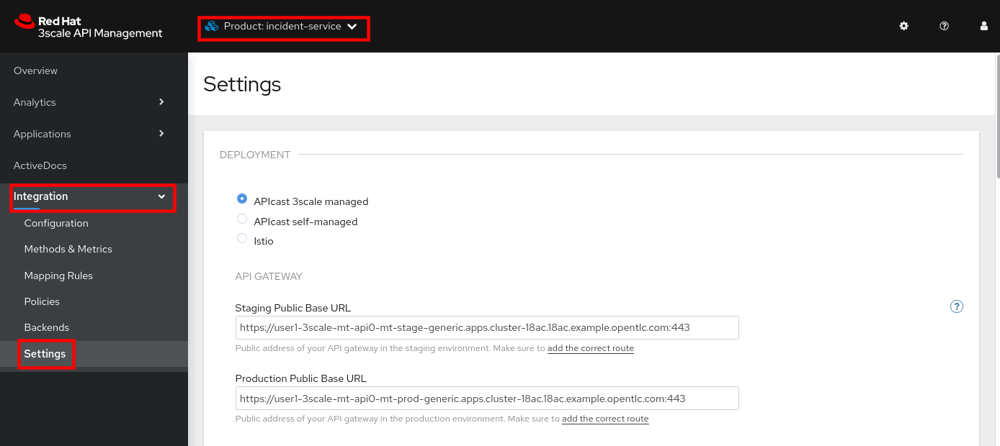
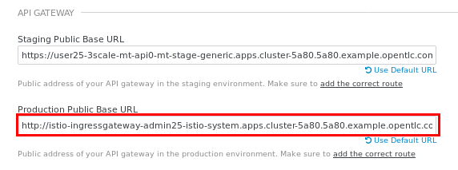
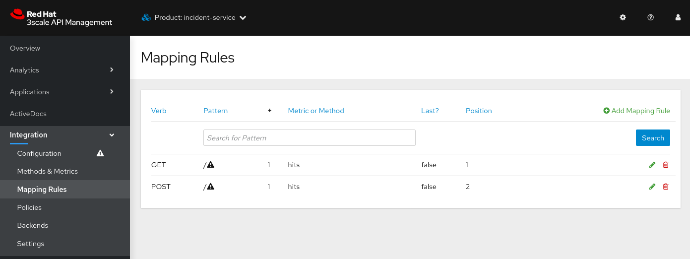

:noaudio:
:scrollbar:
:toc2:
:linkattrs:
:data-uri:

== 3scale Istio Adapter Lab

.Goals
** Review 3scale Istio adapter components
** Apply _API policies_ to network traffic within microservices applications using the 3scale Istio adapter

.Prerequisites
** Completion of previous labs in this course--specifically the second lab in module 1 on north/south API traffic and the lab in module 2 on secure mTLS.

:numbered:
== Overview

The 3scale API Management engineering team, in collaboration with the Red Hat^(R)^ OpenShift^(R)^ Service Mesh team, have created a service mesh Mixer adapter for API management called _3scale Istio adapter_.
This adapter allows 3scale API Management policies to be applied directly to communication that occurs between services in the service mesh.

image::images/3scale_mixer_adapter.png[]

In this diagram, note that the API gateway has been replaced with the 3scale Istio adapter.

== Disable Existing API Production Gateway

Your 3scale API gateways (utilized briefly in the first module of this course) are no longer needed.
Instead, inbound traffic to your Emergency Response Demo application flows directly through the _Istio ingress gateway_. Subsequently, your API production gateway can be disabled.

. Switch to the owner of your existing API gateways:
+
-----
$ oc login -u $ERDEMO_USER -p $OCP_PASSWD
-----

. Scale down the existing API production gateway:
+
-----
$ oc scale dc/prod-apicast --replicas=0 -n $GW_PROJECT
-----

== Set Up VirtualService

In the lab for module 2, you created a wildcard gateway as well as a VirtualService to route inbound traffic to the incident service through the service mesh _ingress gateway_. If you have not yet done so, complete the lab exercises in module 2 before continuing with this lab.

== Review 3scale Istio Adapter

OpenShift Service Mesh provides a Mixer adapter called the _3scale Istio adapter_.
In this section of the lab, you review the various components of the adapter and then configure it so that it applies API management policies to inbound requests.

General information about Istio's plug-in architecture for applying policies and capturing telemetry can be found link:https://istio.io/docs/concepts/policies-and-telemetry/[here].

image::images/mixer_architecture.png[]

=== Enable Policy Checks

OpenShift Service Mesh allows for enabling or disabling policy evaluation through the `mixer` component of your service mesh control plane.

In order for API management policies to be applied to service mesh traffic, policy evaluation in `mixer` needs to be enabled. By default, policy checks are disabled in the service mesh.

. Log in to the OpenShift Container Platform as the control plane admin user:
+
----
$ oc login $LAB_MASTER_API -u $SM_CP_ADMIN -p $OCP_PASSWD
----
=== Explore 3scale Istio Adapter Components

Your service mesh control plane was initially installed without the 3scale Istio adapter.
In this section of the lab, you enable it.

. Update the `ServiceMeshControlPlane` resource with the `threeScale` component:
+
-----
$ oc patch smcp/full-install -n $SM_CP_NS --type=json -p \
'[
    {
        "op": "replace",
        "path": "/spec/threeScale/enabled",
        "value": true
    },
    {
        "op": "add",
        "path": "/spec/threeScale/image",
        "value": "3scale-istio-adapter-rhel8"
    },
    {
        "op": "add",
        "path": "/spec/threeScale/tag",
        "value": "1.0.0"
    },
    {
        "op": "add",
        "path": "/spec/threeScale/PARAM_THREESCALE_LISTEN_ADDR",
        "value": 3333
    },
    {
        "op": "add",
        "path": "/spec/threeScale/PARAM_THREESCALE_LOG_LEVEL",
        "value": "debug"
    },
    {
        "op": "add",
        "path": "/spec/threeScale/PARAM_THREESCALE_LOG_JSON",
        "value": true
    },
    {
        "op": "add",
        "path": "/spec/threeScale/PARAM_THREESCALE_LOG_GRPC",
        "value": false
    },
    {
        "op": "add",
        "path": "/spec/threeScale/PARAM_THREESCALE_REPORT_METRICS",
        "value": true
    },
    {
        "op": "add",
        "path": "/spec/threeScale/PARAM_THREESCALE_METRICS_PORT",
        "value": 8080
    },
    {
        "op": "add",
        "path": "/spec/threeScale/PARAM_THREESCALE_CACHE_TTL_SECONDS",
        "value": 300
    },
    {
        "op": "add",
        "path": "/spec/threeScale/PARAM_THREESCALE_CACHE_REFRESH_SECONDS",
        "value": 180
    },
    {
        "op": "add",
        "path": "/spec/threeScale/PARAM_THREESCALE_CACHE_ENTRIES_MAX",
        "value": 1000
    },
    {
        "op": "add",
        "path": "/spec/threeScale/PARAM_THREESCALE_CACHE_REFRESH_RETRIES",
        "value": 1
    },
    {
        "op": "add",
        "path": "/spec/threeScale/PARAM_THREESCALE_ALLOW_INSECURE_CONN",
        "value": false
    },
    {
        "op": "add",
        "path": "/spec/threeScale/PARAM_THREESCALE_CLIENT_TIMEOUT_SECONDS",
        "value": 10
    },
    {
        "op": "add",
        "path": "/spec/threeScale/PARAM_THREESCALE_GRPC_CONN_MAX_SECONDS",
        "value": 60
    }
]'
-----
* Note that the above configuration enables the `threeScale` Mixer plug-in and also specifies the exact tag of the `3scale-istio-adapter` link:https://access.redhat.com/containers/?tab=tags#/registry.access.redhat.com/openshift-service-mesh/3scale-istio-adapter-rhel8[image to pull] from registry.redhat.io.

* Because a change was made to `ServiceMeshControlPlane`, expect the OpenShift Service Mesh operator to detect this change.
Eventually, it automatically starts a `3scale-istio-adapter` deployment.
. Monitor the pods of your service mesh control plane to view the new `3scale-istio-adapter` pod.

. Review the 3scale Istio adapter components in your service mesh control plane namespace:
+
-----
$ oc get all -l app=3scale-istio-adapter -n $SM_CP_NS
-----

* Expect the response to list the `3scale-istio-adapter` deployment, ReplicaSet, and pod.

* Per the diagram above, the `3scale-istio-adapter` Linux^(R)^ container includes the following two components:
** `3scale-istio-adapter`: Accepts gRPC invocations from the Istio ingress gateway and routes them to the other sidecar in the pod, `3scale-istio-httpclient`.

** `3scale-istio-httpclient`: Accepts invocations from `3scale-istio-adapter` and invokes the `system-provider` and `backend-listener` endpoints of the remote Red Hat 3scale API Management system.

. View listings of configurations that support the 3scale Istio adapter:
+
[NOTE]
====
Embedded in the following YAML files is the 3scale `handler` resource that is injected into the Istio Mixer.
This `handler` resource is written in Golang by the 3scale engineering team per the link:https://github.com/istio/istio/wiki/Mixer-Out-Of-Process-Adapter-Dev-Guide[Mixer Out of Process Adapter Dev Guide].
Many of these files consist of the adapter's configuration link:https://developers.google.com/protocol-buffers/docs/proto3[proto].
====

.. View adapters:
+
-----
$ oc get adapters.config.istio.io -n $SM_CP_NS
-----
+
.Sample Output
-----
threescale   3h26m
-----

.. View templates:
+
-----
$ oc get templates.config.istio.io -n $SM_CP_NS
-----
+
.Sample Output
-----
threescale-authorization   3h26m
-----

== Configure 3scale Istio Adapter

Now that you have verified that the 3scale Istio adapter exists, you need to configure the adapter to apply API policies to traffic to the Emergency Response Demo incident service.

In particular, you specify the URL of the `system-provider` endpoint of your 3scale API Management tenant along with the corresponding access token.
This is needed so that the Istio Mixer can pull API proxy details from the 3scale API Management system (similar to what the 3scale APIcast gateway does).

. Confirm that you have the following environment variables (set during the north/south traffic lab):

.. `INCIDENT_SERVICE_API_KEY`
.. `INCIDENT_SERVICE_ID`
.. `SYSTEM_PROVIDER_URL`
.. `API_ADMIN_ACCESS_TOKEN`

. Clone the source code of the 3scale Istio adapter configurations:
+
-----
$ git clone \
      --branch v1.0.0 \
      https://github.com/3scale/istio-integration \
      $HOME/lab/istio-integration
-----

. Review the `threescale-adapter-config.yaml` file :
+
-----
$ less $HOME/lab/istio-integration/istio/threescale-adapter-config.yaml | more
-----

. Modify the `threescale-adapter-config.yaml` file with the ID of your incident API service:
+
-----
$ sed -i "s/service_id: .*/service_id: \"$INCIDENT_SERVICE_ID\"/" \
      $HOME/lab/istio-integration/istio/threescale-adapter-config.yaml
-----

. Modify the `threescale-adapter-config.yaml` file with the URL to your 3scale API Management tenant:
+
-----
$ sed -i "s/system_url: .*/system_url: \"https:\/\/$SYSTEM_PROVIDER_URL\"/" \
      $HOME/lab/istio-integration/istio/threescale-adapter-config.yaml
-----

. Modify the `threescale-adapter-config.yaml` file with the administrative access token of your 3scale API Management administration account:
+
-----
$ sed -i "s/access_token: .*/access_token: \"$API_ADMIN_ACCESS_TOKEN\"/" \
      $HOME/lab/istio-integration/istio/threescale-adapter-config.yaml
-----

. Review the `rule` in `threescale-adapter-config.yaml` that defines the conditions for applying API management policies to a request.

* The existing default rule is as follows:
+
-----
match: destination.labels["service-mesh.3scale.net"] == "true"
-----

* This rule specifies that API management policies are applied to the request when the target deployment includes the `service-mesh.3scale.net` label.

. Update the `threescale-adapter-config.yaml` file with a modified rule specifying that API management policies are to be applied when the target is the incident service:
+
-----
$ sed -i "s/match: .*/match: destination.service.name == \"$ERDEMO_USER-incident-service\"/" \
      $HOME/lab/istio-integration/istio/threescale-adapter-config.yaml
-----
+
[NOTE]
You can find more information about Istio's Policy Attribute Vocabulary (used in the creation of rules) link:https://istio.io/docs/reference/config/policy-and-telemetry/attribute-vocabulary/[here].

. Load the 3scale Istio adapter configurations:
+
----
$ oc create -f $HOME/lab/istio-integration/istio/threescale-adapter-config.yaml -n $SM_CP_NS
----
+
.Sample Output
----
handler.config.istio.io/threescale created
instance.config.istio.io "threescale-authorization" created
rule.config.istio.io "threescale" created
----
+
[NOTE]
====
If you need to delete these 3scale Istio adapter configurations, execute the following commands:

-----
$ oc delete rule.config.istio.io threescale -n $SM_CP_NS
$ oc delete instance.config.istio.io threescale-authorization -n $SM_CP_NS
$ oc delete handler.config.istio.io threescale -n $SM_CP_NS
-----
====

. Verify that the 3scale Istio adapter `handler` configurations were created in the service mesh control plane namespace:
+
-----
$ oc get handler threescale -n $SM_CP_NS -o yaml
-----
+
.Sample Output
-----
apiVersion: v1
items:
- apiVersion: config.istio.io/v1alpha2
  kind: handler

  [...]

  spec:
    adapter: threescale
    connection:
      address: threescale-istio-adapter:3333
    params:
      access_token: secret-token
      service_id: "15"
      system_url: https://user50-3scale-mt-admin.apps.4a64.openshift.opentlc.com

-----

== Update Production Base URL

In this section of the lab, you update your incident service's production base URL to the 3scale production base URL.

. Point your browser to the Admin Portal of your 3scale API Management tenant, which is available at the following URL:
+
-----
$ echo -en "\n\nhttps://$(oc get routes -n $API_MANAGER_NS | grep admin | grep $ERDEMO_USER | awk '{print $2}')\n"
-----

. Authenticate using the values of the following environment variables:
.. *Username*: `$API_TENANT_USERNAME`
.. *Password*: `$API_TENANT_PASSWORD`

. In your `incident-service` API, navigate to *Integration -> Settings*:
+

. Change the value of *Production Public Base URL* to the value of the following:
+
-----
$ echo -en "\nhttps://`oc get route incident-service-gateway -n $SM_CP_NS -o template --template {{.spec.host}}:443`\n\n"
-----
+

. Save the configuration change by scrolling down to the bottom of the page and clicking *Update Product*:
+

. Promote the change to production:
.. Navigate to *Integration -> Configuration*.
.. Click *Promote to Staging APIcast*:
+

.. Click *Promote to Production APIcast*
+

== Smoke Test 3scale Istio Adapter

. From the terminal, execute the following `curl` command to invoke your incident service directly via the Istio ingress gateway:
+
-----
$ curl -v -k \
       `echo "https://"$(oc get route incident-service-gateway -n $SM_CP_NS -o template --template {{.spec.host}})"/incidents"`
-----
+
.Sample Output
-----
[...]

< HTTP/1.1 403 Forbidden
[...]

* Connection #0 to host istio-ingressgateway-istio-system.apps.clientvm.b902.rhte.opentlc.com left intact

PERMISSION_DENIED:threescalehandler.handler.istio-system:no auth credentials provided or provided in invalid location
-----
* Expect to see a 403 error response with a "PERMISSION_DENIED:threescalehandler.handler.istio-system:..." message.

* Inbound requests through the Istio ingress gateway are now correctly flowing through the Mixer to the 3scale Istio adapter.

* In the example above, the API `user_key` value associated with your incident service application was omitted.

. View the log file of the 3scale Istio adapter:
+
-----
$ oc logs -f `oc get pod -n $SM_CP_NS | grep "3scale-istio-adapter" | awk '{print $1}'` \
          -n $SM_CP_NS \
          -c 3scale-istio-adapter
-----
+
.Sample Output
-----

"Got instance &InstanceMsg{Subject:&SubjectMsg{User:,Groups:,Properties:map[string]*istio_policy_v1beta11.Value{app_id: &Value{Value:&Value_StringValue{StringValue:,},},app_key: &Value{Value:&Value_StringValue{StringValue:,},},},},Action:&ActionMsg{Namespace:,Service:,Method:GET,Path:/products,Properties:map[string]*istio_policy_v1beta11.Value{},},Name:threescale-authorization.instance.istio-system,}"

"proxy config for service id 4 is being fetching from 3scale"
-----

. Invoke your incident service again, this time using the incident service `user_key` value:
+
-----
$ curl -v -k \
       `echo "https://"$(oc get route incident-service-gateway -n $SM_CP_NS -o template --template {{.spec.host}})"/incidents?user_key=$INCIDENT_SERVICE_API_KEY"`
-----
+
[TIP]
====
If you see the message `PERMISSION_DENIED:deny-curl-handler.admin21-istio-system:not allowed`, remove the _deny-curl_ `rule` you created in the previous lab.
----
$ oc delete rule incident-service-deny-curl -n $SM_CP_NS
----
====

* Expect to see that the incident service is again being managed and secured by Red Hat 3scale API Management.
This time however, the 3scale Istio adapter is being utilized rather than the API gateway.

== Fine-Tune 3scale Istio Adapter Rules

At this point, _all_ traffic inbound through the Istio ingress gateway is configured to route through the 3scale Istio adapter.
Your use case may require more fine-grained routing rules.

In this section of the lab, you specify that GET requests to the incident service's `/incidents` endpoint can bypass the 3scale Istio adapter and invoke the incident service without applying API policies.
However, all POST requests to the `/incidents` endpoint continue to have API policies applied via the 3scale Istio adapter.

[NOTE]
====
For this section of the lab to work as expected, you need to delete the `AuthorizationPolicy` resources you created in the Secure mTLS lab in module 2.

----
$ oc delete AuthorizationPolicy incident-service-external -n $ERDEMO_NS
$ oc delete AuthorizationPolicy deny-all-incident-service -n $ERDEMO_NS
$ oc delete AuthorizationPolicy incident-service-internal -n $ERDEMO_NS
----
====

=== Configure HTTP POST Mapping Rule

In the Admin Portal of the 3scale API Management tenant, you need to configure a _mapping rule_ for your `incident-service` API service.
This mapping rule allows for HTTP POST requests to the incident service in order to create incidents.

. Access your Admin Portal by pointing your browser to the output of the following:
+
-----
$ echo -en "\n\nhttps://$(oc get routes -n $API_MANAGER_NS | grep admin | grep $ERDEMO_USER | awk '{print $2}')\n"
-----

. Authenticate using the following values:
.. *Username*: `$API_TENANT_USERNAME`
.. *Password*: `$API_TENANT_PASSWORD`

. In your `incident-service` API, navigate to *Integration -> Mapping Rules*:

. Add a new mapping rule with the following values:
.. *Verb*: `POST`
.. *Pattern*: `/`
+

. Navigate to *Integration -> Configuration*.
.. Click *Promote to Staging APIcast*:
.. Click *Promote to Production APIcast*

. At the command line, modify the existing `usethreescale` rule in `$SM_CP_NS`:
+
-----
$ oc patch rule.config.istio.io threescale \
       --type=json \
       --patch '[{"op": "add", "path": "/spec/match", "value":"destination.service.name == \"'$ERDEMO_USER'-incident-service\" && source.namespace != \"'$ERDEMO_NS'\" && request.method == \"POST\" && request.path.startsWith(\"/incidents\")"  }]' \
       -n $SM_CP_NS
-----
* This modification introduces a fine-grained `match` rule with several conditions.
When all of the conditions are met, the inbound traffic is routed to the 3scale Istio adapter.

. Review the conditions of the rule:

* The destination service needs to be the incident service.
* The inbound request needs to originate from outside `$ERDEMO_NS` (that is, from the `istio-ingress` of the `$SM_CP_NS` namespace).
* The HTTP verb is of type `POST`.
* The target is the `/incidents/` endpoint.

. View the `istio-policy` pod's log file:
+
-----
$ oc logs -f `oc get pod -n $SM_CP_NS | grep "istio-policy" | awk '{print $1}'` -c mixer -n $SM_CP_NS
-----
+
.Sample Output
-----
[...]

IntrospectionOptions: ctrlz.Options{Port:0x2694, Address:"127.0.0.1"}
warn    Neither --kubeconfig nor --master was specified.  Using the inClusterConfig.  This might not work.
info    Built new config.Snapshot: id='0'
info    Cleaning up handler table, with config ID:-1
info    Built new config.Snapshot: id='1'
info    adapters        getting kubeconfig from: ""     {"adapter": "handler.kubernetesenv.istio-system"}
warn    Neither --kubeconfig nor --master was specified.  Using the inClusterConfig.  This might not work.
info    adapters        Waiting for kubernetes cache sync...    {"adapter": "handler.kubernetesenv.istio-system"}
info    adapters        Cache sync successful.  {"adapter": "handler.kubernetesenv.istio-system"}
info    Cleaning up handler table, with config ID:0
info    adapters        serving prometheus metrics on 42422     {"adapter": "handler.prometheus.istio-system"}
 Mixer: root@71a9470ea93c-docker.io/istio-1.0.0-3a136c90ec5e308f236e0d7ebb5c4c5e405217f4-Clean
Starting gRPC server on port 9091
info    ControlZ available at 172.17.0.10:9876
-----
* In particular, note that the new policies were put into effect with no error messages logged.

=== Test
. Invoke your incident service again, this time _without_ the incident service `user_key` value:
+
-----
$ curl -v -k \
       `echo "https://"$(oc get route incident-service-gateway -n $SM_CP_NS -o template --template {{.spec.host}})"/incidents"`
-----
* Expect this request to be routed directly to your back-end incident service.
This is because the request is using an HTTP GET, which causes the third condition of the rule to fail.
Subsequently, the API `user_key` value is not needed.

. Try to POST a new incident service _without_ the incident service `user_key` value:
+
-----
$ curl -v -k \
       -X POST \
       -H "Content-Type: application/json" \
       `echo "https://"$(oc get route incident-service-gateway -n $SM_CP_NS -o template --template {{.spec.host}})"/incidents"` \
       -d '{
  "lat": "34.14338",
  "lon": "-77.86569",
  "numberOfPeople": 3,
  "medicalNeeded": "true",
  "victimName": "victim",
  "victimPhoneNumber": "111-111-111"
}'
-----
* Expect this request to be routed to the 3scale Istio adapter because all three conditions of the routing rule have been met.
* Also expect the response to be "403 PERMISSION DENIED" because the API `user_key` value was not applied.

. Try again, this time using an HTTP POST to create a new incident and using the `user_key` value:
+
-----
$ curl -v -k \
       -X POST \
       -H "Content-Type: application/json" \
       `echo "https://"$(oc get route incident-service-gateway -n $SM_CP_NS -o template --template {{.spec.host}})"/incidents?user_key=$INCIDENT_SERVICE_API_KEY"` \
       -d '{
  "lat": "34.14338",
  "lon": "-77.86569",
  "numberOfPeople": 3,
  "medicalNeeded": "true",
  "victimName": "victim",
  "victimPhoneNumber": "111-111-111"
}'
-----
* Expect this request to be routed to the 3scale Istio adapter and, because the API `user_key` value was applied, a "201 Created" response to the request.

== Extra Credit

Until now, specific endpoints of a single back-end incident service were being managed by the 3scale API Management via the 3scale Istio adapter.

As an optional exercise, configure the service mesh so that API policies are applied to requests to the Emergency Response Demo `responder-service` via the `ingress-gateway`.

****
*Question*:

Which configurations need to be modified or added?
****

This concludes the lab. You learned about the 3scale Istio adapter and its components and applied API policies to network traffic within a microservices application using it.

ifdef::showscript[]

== Conclusion

In this lab we covered the following topics:

* Injecting Istio Envoy proxy configurations into an API gateway
* Configuration of an Istio Egress Route to allow the API gateway to communicate to the remote API Manager
* Invocation of your back-end service via the Istio Ingress gateway and Red Hat 3scale API Management gateway
* End-to-end distributed tracing of an MSA application using the Jaeger implementation of the _OpenTracing_ specification
* Review of the analytics dashboard provided by Red Hat 3scale API Management
* Introduction to the Red Hat 3scale API Management Mixer Adapter

endif::showscript[]
