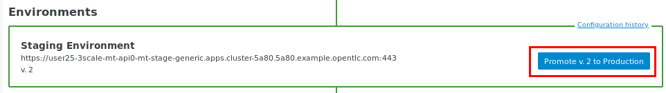

:noaudio:
:scrollbar:
:toc2:
:linkattrs:
:data-uri:

= API Mgmt Mixer Plugin Lab

.Goals
** Review 3scale API Management _Mixer Adapter_ components
** Apply _API Policies_ to network traffic within microservice application using Red Hat 3scale API Management _Mixer Adapter_

.Pre-requisites
** Completion of the _North South Traffic Lab_

:numbered:

== Overview

The Red Hat 3scale API Management engineering team, in collaboration with the Red Hat Service Mesh team, has created a service mesh _mixer_ adapter for API Management.
This service mesh mixer adapter will allow Red Hat 3scale API Management policies to be applied directly to communication that occurs between services in the _service mesh_.

image::images/3scale_mixer_adapter.png[]

In the above diagram, [blue]#notice the replacement of an API Gateway with the service mesh 3scale Mixer Adapter#.

== Disable Existing API Production Gateway

Your 3scale API gateways (utilized briefly in the first module of this course) will no longer be needed.
Instead, inbound traffic to your Emergency Response application will flow through the _Istio ingress gateway_ directly.

Subsequently, your API production gateway can be disabled.

. Switch to the owner of your pre-existing API Gateways:
+
-----
oc login -u $ERDEMO_USER -p $OCP_PASSWD
-----

. Scale down the existing API production gateway:
+
-----
$ oc scale deploy/prod-apicast --replicas=0 -n $GW_PROJECT
-----

== New Virtual Service to Incident Service

In this section of the lab, you will create a routing rule to invoke the backend incident service directly via the Istio _ingress_ gateway.

Later, more complex routing rules will modify the flow to also apply API policies via the Red Hat 3scale API Management Istio Mixer adapter.

. Define a gateway that allows inbound traffic from the _ingressgateway_ on port 80:
+
-----
$ echo \
    "apiVersion: networking.istio.io/v1alpha3
kind: Gateway
metadata:
  name: erd-wildcard-gateway-insecure
spec:
  selector:
    istio: ingressgateway
  servers:
  - port:
      number: 80
      name: http
      protocol: HTTP
    hosts:
    - \"istio-ingressgateway-$SM_CP_NS.apps.$SUBDOMAIN_BASE\"

---
apiVersion: networking.istio.io/v1alpha3
kind: VirtualService
metadata:
  name: incident-direct-vs
spec:
  hosts:
  - \"*\"
  gateways:
  - erd-wildcard-gateway-insecure
  http:
  - match:
    - uri:
        prefix: /incidents
    route:
    - destination:
        host: $ERDEMO_USER-incident-service
        port:
          number: 8080" \
 > $HOME/lab/incident-service-gw-vs.yml
-----
+
Notice that a match is made for all context paths exposed by the incident service:  `/incidents`.

. Create the gateway and virtual service in your Emergency Response Demo project :
+
-----
oc create -f $HOME/lab/incident-service-gw-vs.yml -n $ERDEMO_NS
-----

. As the administrator of your service mesh control plane, check the routes registered with the istio-ingressgateway:
+
-----
oc login -u $SM_CP_ADMIN -p $OCP_PASSWD

oc project $SM_CP_NS && \
         oc rsh `oc get pod | grep "istio-ingressgateway" | awk '{print $1}'` \
         curl http://localhost:15000/config_dump \
         > /tmp/config_dump \
         && less /tmp/config_dump \
         | jq ".configs | last | .dynamic_route_configs"

oc login -u $ERDEMO_USER -p $OCP_PASSWD
-----

. From the terminal, conduct a smoke test to validate traffic to the incident service directly from the Istio ingress gateway.
.. For the next few smoke tests, notice that the API _user_key_ is not being specified.
It is not needed in these smoke tests because this inbound traffic is no longer flowing through your API gateway.
Later in the lab, you'll re-introduce the use of the API _user_key_ .

.. GET a listing of Emergency Response incidents:
+
-----
$ curl -v -X GET -H "Content-Type: application/json" `echo "http://"$(oc get route istio-ingressgateway -n $SM_CP_NS -o template --template {{.spec.host}})""`/incidents/ | jq .

...

< HTTP/1.1 200 OK

... 

  {
    "id": "31c8170e-81be-43b0-8bf5-c1023d9f54e5",
    "lat": "34.22222",
    "lon": "-77.88435",
    "numberOfPeople": 5,
    "medicalNeeded": true,
    "victimName": "Hudson James",
    "victimPhoneNumber": "(984) 555-8130",
    "timestamp": 1574204506538,
    "status": "PICKEDUP"
  }
-----
+
The reponse status back should be an HTTP 201 .

[blue]#You have successully routed traffic through the _istio-ingressgateway_ directly to your backend business service#.
Next step is to inject the _3scale Istio Mixer_ into this request path and subsequently begin to apply API Management policies.

== 3scale Istio Mixer Adapter

Red Hat Service Mesh provides a component called the _3scale Istio Mixer Adapter_.

In this section of the lab, you review the various components of the _3scale Istio Adapter_ .
You then configure it so that it applies API Management policies to inbound requests.

General information about Istio's plug-in architecture to apply policies and capture telemetry can be found link:https://istio.io/docs/concepts/policies-and-telemetry/[here].

image::images/mixer_architecture.png[]

=== Ensure Policy Checks are not disabled
Red Hat Service Mesh allows for disablement of policy evaluation through the _mixer_ component of your service mesh control plane.

In order for API Management policies to be applied to service mesh traffic, policy evaluation in _mixer_ needs to be enabled.
The setting for this behavior is in the _istio_ configmap found in the namespace of your service mesh control plane.
This configmap is read by the Envoy proxy upon start-up of a service mesh enabled pod.

You can view state of this setting that disables service mesh policies as follows:

. Switch to the owner of your service mesh control plane:
+
-----
oc login -u $SM_CP_ADMIN -p $OCP_PASSWD
-----
+
NOTE: The remaining tasks in this lab need to be executed by the administrator of your service mesh control plane.

. View the value of the _disablePolicyChecks_ variable:
+
-----
oc describe cm istio -n $SM_CP_NS | grep disablePolicyChecks

disablePolicyChecks: false
-----

.. The value of this variable is true, then you will need to manually edit this configmap.
.. You can do so as the $SM_CP_ADMIN user either at the command line (ie:  oc edit .... ) or via the OpenShift web console.
.. The change to this configmap will take affect without having to restart any pods in your service mesh control plane or your Emergency Response application.

=== 3scale Istio Adapter components

Your service mesh _control plane_ was initially installed without the 3scale mixer adapter.
In this section of the lab, you enable it.

. Update the _ServiceMeshControlPlane_ resource with the _threeScale_ component:
+
-----
oc patch smcp/full-install -n $SM_CP_NS --type=json -p \
'[
    {
        "op": "replace",
        "path": "/spec/threeScale/enabled",
        "value": true
    },
    {
        "op": "add",
        "path": "/spec/threeScale/image",
        "value": "3scale-istio-adapter-rhel8"
    },
    {
        "op": "add",
        "path": "/spec/threeScale/tag",
        "value": "1.0.0"
    },
    {
        "op": "add",
        "path": "/spec/threeScale/PARAM_THREESCALE_LISTEN_ADDR",
        "value": 3333
    },
    {
        "op": "add",
        "path": "/spec/threeScale/PARAM_THREESCALE_LOG_LEVEL",
        "value": "debug"
    },
    {
        "op": "add",
        "path": "/spec/threeScale/PARAM_THREESCALE_LOG_JSON",
        "value": true
    },
    {
        "op": "add",
        "path": "/spec/threeScale/PARAM_THREESCALE_LOG_GRPC",
        "value": false
    },
    {
        "op": "add",
        "path": "/spec/threeScale/PARAM_THREESCALE_REPORT_METRICS",
        "value": true
    },
    {
        "op": "add",
        "path": "/spec/threeScale/PARAM_THREESCALE_METRICS_PORT",
        "value": 8080
    },
    {
        "op": "add",
        "path": "/spec/threeScale/PARAM_THREESCALE_CACHE_TTL_SECONDS",
        "value": 300
    },
    {
        "op": "add",
        "path": "/spec/threeScale/PARAM_THREESCALE_CACHE_REFRESH_SECONDS",
        "value": 180
    },
    {
        "op": "add",
        "path": "/spec/threeScale/PARAM_THREESCALE_CACHE_ENTRIES_MAX",
        "value": 1000
    },
    {
        "op": "add",
        "path": "/spec/threeScale/PARAM_THREESCALE_CACHE_REFRESH_RETRIES",
        "value": 1
    },
    {
        "op": "add",
        "path": "/spec/threeScale/PARAM_THREESCALE_ALLOW_INSECURE_CONN",
        "value": false
    },
    {
        "op": "add",
        "path": "/spec/threeScale/PARAM_THREESCALE_CLIENT_TIMEOUT_SECONDS",
        "value": 10
    },
    {
        "op": "add",
        "path": "/spec/threeScale/PARAM_THREESCALE_GRPC_CONN_MAX_SECONDS",
        "value": 60
    }
]'
-----
+
Notice that the above configuration enables the _threeScale_ mixer plugin and also specifies the exact tag of the _3scale-istio-adapter_ link:https://access.redhat.com/containers/?tab=tags#/registry.access.redhat.com/openshift-service-mesh/3scale-istio-adapter-rhel8[image to pull] (from registery.redhat.io).

. Because a change was made to the _ServiceMeshControlPlane_, expect the Red Hat Service Mesh operator to detect this change.
It will eventually automatically start a _3scale-istio-adapter_ deployment.
Monitor the pods of your service mesh control plane to view the new _3scale-istio-adapter_ pod.

. Review 3scale Istio Adapter components in your service mesh control plane namespace:
+
-----
oc get all -l app=3scale-istio-adapter -n $SM_CP_NS
-----

.. The response should list the _3scale-istio-adapter_ related deployment, replicaset and pod.

.. As per the diagram above, the _3scale-istio-adapter_ Linux container includes the following two components:

... *3scale-istio-adapter*
+
Accepts gRPC invocations from Istio ingress and routes to the other side car in the pod:  _3scale-istio-httpclient_

... *3scale-istio-httpclient*
+
Accepts invocations from _3scale-istio-adapter_ and invokes the _system-provider_ and _backend-listener_ endpoints of the remote Red Hat 3scale API Management manager.

. View listing of configs that support the 3scale Mixer Adapter:
+
Embedded in the following YAML files is the 3scale _handler_ that is injected into the Istio Mixer.
This _handler_ is written in Golang by the 3scale engineering team as per the link:https://github.com/istio/istio/wiki/Mixer-Out-Of-Process-Adapter-Dev-Guide[Mixer Out of Process Adapter Dev Guide].
Much of these files consist of the adapter's configuration link:https://developers.google.com/protocol-buffers/docs/proto3[proto].

.. Adapters:
+
-----
oc get adapters.config.istio.io -n $SM_CP_NS

threescale   3h26m
-----

.. Template:
+
-----
oc get templates.config.istio.io -n $SM_CP_NS

threescale-authorization   3h26m
-----

== Red Hat 3scale Mixer Adapter Configurations

Now that 3scale Istio Adapter has been verified to exist, the adapter needs to be configured to apply API policies to traffic to the Emergency Response _incident service_.

In particular, you will specify the URL of the _system-provider_ endpoint of your 3scale tenant along with the corresponding access token.
This is needed so that the Istio Mixer can pull API proxy details from the 3scale API Manager (similar to what the 3scale API Gateway does).

. From a previous module of this course, you should have already completed the following lab:  _North / South Traffic Lab_.
+
From this previous lab, you should have set the following environment variables:

.. *INCIDENT_SERVICE_API_KEY*
.. *INCIDENT_SERVICE_ID*
.. *SYSTEM_PROVIDER_URL*
.. *API_ADMIN_ACCESS_TOKEN*

. Clone the source code of the 3scale Istio Mixer configurations.
+
Execute:
+
-----
git clone \
      --branch v1.0.0 \
      https://github.com/3scale/istio-integration \
      $HOME/lab/istio-integration
-----

. Review the `threescale-adapter-config.yaml` file :
+
-----
less $HOME/lab/istio-integration/istio/threescale-adapter-config.yaml | more
-----

. Modify the `threescale-adapter-config.yaml` file with the ID of your incident API service:
+
-----
sed -i "s/service_id: .*/service_id: \"$INCIDENT_SERVICE_ID\"/" \
      $HOME/lab/istio-integration/istio/threescale-adapter-config.yaml
-----

. Modify the `threescale-adapter-config.yaml` file with the URL to your Red Hat 3scale API Management manager tenant:
+
-----
sed -i "s/system_url: .*/system_url: \"https:\/\/$SYSTEM_PROVIDER_URL\"/" \
      $HOME/lab/istio-integration/istio/threescale-adapter-config.yaml
-----

. Modify the `threescale-adapter-config.yaml` file with the administrative access token of your Red Hat 3scale API Management manager administration account:
+
-----
sed -i "s/access_token: .*/access_token: \"$API_ADMIN_ACCESS_TOKEN\"/" \
      $HOME/lab/istio-integration/istio/threescale-adapter-config.yaml
-----

. The _rule_ in _threescale-adapter-config.yaml_ defines the conditions that API Management policies should be applied to a request.
+
The existing default rule is as follows:
+
-----
match: destination.labels["service-mesh.3scale.net"] == "true"
----- 
+
This rule specifies that API Management policies should be applied to the request when the target Deployment includes a label of:  `service-mesh.3scale.net`.

.. Update the `threescale-adapter-config.yaml` file with a modified rule that specifies that API Management policies should be applied when the target is the _incident-service_:
+
-----
sed -i "s/match: .*/match: destination.service.name == \"$ERDEMO_USER-incident-service\"/" \
      $HOME/lab/istio-integration/istio/threescale-adapter-config.yaml
-----

.. More information about Istio's Policy Attribute Vocabulary (used in the creation of rules) can be found link:https://istio.io/docs/reference/config/policy-and-telemetry/attribute-vocabulary/[here].

. Load the Red Hat 3scale API Management Istio Handler configurations:
+
-----
oc create -f $HOME/lab/istio-integration/istio/threescale-adapter-config.yaml -n $SM_CP_NS

...

handler.config.istio.io/threescale created
instance.config.istio.io "threescale-authorization" created
rule.config.istio.io "threescale" created
-----

.. If for whatever reason you want to delete these 3scale Istio mixer adapter configurations, execute the following:
+
-----
oc delete rule.config.istio.io threescale -n $SM_CP_NS
oc delete instance.config.istio.io threescale-authorization -n $SM_CP_NS
oc delete handler.config.istio.io threescale -n $SM_CP_NS
-----

. Verify that the Istio Handler configurations were created in the service mesh control plane namespace:
+
-----
oc get handler threescale -n $SM_CP_NS -o yaml

apiVersion: v1
items:
- apiVersion: config.istio.io/v1alpha2
  kind: handler

  ....

  spec:
    adapter: threescale
    connection:
      address: threescaleistioadapter:3333
    params:
      access_token: secret-token
      service_id: "15"
      system_url: https://user1-3scale-mt-admin.apps.4a64.openshift.opentlc.com

-----

== 3scale _incident-service_ Production Base URL

. Point your browser to the Admin Console of your 3scale tenant which is available at the following URL:
+
-----
echo -en "\n\nhttps://$(oc get routes -n $API_MANAGER_NS | grep admin | grep $ERDEMO_USER | awk '{print $2}')\n"
-----

. Authenticate using the values of the following environment variables:
.. *Username*:  $API_TENANT_USERNAME
.. *Password*:  $API_TENANT_PASSWORD

. Navigate to the `APIcast configuration` page of the _incident_service_.
+

. Change the value of the _Production Base URL_ to the value of the following:
+
-----
$ echo -en "\nhttp://`oc get route istio-ingressgateway -n $SM_CP_NS -o template --template {{.spec.host}}:80`\n\n"
-----
+
image::images/istioingress_public_url.png[]

. Save the configuration change by scrolling down to the bottom of the page and clicking: `Update & test in Staging Environment`
+

. Promote the change to production
.. Click the link: `Back to Integration & Configuration`
.. Click the link: `Promote to Production`
+

== Smoke Test 3scale Istio Mixer Adapter

. From the terminal, execute the following to invoke your incident service directly via the Istio ingress:
+
-----
curl -v \
       `echo "http://"$(oc get route istio-ingressgateway -n $SM_CP_NS -o template --template {{.spec.host}})"/incidents"`

...

< HTTP/1.1 403 Forbidden
...

* Connection #0 to host istio-ingressgateway-istio-system.apps.clientvm.b902.rhte.opentlc.com left intact

PERMISSION_DENIED:threescalehandler.handler.istio-system:no auth credentials provided or provided in invalid location
-----

.. Notice a 403 error response of `PERMISSION_DENIED:threescalehandler.handler.istio-system:`. This is to be expected.
+
Inbound requests through the Istio ingress are now correctly flowing through the mixer to the 3scale adapter.
+
In the above request however, the API _user_key_ associated with your incident service _application_ has been omitted.
.. View the log file of the 3scale adapter:
+
-----
oc logs -f `oc get pod -n $SM_CP_NS | grep "3scale-istio-adapter" | awk '{print $1}'` \
          -n $SM_CP_NS \
          -c 3scale-istio-adapter

"Got instance &InstanceMsg{Subject:&SubjectMsg{User:,Groups:,Properties:map[string]*istio_policy_v1beta11.Value{app_id: &Value{Value:&Value_StringValue{StringValue:,},},app_key: &Value{Value:&Value_StringValue{StringValue:,},},},},Action:&ActionMsg{Namespace:,Service:,Method:GET,Path:/products,Properties:map[string]*istio_policy_v1beta11.Value{},},Name:threescale-authorization.instance.istio-system,}"

"proxy config for service id 4 is being fetching from 3scale"
-----

. Try again to invoke your incident-service using the incident-service _user_key_:
+
-----
curl -v \
       `echo "http://"$(oc get route istio-ingressgateway -n $SM_CP_NS -o template --template {{.spec.host}})"/incidents?user_key=$INCIDENT_SERVICE_API_KEY"`
-----

[blue]#Congratulations! The incident-service is again being managed and secured by the Red Hat 3scale API Management manager.#
This time however, the 3scale Istio Mixer adapter is being utilized rather than the API gateway.

== Fine-tune 3scale Istio Mixer Adapter Rules

At this point, *all* traffic inbound through the Istio ingress is configured to route through the 3scale Istio Mixer adapter.
Your use case may require more fine-grained routing rules.

In this last section of the lab, you specify that GET requests to the incident-service `/incidents` endpoint can bypass the 3scale Istio Mixer adapter and invoke the incident-service without API policies having been applied.
Instead, all POST requests to the `/incidents` endpoint will continue to have API policies applied via the 3scale Istio Mixer adapter.

=== HTTP POST

In the admin console of the 3scale tenant, you need to configure a _mapping rule_ for your _incident-service_ API service.
This mapping rule will allow for HTTP POST requests to the incident service (so as to create incidents).

. Access your 3scale by Red Hat Admin Portal by pointing your browser to the output of the following:
+
-----
echo -en "\n\nhttps://$(oc get routes -n $API_MANAGER_NS | grep admin | grep $ERDEMO_USER | awk '{print $2}')\n"
-----

. Authenticate using the following values:
.. *Username*:  $API_TENANT_USERNAME
.. *Password*:  $API_TENANT_PASSWORD

. In the Admin Portal of your 3scale API Manager tenant, navigate to: `API: Incident-service -> Integration -> Configuration -> edit APIcast configuration`
+
images/edit_apicast_configs.png[]

. Scroll down to the _MAPPING RULES_ section and add a new mapping rule with the following value:
.. *Verb*: POST
.. *Pattern*: /
+

. Scroll down to the bottom and click: `Update & test in Staging Environment`.
. Afterwards, click the link the link in the left panel:  `Integration -> Configuration`.
. Click the blue button to `Promote to Production`:
+

 
. At the command line, modify the existing `usethreescale` rule in the $SM_CP_NS:
+
-----
oc patch rule.config.istio.io threescale \
       --type=json \
       --patch '[{"op": "add", "path": "/spec/match", "value":"destination.service.name == \"'$ERDEMO_USER'-incident-service\" && source.namespace != \"'$ERDEMO_NS'\" && request.method == \"POST\" && request.path.startsWith(\"/incidents\")"  }]' \
       -n $SM_CP_NS 
-----
+
This modification introduces a fine grained _match_ rule with several conditions. 
Only when all of the conditions are met, will the inbound traffic be routed to the 3scale mixer adapter.
+
The conditions of the rule are as follows:

.. The destination service needs to be your incident service.
.. The inbound request needs to originate from outside the $ERDEMO_NS (that is, from the istio-ingress of the $SM_CP_NS namespace).
.. The HTTP verb is of type: `POST`.
.. The target is the `/incidents/` endpoint.

ifdef::showscript[]
.. View the log file of the _istio-policy_ pod:
+
-----
oc logs -f `oc get pod -n $SM_CP_NS | grep "istio-policy" | awk '{print $1}'` -c mixer -n $SM_CP_NS

....

IntrospectionOptions: ctrlz.Options{Port:0x2694, Address:"127.0.0.1"}
warn    Neither --kubeconfig nor --master was specified.  Using the inClusterConfig.  This might not work.
info    Built new config.Snapshot: id='0'
info    Cleaning up handler table, with config ID:-1
info    Built new config.Snapshot: id='1'
info    adapters        getting kubeconfig from: ""     {"adapter": "handler.kubernetesenv.istio-system"}
warn    Neither --kubeconfig nor --master was specified.  Using the inClusterConfig.  This might not work.
info    adapters        Waiting for kubernetes cache sync...    {"adapter": "handler.kubernetesenv.istio-system"}
info    adapters        Cache sync successful.  {"adapter": "handler.kubernetesenv.istio-system"}
info    Cleaning up handler table, with config ID:0
info    adapters        serving prometheus metrics on 42422     {"adapter": "handler.prometheus.istio-system"}
 Mixer: root@71a9470ea93c-docker.io/istio-1.0.0-3a136c90ec5e308f236e0d7ebb5c4c5e405217f4-Clean
Starting gRPC server on port 9091
info    ControlZ available at 172.17.0.10:9876
-----
+
In particular, notice that the new policies were put into effect with no error messages logged.
endif::showscript[]

=== Test
. Try again to invoke your incidents-service *without* the incident service _user_key_:
+
-----
curl -v \
       `echo "http://"$(oc get route istio-ingressgateway -n $SM_CP_NS -o template --template {{.spec.host}})"/incidents"`
-----
+
This request should have now been routed directly to your backend incident-service.
This is because the an HTTP GET is being used in the request (which fails the third condition of the rule).
Subsequently, the API _user_key_ is not needed.

. Try to POST a new incident service *without* the incident service _user_key_:
+
-----
curl -v \
       -X POST \
       -H "Content-Type: application/json" \
       `echo "http://"$(oc get route istio-ingressgateway -n $SM_CP_NS -o template --template {{.spec.host}})"/incidents"` \
       -d '{
  "lat": "34.14338",
  "lon": "-77.86569",
  "numberOfPeople": 3,
  "medicalNeeded": "true",
  "victimName": "victim",
  "victimPhoneNumber": "111-111-111" 
}'
-----
+
This request should have been routed to the 3scale Istio Mixer adapter.
This is because all three conditions of the routing rule have been met.
Subsequently, because the API _user_key_ was not applied, the response should be "403 PERMISSION DENIED".

. Try again using an HTTP POST to create a new incident and using _user_key_:
+
-----
curl -v \
       -X POST \
       -H "Content-Type: application/json" \
       `echo "http://"$(oc get route istio-ingressgateway -n $SM_CP_NS -o template --template {{.spec.host}})"/incidents?user_key=$INCIDENT_SERVICE_API_KEY"` \
       -d '{
  "lat": "34.14338",
  "lon": "-77.86569",
  "numberOfPeople": 3,
  "medicalNeeded": "true",
  "victimName": "victim",
  "victimPhoneNumber": "111-111-111" 
}'
-----
+
This request should have been routed to the 3scale Istio Mixer adapter.
Subsequently, because the API _user_key_ was applied, the response should be "201 Created".

== Extra Credit

Until now, specific endpoints of a single backend _incident_ service are being managed by the API Manager via the 3scale Istio Mixer adapter.

As an additional exercise, configure the service mesh such that API Policies are applied to requests to the Emergency Response _responder-service_ via the _ingress-gateway_.

Which configurations need to be modified or added?

ifdef::showscript[]
== Questions

. Which of the following libraries is embedded in the community API gateway to support distributed tracing?
+
-----
a) ngx_http_opentracing_module.so
b) libjaegertracing.so.0
c) libzipkintracing.so.0
d) A and B
-----

. What is the name of the CustomResourceDefinition introduced by Istio's v1alpha3 routing API that allows for configuration of an egress route?
+
-----
a) EgressRule
b) DestinationRule
c) ServiceEntry
d) EgressRoute
-----

. The Jaeger Java client library provides which of the following features?
+
-----
a) Propogation of traces to the jaeger-agent via UDP on port 6831
b) Propogation of traces to the jaeger-collector via TCP by specifying the environment variable: JAEGER_ENDPOINT
c) Setting of the trace sampler type via the environment variable: JAEGER_SAMPLER_TYPE
d) All of the above
-----

. Which of the following are features of the Red Hat 3scale API Management product that are not found in Istio?
+
-----
a) Developer portal
b) Rate limiting
c) Billing
d) A and C
-----

1)  answer D
2)  answer C
3)  answer D
4)  answer D
endif::showscript[]

ifdef::showscript[]

== Conclusion

In this lab we covered the following topics:

* Injecting Istio Envoy proxy configurations into an API gateway
* Configuration of an Istio Egress Route to allow the API gateway to communicate to the remote API Manager
* Invocation of your backend service via the Istio Ingress gateway and Red Hat 3scale API Management gateway
* End-to-end distributed tracing of an MSA application using the Jaeger implementation of the _OpenTracing_ specification
* Review of the analytics dashboard provided by Red Hat 3scale API Management
* Introduction to the Red Hat 3scale API Management Mixer Adapter

-----
"{" +
                "\"lat\": \"34.14338\"," +
                "\"lon\": \"-77.86569\"," +
                "\"numberOfPeople\": 3," +
                "\"medicalNeeded\": true," +
                "\"victimName\": \"victim\"," +
                "\"victimPhoneNumber\": \"111-111-111\"" +
                "}";
-----

endif::showscript[]

