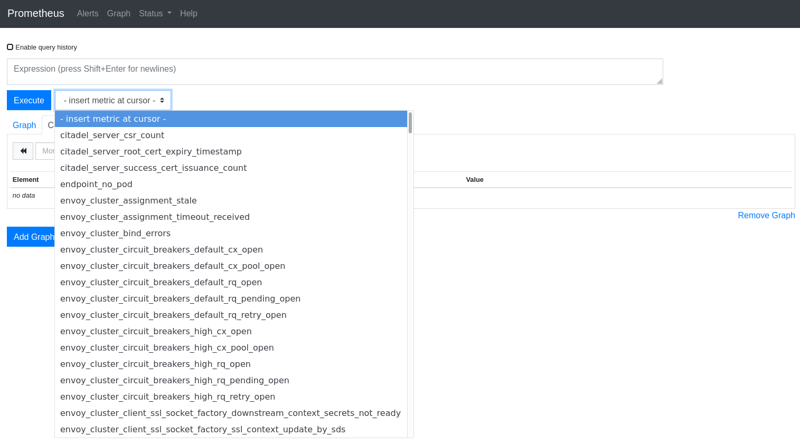
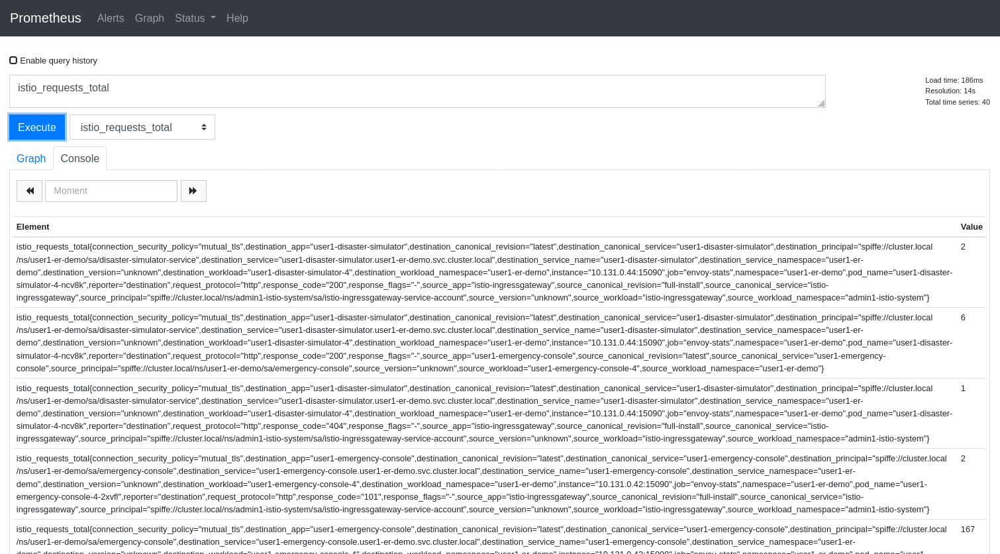
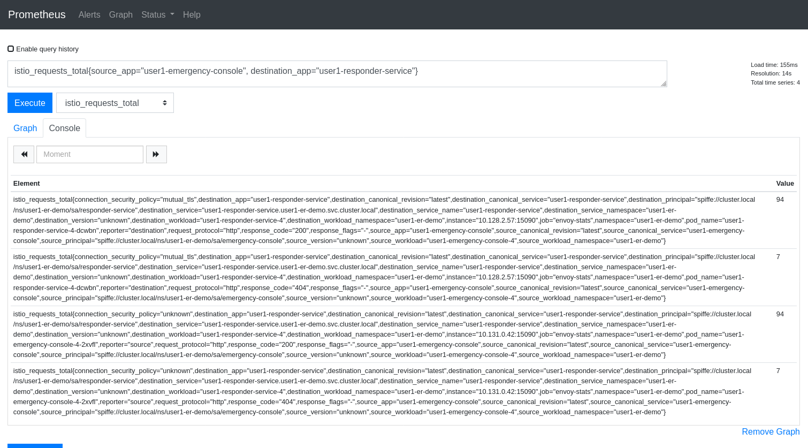
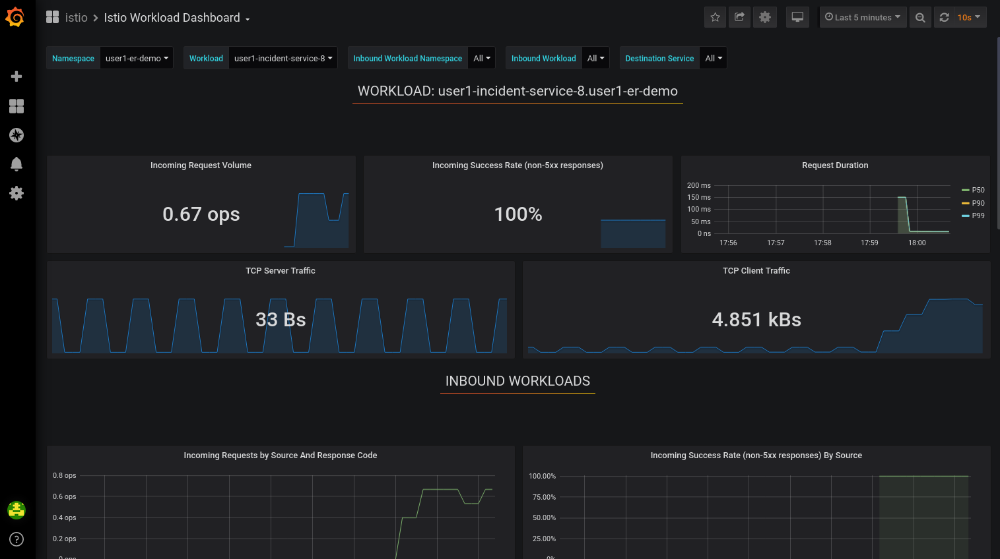
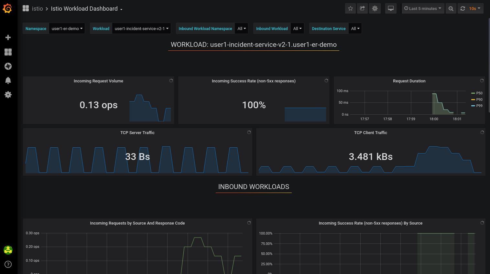
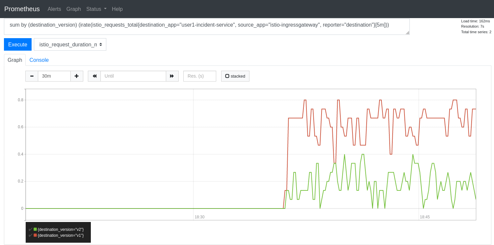
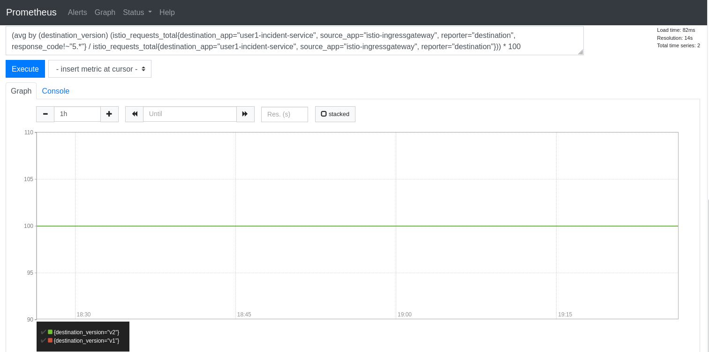
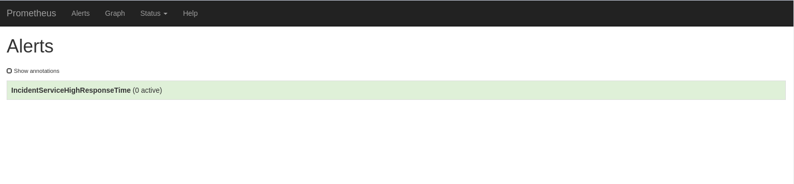

:noaudio:
:scrollbar:
:toc2:
:linkattrs:
:data-uri:

== Observability: Metrics and Monitoring Lab

.Goals
* Understand metrics and monitoring in Red Hat^(R)^ OpenShift^(R)^ Service Mesh
* Create and collect custom metrics
* Define alerts in Prometheus

:numbered:

== Explore OpenShift Service Mesh Metrics and Monitoring

One of the core features of OpenShift Service Mesh is the observability of network traffic. Because all service-to-service communication is routed through Envoy proxies, and the service mesh control plane is able to gather logs and metrics from these proxies, the service mesh can give deep insights about the mesh network. This provides operators with unique ways of troubleshooting, managing, and optimizing their services, without imposing any additional burdens on application developers.

Service Mesh 2.0 uses Telemetry v2, which is a radical change compared to earlier versions, which relied on the Mixer control plane component for telemetry collection. Mixer is deprecated in Service Mesh 2.0, and will disappear completely in a future version.

With Telemetry V2, Envoy exposes metric data (including metadata necessary to provide rich metrics) directly for scraping by Prometheus. By moving away from a central component substantial gains in latency and cpu consumption are achieved.

The metrics exposed by Envoy fall in two categories: _proxy-level_ metrics and _service-level_ metrics. +
Proxy-level metrics are standard metrics provided by the Envoy proxy itself about all pass-through traffic, as well as detailed statistics about the administrative functions of the proxy, including configuration and health information.
Server-level metrics provide service-oriented metrics for monitoring service communications. These metrics cover the four basic service monitoring needs: latency, traffic, errors, and saturation. 

=== Explore Prometheus

The service mesh instance of Prometheus is configured with a number of scraping targets, which means it collects metrics from the components and from each sidecar. All of these metrics are aggregated and visualized in a Grafana dashboard.

. Make sure you are logged in to OpenShift Container Platform as the control plane admin user:
+
----
$ oc login $LAB_MASTER_API -u $SM_CP_ADMIN -p $OCP_PASSWD
----
. Obtain the URL of the Prometheus UI:
+
----
$ echo -en "\n\nhttps://$(oc get route prometheus -o template --template={{.spec.host}} -n $SM_CP_NS)\n\n"
----
. In a browser window, navigate to the Prometheus UI.
. Navigate to *Status -> Targets* to view all of the scraping targets discovered by the Prometheus server:
+
image::images/prometheus-targets.png[]

* These targets include:

** `envoy-stats`: The different envoy proxies.
** `istio-mesh`: The scraping target for service mesh metrics through Mixer's Prometheus adapter. +
As Mixer is not used for telemetry in Service mesh 2.0, there are no discovered instances for this target.
** `citadel`, `pilot`, `galley`, `istio-telemetry`, `istio-policy`: The metrics exposed by the control plane components about themselves. +
Note that only `pilot` has a discovered target, which corresponds to the `istiod` pod. The other targets belong to obsolete control plane components, and as such are not discovered.
** `kubernetes-service-endpoints`: Service endpoints that do not necessarily belong to the mesh. They are discovered automatically because the service resources have Prometheus annotations.

. Click *Graph* and then click the *insert metric at cursor* list to see which metrics are scraped by this Prometheus instance:
+

* The metrics are prefixed according to their source:

** `envoy_`: The proxy-level metrics exposed by the Envoy proxy.
** `istio_`: The service-level metrics exposed by the Envoy proxy, including the following:
*** `istio_requests_total`: A counter that aggregates request totals. For example, it can be used to calculate the number of requests per second grouped by source, destination, protocol, and response code.
*** `istio_request_duration_milliseconds`: A histogram which measures the duration of requests.
*** `istio_request_bytes` and `istio_response_bytes`: Histograms that collect the ingoing and outgoing bytes per request and response.
*** metrics prefixed with `istio_tcp`: metrics generated for TCP traffic, including bytes sent and received, and connections opened and closed. 

. Execute a query against the metrics collected by Prometheus by inserting a metric in the *Expressions* text box. +
For example, from the *insert metrics at cursor* drop-down, select `istio_requests_total`, and click *Execute*.
+

+
Expect to see a large number of metrics, categorized according to a number of _labels_, such as `source_app`, `source_workload_namespace`, `response_code`, `destination_app` etc...
+
The labels can be used to further drill down into the metrics. For example, to filter for traffic between the _emergency console_ and the _responder service_, modify the metric to:
+
----
istio_requests_total{source_app="user1-emergency-console", destination_app="user1-responder-service"}
----
+

=== Explore Grafana
Prometheus is essentially a time-series database, and as such has limited functionality for displaying metric data in graphs and dashboards. That is why Prometheus is often deployed together with Grafana. Grafana uses the Prometheus time-series as a data source for graphics and dashboards. The default installation of service mesh includes Grafana and prebuilt dashboards for the different metric groups obtained from Prometheus.

. Obtain the URL for the Grafana instance:
+
----
$ echo -en "\n\nhttps://$(oc get route grafana -o template --template={{.spec.host}} -n $SM_CP_NS)\n\n"
----
. In a browser window, navigate to the Grafana home page and log in with the control plane admin username and password:
+
image::images/grafana-homepage.png[]
. Click *Home* and select the *Istio* folder to see the different default dashboards:
+
image::images/grafana-dashboards.png[]
. Select *Istio Workload Dashboard*:
+
image::images/grafana-workload-dashboard.png[]
* This dashboard groups the dashboards for the different metric groups obtained through the Mixer's Prometheus adapter.
* In the selection bar at the top, you can select the namespace and workload you want to see, then filter further on inbound workload namespace, inbound workload, and destination service.

== Monitor Istio A/B deployments and Canary deployments

One of the major features of Service Mesh is the ability to establish intelligent routing based on e.g. the service version.

This ability can be used for 

* Content-based routing: For example, if the user-agent is a mobile phone, you can change the specific service that formats the final HTML template.
* A/B deployments: Two similar versions of the service that you want to compare in production.
* Canary deployment: Experimental service version that will only be triggered by certain conditions (like some specific test users).
* Traffic Shifting: Progressive migration to the new service version maintaining the old version fully functional.

Using the metrics produced by the Service Mesh, these service migrations can be closely monitored and as such help drive operational decisions.

In this section of the lab, you deploy a second version of the incident service and distribute traffic between the two versions. Then you define queries over the metrics produced by the Service mesh to compare both versions.

One of the labels that are added to metrics by Envoy is `destination_version`, which corresponds to the value of the `version` label on the pods of the destination service. This allows you to filter and roup metrics by the value of the `version` label.

. Label the deployed version of the incident service as `v1`:
+
----
$ oc patch dc $ERDEMO_USER-incident-service -p '{"spec":{"template":{"metadata":{"labels":{"version":"v1"}}}}}' -n $ERDEMO_NS
----
* This forces a redeployment of the incident service pods.
. Deploy version `v2` of the incident service:
+
----
$ echo "---
apiVersion: apps.openshift.io/v1
kind: DeploymentConfig
metadata:
  labels:
    app: $ERDEMO_USER-incident-service
    app.kubernetes.io/part-of: bizservices
  name: $ERDEMO_USER-incident-service-v2
spec:
  replicas: 1
  revisionHistoryLimit: 2
  selector:
    app: $ERDEMO_USER-incident-service
    group: erd-services
  strategy:
    type: Recreate
    recreateParams:
      timeoutSeconds: 600
    resources: {}
    activeDeadlineSeconds: 21600
  template:
    metadata:
      annotations:
        sidecar.istio.io/inject: 'true'
        sidecar.istio.io/rewriteAppHTTPProbers: 'true'
      creationTimestamp: null
      labels:
        app: $ERDEMO_USER-incident-service
        group: erd-services
        version: v2
    spec:
      containers:
      - env:
        - name: KUBERNETES_NAMESPACE
          valueFrom:
            fieldRef:
              apiVersion: v1
              fieldPath: metadata.namespace
        imagePullPolicy: IfNotPresent
        livenessProbe:
          httpGet:
            path: /health/live
            port: 8080
            scheme: HTTP
          initialDelaySeconds: 20
          timeoutSeconds: 3
          periodSeconds: 30
          successThreshold: 1
          failureThreshold: 3
        name: $ERDEMO_USER-incident-service
        ports:
        - name: http
          containerPort: 8080
          protocol: TCP
        readinessProbe:
          httpGet:
            path: /health/ready
            port: 8080
            scheme: HTTP
          initialDelaySeconds: 3
          periodSeconds: 10
          successThreshold: 1
          failureThreshold: 3
        resources:
          limits:
            cpu: 250m
            memory: 500Mi
          requests:
            cpu: 100m
            memory: 200Mi
        securityContext:
          privileged: false
        terminationMessagePath: /dev/termination-log
        terminationMessagePolicy: File
        volumeMounts:
        - name: config
          mountPath: /deployments/config
      dnsPolicy: ClusterFirst
      restartPolicy: Always
      schedulerName: default-scheduler
      securityContext: {}
      serviceAccount: incident-service
      serviceAccountName: incident-service
      terminationGracePeriodSeconds: 30
      volumes:
      - name: config
        configMap:
          name: incident-service
          defaultMode: 420
  test: false
  triggers:
  - type: ConfigChange
  - type: ImageChange
    imageChangeParams:
      automatic: true
      containerNames:
      - $ERDEMO_USER-incident-service
      from:
        kind: ImageStreamTag
        name: $ERDEMO_USER-incident-service:sm-tracing
        namespace: $ERDEMO_NS
" | oc create -f - -n $ERDEMO_NS
----

* Note that for the sake of simplicity, you are deploying the same image of the incident service. Only the value of the `version` label marks the difference between the two.
. Observe that both deployments are bound to the same service:
+
----
$ oc get service $ERDEMO_USER-incident-service -o custom-columns=NAME:.metadata.name,SELECTOR:.spec.selector -n $ERDEMO_NS
----
+
.Sample Output
----
NAME                      SELECTOR
user50-incident-service   map[app:user50-incident-service group:erd-services]
----
* The `Selector` of the service matches the labels `app=$ERDEMO_USER-incident-service` and `group=erd-services`.
. Verify that the incident service has two endpoints:
+
----
$ oc describe service $ERDEMO_USER-incident-service -n $ERDEMO_NS | grep Endpoints
----
+
.Sample Output
----
Endpoints:         10.128.3.245:8080,10.128.3.247:8080
----

* The traffic directed to the incident service will be more or less equally distributed between the two versions.
. You can give a weight to each service by defining subsets of the service in the incident service DestinationRule and configuring routing weights in the incident service VirtualService:
.. Define the incident service subsets in the DestinationRule:
+
----
$ echo "---
apiVersion: networking.istio.io/v1beta1
kind: DestinationRule
metadata:
  name: incident-service-client-mtls
spec:
  host: $ERDEMO_USER-incident-service.$ERDEMO_NS.svc.cluster.local
  trafficPolicy:
    tls:
      mode: ISTIO_MUTUAL
  subsets:
  - name: v1
    labels:
      version: v1
  - name: v2
    labels:
      version: v2
" | oc apply -f - -n $ERDEMO_NS
----
.. Add routing instructions to the VirtualService:
+
----
$ echo "---
apiVersion: networking.istio.io/v1beta1
kind: VirtualService
metadata:
  name: incident-service-virtualservice
spec:
  hosts:
  - incident-service.$ERDEMO_USER.apps.$SUBDOMAIN_BASE
  gateways:
  - incident-service-gateway.$SM_CP_NS.svc.cluster.local
  http:
    - match:
        - uri:
            prefix: /incidents
      route:
        - destination:
            host: $ERDEMO_USER-incident-service.$ERDEMO_NS.svc.cluster.local
            port:
              number: 8080
            subset: v1
          weight: 80
        - destination:
            host: $ERDEMO_USER-incident-service.$ERDEMO_NS.svc.cluster.local
            port:
              number: 8080
            subset: v2
          weight: 20
" | oc apply -f - -n $ERDEMO_NS
----
* In the example above, roughly 20% of the requests are to be routed to version `v2` of the incident service.
. Create some traffic to the incident service:
+
----
$ while :; do curl -k https://incident-service.$ERDEMO_USER.apps.$SUBDOMAIN_BASE/incidents; sleep 1; done
----
+
Leave this command running during the remainder of this lab.

. In the *Istio Workload Dashboard* in Grafana, select the application namespace and the incident service workload to verify that some traffic reaches the original version (`v1`) of the incident service:
+

. Verify that the `v2` version of the service gets a lot less traffic:
+

. A first metric that you might be interested in is the distribution of requests between the two versions. +
On the *Graph* page of the Prometheus UI, paste the following query in the *Expression* test box.
+
----
sum by (destination_version) (irate(istio_requests_total{destination_app="user1-incident-service", source_app="istio-ingressgateway", reporter="destination"}[5m]))
----
+
Click *Execute* to execute the query, and click the *Graph* to see a graph of the data:
+

+
* The query calculates the per-second instant rate of requests as measured over the last 5 minutes, filtered for the traffic from the ingress-gateway to the incident service. As each version might have more than 1 pod, the sum of the request rate is taken and grouped by the version. +
For more details on the semantics of `irate` and other Prometheus query functions, refer to https://prometheus.io/docs/prometheus/latest/querying/functions.
* Expect roughly a 4:1 distribution in requests between the two versions.

. When deploying a new version of a service, it is essential to monitor the performance compared to the previous version. In the case of a REST based service, you can use the latency or duration of HTTP requests as a performance comparison point.
+
Paste the following query in the Prometheus UI:
+
----
avg by (destination_version) (rate(istio_request_duration_milliseconds_sum{destination_app="user1-incident-service", source_app="istio-ingressgateway", reporter="destination"}[5m]) / rate(istio_request_duration_milliseconds_count{destination_app="user1-incident-service", source_app="istio-ingressgateway", reporter="destination"}[5m]))
----
+
Click *Execute* to execute the query, and click the *Graph* to see a graph of the data:
+
image::images/prometheus-graph-version-2.png[]
+
* The query divides the total request duration (in milliseconds) by the total number of requests, and takes the average grouped per destination. 

. Another interesting metric is the relative number of HTTP errors. As an example, you can divide the number of requests returning a HTTP code loer than by the total number of requests to get the success rate. +
Paste the following query in the Prometheus UI:
+
----
(avg by (destination_version) (istio_requests_total{destination_app="user1-incident-service", source_app="istio-ingressgateway", reporter="destination", response_code!~"5.*"} / istio_requests_total{destination_app="user1-incident-service", source_app="istio-ingressgateway", reporter="destination"})) * 100
----
+
Click *Execute* to execute the query, and click the *Graph* to see a graph of the data:
+

At this point you can stop the curl loop command.

== Define Alerts in Prometheus

Prometheus allows you to define alerts on metrics. The Prometheus server alert functionality is limited to generating the alerts, so in order to do something useful with them, you need an additional component of the Prometheus ecosystem--the _Alertmanager_.
The Alertmanager handles alerts sent by client applications such as the Prometheus server. It takes care of deduplicating, grouping, and routing them to the correct receiver integration such as email, PagerDuty, or OpsGenie. It also takes care of silencing and inhibiting alerts.

NOTE: The default installation of OpenShift Service Mesh includes the Prometheus server, but not the Alertmanager component.

In this section of the lab, you define a _recording rule_ and alerts based on the rule.
Recording rules allow you to precompute frequently needed or computationally expensive expressions and save their results as a new time series set.

Recording and alerting rules exist in a rule group. Rules within a group are run sequentially at a regular interval. Recording and alerting rules are configured in their own files, which are referenced from the general Prometheus configuration file.

The main configuration file for the service mesh Prometheus adapter is managed by the `prometheus` ConfigMap in the control plane namespace. The ConfigMap is mounted into the `/etc/prometheus` directory of the Prometheus pod.
The recording and alerting rules need to be added to the ConfigMap.

. Extract the current Prometheus configuration from the ConfigMap to your local system:
+
----
$ oc extract cm/prometheus -n $SM_CP_NS --to=. --keys=prometheus.yml
----
. Open the `prometheus.yml` file with your favorite text editor and make the following changes:
.. In the `global` section, add the evaluation interval for recording and alerting rules:
+
----
global:
  scrape_interval: 15s
  evaluation_interval: 15s

[...]
----
.. Under the `global` section, add the configuration for the rules file location:
+
----
global:
  scrape_interval: 15s
  evaluation_interval: 15s

rule_files:
- "*.rules"

[...]
----
+
. Save the file.
. Create a new `ingress.rules` file for the recording rule. In this example, you create a recording rule for the `0.5`, `0.9`, and `0.99` quantiles of the request duration for all requests that have the Istio ingress gateway as the source workload:
+
----
$ echo "
groups:
  - name: ingress_gateway
    rules:
      - record: ingress:request_duration_milliseconds:histogram_quantile
        expr: histogram_quantile(0.5 ,sum(irate(istio_request_duration_milliseconds_bucket{source_workload=\"istio-ingressgateway\"} [1m])) by (destination_workload, le))
        labels:
          quantile: \"0.5\"
      - record: ingress:request_duration_milliseconds:histogram_quantile
        expr: histogram_quantile(0.9, sum(irate(istio_request_duration_milliseconds_bucket{source_workload=\"istio-ingressgateway\"} [1m])) by (destination_workload, le))
        labels:
          quantile: \"0.9\"
      - record: ingress:request_duration_milliseconds:histogram_quantile
        expr: histogram_quantile(0.99,sum(irate(istio_request_duration_milliseconds_bucket{source_workload=\"istio-ingressgateway\"} [1m])) by (destination_workload, le))
        labels:
          quantile: \"0.99\"
" > ingress.rules
----
. Create an `ingress-alert.rules` file to define an alert based on the histogram calculated by the recording rule.
In this example, assume you want to fire an alert whenever 90% of the requests to the incident service have a response time higher than one second, for more than 30 seconds:
+
----
$ echo "
groups:
  - name: ingress_gateway_alerts
    rules:
      - alert: IncidentServiceHighResponseTime
        expr:  ingress:request_duration_milliseconds:histogram_quantile{quantile=\"0.9\",destination_workload=~\"^$ERDEMO_USER-incident-service.*\"} > 1000
        for: 30s
        labels:
          severity: high
        annotations:
          message: The Incident Service has a 90th percentile response time of {{ \$value }} seconds for destination {{ \$labels.destination_workload }}.
" > ingress-alert.rules
----
. Delete the `prometheus` ConfigMap in the control plane namespace and create a new one from the configuration and rule files:
+
----
$ oc delete configmap prometheus -n $SM_CP_NS
$ oc create configmap prometheus -n $SM_CP_NS --from-file=prometheus.yml --from-file=ingress.rules --from-file=ingress-alert.rules --save-config=true
$ oc label configmap prometheus -n $SM_CP_NS app=prometheus app.kubernetes.io/part-of=istio app.kubernetes.io/instance=$SM_CP_NS release=istio app.kubernetes.io/version=2.0.2-3.el8-1 app.kubernetes.io/component=prometheus maistra-version=2.0.2 app.kubernetes.io/managed-by=maistra-istio-operator maistra.io/owner=$SM_CP_NS app.kubernetes.io/name=prometheus
----
. Restart the Prometheus pod in the control plane namespace:
+
----
$ oc patch deployment prometheus -p '{"spec":{"template":{"metadata":{"annotations":{"kubectl.kubernetes.io/restartedAt": "'`date -Iseconds`'"}}}}}' -n $SM_CP_NS
----
. In the Prometheus UI, navigate to *Status -> Rules* and verify that the recording and alerting rules are present:
+
image::images/prometheus-rules.png[]
. Generate traffic to the incident service:
+
----
$ while :; do curl -k https://incident-service.$ERDEMO_USER.apps.$SUBDOMAIN_BASE/incidents; sleep 1; done
----
. In the Prometheus UI, navigate to the *Graph* page and paste the following expression in the *Expression* box:
+
----
ingress:request_duration_milliseconds:histogram_quantile{destination_workload=~"^$ERDEMO_USER-incident-service.*"}
----
. Click *Execute*.
* Expect to see values for the histogram quantiles of the response times of ingress traffic to the incident service:
+
image::images/prometheus-quantiles.png[]
+
image::images/prometheus-quantiles-graph.png[]
. In the Prometheus UI, navigate to the *Alerts* page and observe that the `IncidentServiceHighResponseTime` is present and has zero activations:
+

. Use the fault injection mechanism from OpenShift Service Mesh to trigger the alert. This functionality allows to inject HTTP delays or HTTP error codes into requests to services. This is often used to test the resiliency of an application. Fault injection rules are defined in `VirtualService` resources.
.. Add the fault injection definition to the incident service VirtualService:
+
----
$ echo "---
apiVersion: networking.istio.io/v1beta1
kind: VirtualService
metadata:
  name: incident-service-virtualservice
spec:
  gateways:
    - erd-wildcard-gateway.$SM_CP_NS.svc.cluster.local
  hosts:
    - incident-service.$ERDEMO_USER.apps.$SUBDOMAIN_BASE
  http:
    - match:
        - uri:
            prefix: /incidents
      route:
        - destination:
            host: $ERDEMO_USER-incident-service.$ERDEMO_NS.svc.cluster.local
            port:
              number: 8080
            subset: v1
          weight: 80
        - destination:
            host: $ERDEMO_USER-incident-service.$ERDEMO_NS.svc.cluster.local
            port:
              number: 8080
            subset: v2
          weight: 20
      fault:
        delay:
          fixedDelay: 2s
          percentage:
            value: 30
" | oc apply -f - -n $ERDEMO_NS
----

** In this case, a delay of two seconds will be injected in 30% of the requests to the incident service.
. Generate traffic to the incident service:
+
----
$ while :; do curl -k https://incident-service.$ERDEMO_USER.apps.$SUBDOMAIN_BASE/incidents; sleep 1; done
----
. From the *Alerts* page, refresh regularly until you see one or two alerts activated.
. Click the alert bar to see the details of the alert:
+
image::images/prometheus-alert-fired.png[]

* Once the condition in the alert expression evaluates to true, the alert is put in a `PENDING` state. If the alert continues to be active for each evaluation during the period specified in the optional `for` clause of the alert definition, the alert is _fired_. Once fired, the alert is cleared.

This concludes the lab. You learned about metrics and monitoring in OpenShift Service Mesh, created and collected custom metrics, and defined alerts in Prometheus.
