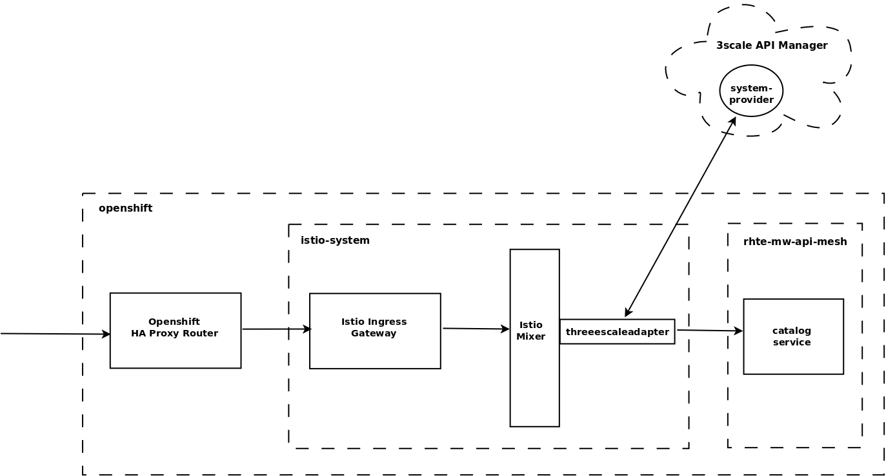
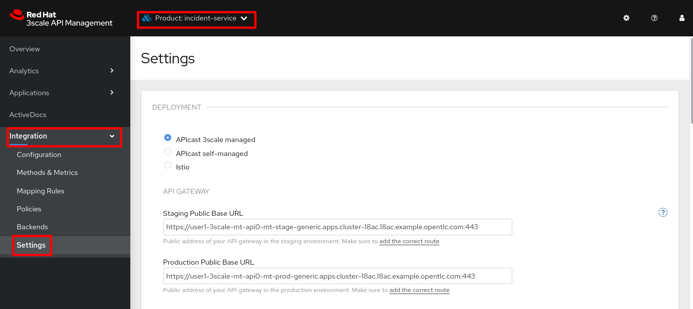
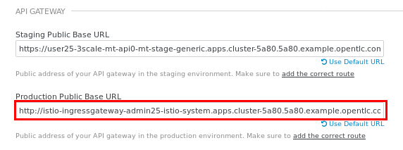
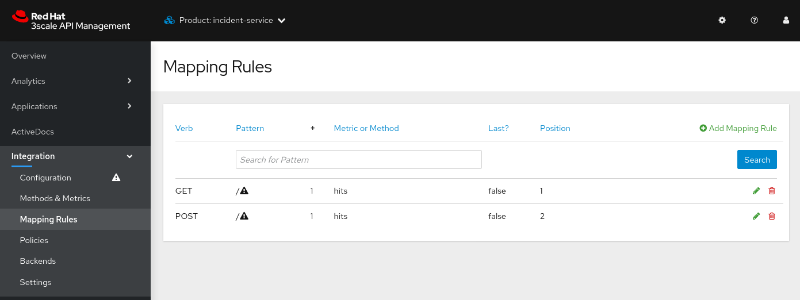

:noaudio:
:scrollbar:
:toc2:
:linkattrs:
:data-uri:

== 3scale Istio Adapter Lab

.Goals
** Review 3scale Istio adapter components
** Apply _API policies_ to network traffic within microservices applications using the 3scale Istio adapter

.Prerequisites
** Completion of previous labs in this course--specifically the second lab in module 1 on north/south API traffic and the lab in module 2 on secure mTLS.

:numbered:
== Overview

The 3scale API Management engineering team, in collaboration with the Red Hat^(R)^ OpenShift^(R)^ Service Mesh team, have created a service mesh Mixer adapter for API management called _3scale Istio adapter_.
This adapter allows 3scale API Management policies to be applied directly to communication that occurs between services in the service mesh.

In this diagram, note that the API gateway has been replaced with the 3scale Istio adapter.

== Set Up VirtualService

In the lab for module 2, you created a wildcard gateway as well as a VirtualService to route inbound traffic to the incident service through the service mesh _ingress gateway_. If you have not yet done so, complete the lab exercises in module 2 before continuing with this lab.

== Review 3scale Istio Adapter

OpenShift Service Mesh provides a Mixer adapter called the _3scale Istio adapter_.
In this section of the lab, you review the various components of the adapter and then configure it so that it applies API management policies to inbound requests.

General information about Istio's plug-in architecture for applying policies and capturing telemetry can be found link:https://istio.io/v1.4/docs/concepts/observability/[here].

image::images/mixer_architecture.png[]

=== Enable Mixer

In Service Mesh 2.0, Mixer is deprecated and not installed by default. The functionality previously provided by Mixer - policy checks, telemetry reporting - is now provided by the Envoy proxy itself. The Envoy proxy functionality can be extended through filters or WebAssembly modules (WASM). However, the 3scale WebAssembly module is still work in progress, and is expected to be released with Service Mesh 2.1.

This means that the in the current version of Service Mesh, integration with 3scale is still through the 3scale Mixer adapter. In order to use the adapter the Service Mesh Mixer component has to be enabled.

. Log in to the OpenShift Container Platform as the control plane admin user:
+
----
$ oc login $LAB_MASTER_API -u $SM_CP_ADMIN -p $OCP_PASSWD
----

. Use the `oc` client to edit the `ServiceMeshControlPlane` resource in the control plane namespace:
+
----
oc edit smcp full-install -n $SM_CP_NS
----

. In the `spec` section, change the configuration of the `policy` element to type `Mixer`, enable policy checks for mixer , and add a `telemetry` element also with type `Mixer`.
+
----
apiVersion: maistra.io/v2
kind: ServiceMeshControlPlane
metadata:
  name: full-install
[...]
spec:
  [...]
  policy:
    mixer:
      enableChecks: true
    type: Mixer
  telemetry:
    type: Mixer
[...]
----
. Save the modified resource.

. Verify the pods in the control plane namespace. Notice 2 new pods, `istio-policy` and `istio-telemetry`. These are the pods of the Service Mesh Mixer component.
+
----
$ oc get pods -n $SM_CP_NS
----
+
.Sample Output
----
grafana-575c6d664b-n4rkk                2/2     Running   0          2d5h
istio-egressgateway-fc49857b6-rf7ww     1/1     Running   0          44h
istio-ingressgateway-858c48f5cb-j5crs   1/1     Running   0          44h
istio-policy-6b694d666b-qlmvn           2/2     Running   2          2m52s
istio-telemetry-59cd475444-snxqd        2/2     Running   2          2m52s
istiod-full-install-56f7fff968-gjg44    1/1     Running   0          44h
jaeger-6fd54886d5-vcxfk                 2/2     Running   0          2d5h
kiali-558779b6db-qsq76                  1/1     Running   0          97m
prometheus-86c884b8b5-4tn5k             3/3     Running   0          23h
----

=== Explore 3scale Istio Adapter Components

The service mesh control plane was initially installed without the 3scale Istio adapter.
In this section of the lab, you enable it.

. Use the `oc` client to edit the `ServiceMeshControlPlane` resource in the control plane namespace:
+
----
$ oc edit smcp full-install -n $SM_CP_NS
----

. In the `spec.addons.3scale` section, add the configuration for the 3scale adapter, and set the adapter to enabled. In the `spec.runtime.components` section add a section `3scale` with the name and tag of the 3scale adapter container image:
+
----
apiVersion: maistra.io/v2
kind: ServiceMeshControlPlane
metadata:
  name: full-install
[...]
spec:
  addons:
    3scale:
      enabled: true
      listen_addr: 3333
      log_level: debug
      log_grpc: false
      log_json: true
      client:
        allow_insecure_connections: false
        timeout: 10
      grpc:
        max_conn_timeout: 1
      metrics:
        port: 8080
        report: true
      system:
        cache_max_size: 1000
        cache_refresh_interval: 180
        cache_refresh_retries: 1
        cache_ttl: 300
[...]
  runtime:
    components:
      3scale:
        container:
          imageName: 3scale-istio-adapter-rhel8
          imageTag: 2.0.0
[...]
----
. Save the modified resource.

. As a result of the change to the ServiceMeshControlPlane Custom Resource, the service mesh operator deploys the 3scale adapter pod. +
Verify that the pod is deployed correctly:
+
----
$ oc get all -l app=3scale-istio-adapter -n $SM_CP_NS
----
+
.Sample Output
----
NAME                                        READY   STATUS    RESTARTS   AGE
pod/3scale-istio-adapter-66bb856788-npjw5   1/1     Running   0          17m

NAME                               TYPE        CLUSTER-IP   EXTERNAL-IP   PORT(S)             AGE
service/threescale-istio-adapter   ClusterIP   None         <none>        3333/TCP,8080/TCP   17m

NAME                                   READY   UP-TO-DATE   AVAILABLE   AGE
deployment.apps/3scale-istio-adapter   1/1     1            1           17m

NAME                                              DESIRED   CURRENT   READY   AGE
replicaset.apps/3scale-istio-adapter-66bb856788   1         1         1       17m
----

. View listings of configurations that support the 3scale Istio adapter:
.. View adapters:
+
-----
$ oc get adapters.config.istio.io -n $SM_CP_NS
-----
+
.Sample Output
-----
threescale   3h26m
-----

.. View templates:
+
-----
$ oc get templates.config.istio.io -n $SM_CP_NS
-----
+
.Sample Output
-----
threescale-authorization   3h26m
-----

== Configure 3scale Istio Adapter

Now that you have verified that the 3scale Istio adapter exists, you need to configure the adapter to apply API policies to traffic to the Emergency Response Demo incident service.

In particular, you specify the URL of the `system-provider` endpoint of your 3scale API Management tenant along with the corresponding access token.
This is needed so that the Istio Mixer can pull API proxy details from the 3scale API Management system (similar to what the 3scale APIcast gateway does).

. Confirm that you have the following environment variables (set during the north/south traffic lab):

.. `INCIDENT_SERVICE_API_KEY`
.. `INCIDENT_SERVICE_ID`
.. `SYSTEM_PROVIDER_URL`
.. `API_ADMIN_ACCESS_TOKEN`

. Create the _Handler_, _Instance_ and _Rule_ custom resource definitions for the 3scale istio adapter:
+ 
----
$ echo "---
apiVersion: config.istio.io/v1alpha2
kind: handler
metadata:
  name: threescale
spec:
  adapter: threescale
  connection:
    address: dns:///threescale-istio-adapter:3333
  params:
    access_token: $API_ADMIN_ACCESS_TOKEN
    service_id: '$INCIDENT_SERVICE_ID'
    system_url: https://$SYSTEM_PROVIDER_URL
---
apiVersion: config.istio.io/v1alpha2
kind: instance
metadata:
  name: threescale-authorization
spec:
  params:
    action:
      method: request.method | \"get\"
      path: request.url_path
    subject:
      user: request.query_params[\"user_key\"] | request.headers[\"user_key\"] | \"\"
  template: threescale-authorization
---
apiVersion: config.istio.io/v1alpha2
kind: rule
metadata:
  name: threescale
spec:
  actions:
  - handler: threescale.handler
    instances:
    - threescale-authorization.instance
  match: |-
    context.reporter.kind == \"inbound\" &&
    destination.service.name == \"$ERDEMO_USER-incident-service\"
" | tee 3scale-adapter-resources.yml
----
+
* Pay special attention to the _Rule_ resource, which defines when the API management policies need to be applied. In this case, the rule defines that the policies need to be defined when the target service (`destination.service.name`) is the incident service.
+
[NOTE]
You can find more information about Istio's Policy Attribute Vocabulary (used in the creation of rules) link:https://istio.io/v1.6/docs/reference/config/policy-and-telemetry/attribute-vocabulary/[here].

. Create the 3scale Istio adapter configuration resources:
+
----
$ oc create -f 3scale-adapter-resources.yml -n $SM_CP_NS
----
+
.Sample Output
----
handler.config.istio.io/threescale created
instance.config.istio.io/threescale-authorization created
rule.config.istio.io/threescale created
----
+
[NOTE]
====
If you need to delete these 3scale Istio adapter configurations, execute the following commands:

-----
$ oc delete rule.config.istio.io threescale -n $SM_CP_NS
$ oc delete instance.config.istio.io threescale-authorization -n $SM_CP_NS
$ oc delete handler.config.istio.io threescale -n $SM_CP_NS
-----
====

. Verify that the 3scale Istio adapter _handler_ configurations were created in the service mesh control plane namespace:
+
-----
$ oc get handler threescale -n $SM_CP_NS -o yaml
-----
+
.Sample Output
-----
apiVersion: v1
items:
- apiVersion: config.istio.io/v1alpha2
  kind: handler

  [...]

  spec:
    adapter: threescale
    connection:
      address: threescale-istio-adapter:3333
    params:
      access_token: secret-token
      service_id: "15"
      system_url: https://user50-3scale-admin.apps.4a64.openshift.opentlc.com

-----

== Update Production Base URL

In this section of the lab, you update your incident service's production base URL to the 3scale production base URL.

. Point your browser to the Admin Portal of your 3scale API Management tenant, which is available at the following URL:
+
-----
$ echo -en "\n\nhttps://$(oc get routes -n $API_MANAGER_NS | grep admin | grep $ERDEMO_USER | awk '{print $2}')\n"
-----

. Authenticate using the values of the following environment variables:
.. *Username*: `$API_TENANT_USERNAME`
.. *Password*: `$API_TENANT_PASSWORD`

. In your `incident-service` API, navigate to *Integration -> Settings*:
+

. Change the value of *Production Public Base URL* to the value of the following:
+
-----
$ echo -en "\nhttps://`oc get route incident-service-route -n $SM_CP_NS -o template --template {{.spec.host}}:443`\n\n"
-----
+

. Save the configuration change by scrolling down to the bottom of the page and clicking *Update Product*:
+

. Promote the change to production:
.. Navigate to *Integration -> Configuration*.
.. Click *Promote to Staging APIcast*:
+

.. Click *Promote to Production APIcast*
+

== Smoke Test 3scale Istio Adapter

. From the terminal, execute the following `curl` command to invoke your incident service directly via the Istio ingress gateway:
+
-----
$ curl -v -k \
       `echo "https://"$(oc get route incident-service-route -n $SM_CP_NS -o template --template {{.spec.host}})"/incidents"`
-----
+
.Sample Output
-----
[...]

< HTTP/2 401
[...]

* Connection #0 to host incident-service.user1.apps.cluster-0476.0476.sandbox114.opentlc.com left intact
UNAUTHENTICATED:threescale.handler.admin1-istio-system:no auth credentials provided or provided in invalid location
-----
* Expect to see a 401 error response with a "UNAUTHENTICATED:threescale.handler.admin1-istio-system:..." message.

* Inbound requests through the Istio ingress gateway are now correctly flowing through the Mixer to the 3scale Istio adapter.

* In the example above, the API `user_key` value associated with your incident service application was omitted.

. View the log file of the 3scale Istio adapter:
+
-----
$ oc logs -f `oc get pod -n $SM_CP_NS | grep "3scale-istio-adapter" | awk '{print $1}'` -n $SM_CP_NS
-----
+
.Sample Output
-----
[...]
"{"level":"debug","time":"2021-02-14T22:14:53.642382Z","msg":"Got instance &InstanceMsg{Subject:&SubjectMsg{User:,Groups:,Properties:map[string]*istio_policy_v1beta11.Value{},},Action:&ActionMsg{Namespace:,Service:,Method:GET,Path:/incidents,Properties:map[string]*istio_policy_v1beta11.Value{},},Name:threescale-authorization.instance.admin1-istio-system,}"}"
[...]
-----

. Invoke your incident service again, this time using the incident service `user_key` value:
+
-----
$ curl -v -k \
       `echo "https://"$(oc get route incident-service-gateway -n $SM_CP_NS -o template --template {{.spec.host}})"/incidents?user_key=$INCIDENT_SERVICE_API_KEY"`
-----

* Expect to see that the incident service is again being managed and secured by Red Hat 3scale API Management.
This time however, the 3scale Istio adapter is being utilized rather than the API gateway.

== Fine-Tune 3scale Istio Adapter Rules

At this point, _all_ traffic inbound through the Istio ingress gateway is configured to route through the 3scale Istio adapter.
Your use case may require more fine-grained routing rules.

In this section of the lab, you specify that GET requests to the incident service's `/incidents` endpoint can bypass the 3scale Istio adapter and invoke the incident service without applying API policies.
However, all POST requests to the `/incidents` endpoint continue to have API policies applied via the 3scale Istio adapter.

[NOTE]
====
For this section of the lab to work as expected, you need to delete the `AuthorizationPolicy` resources you created in the Secure mTLS lab in module 2.

----
$ oc delete AuthorizationPolicy incident-service-external -n $ERDEMO_NS
$ oc delete AuthorizationPolicy deny-all-incident-service -n $ERDEMO_NS
$ oc delete AuthorizationPolicy incident-service-internal -n $ERDEMO_NS
----
====

=== Configure HTTP POST Mapping Rule

In the Admin Portal of the 3scale API Management tenant, you need to configure a _mapping rule_ for your `incident-service` API service.
This mapping rule allows for HTTP POST requests to the incident service in order to create incidents.

. Access your Admin Portal by pointing your browser to the output of the following:
+
-----
$ echo -en "\n\nhttps://$(oc get routes -n $API_MANAGER_NS | grep admin | grep $ERDEMO_USER | awk '{print $2}')\n"
-----

. Authenticate using the following values:
.. *Username*: `$API_TENANT_USERNAME`
.. *Password*: `$API_TENANT_PASSWORD`

. In your `incident-service` API, navigate to *Integration -> Mapping Rules*:

. Add a new mapping rule with the following values:
.. *Verb*: `POST`
.. *Pattern*: `/`
+

. Navigate to *Integration -> Configuration*.
.. Click *Promote to Staging APIcast*:
.. Click *Promote to Production APIcast*

. At the command line, modify the existing `usethreescale` rule in `$SM_CP_NS`:
+
-----
$ oc patch rule.config.istio.io threescale \
       --type=json \
       --patch '[{"op": "add", "path": "/spec/match", "value":"destination.service.name == \"'$ERDEMO_USER'-incident-service\" && source.namespace != \"'$ERDEMO_NS'\" && request.method == \"POST\" && request.path.startsWith(\"/incidents\")"  }]' \
       -n $SM_CP_NS
-----
* This modification introduces a fine-grained `match` rule with several conditions.
When all of the conditions are met, the inbound traffic is routed to the 3scale Istio adapter.

. Review the conditions of the rule:

* The destination service needs to be the incident service.
* The inbound request needs to originate from outside `$ERDEMO_NS` (that is, from the `istio-ingressgateway` of the `$SM_CP_NS` namespace).
* The HTTP verb is of type `POST`.
* The target is the `/incidents/` endpoint.

=== Test
. Invoke your incident service again, this time _without_ the incident service `user_key` value:
+
-----
$ curl -v -k \
       `echo "https://"$(oc get route incident-service-gateway -n $SM_CP_NS -o template --template {{.spec.host}})"/incidents"`
-----
* Expect this request to be routed directly to your back-end incident service.
This is because the request is using an HTTP GET, which causes the third condition of the rule to fail.
Subsequently, the API `user_key` value is not needed.

. Try to POST a new incident service _without_ the incident service `user_key` value:
+
-----
$ curl -v -k \
       -X POST \
       -H "Content-Type: application/json" \
       `echo "https://"$(oc get route incident-service-gateway -n $SM_CP_NS -o template --template {{.spec.host}})"/incidents"` \
       -d '{
  "lat": "34.14338",
  "lon": "-77.86569",
  "numberOfPeople": 3,
  "medicalNeeded": "true",
  "victimName": "victim",
  "victimPhoneNumber": "111-111-111"
}'
-----
* Expect this request to be routed to the 3scale Istio adapter because all three conditions of the routing rule have been met.
* Also expect the response to be "403 PERMISSION DENIED" because the API `user_key` value was not applied.

. Try again, this time using an HTTP POST to create a new incident and using the `user_key` value:
+
-----
$ curl -v -k \
       -X POST \
       -H "Content-Type: application/json" \
       `echo "https://"$(oc get route incident-service-gateway -n $SM_CP_NS -o template --template {{.spec.host}})"/incidents?user_key=$INCIDENT_SERVICE_API_KEY"` \
       -d '{
  "lat": "34.14338",
  "lon": "-77.86569",
  "numberOfPeople": 3,
  "medicalNeeded": "true",
  "victimName": "victim",
  "victimPhoneNumber": "111-111-111"
}'
-----
* Expect this request to be routed to the 3scale Istio adapter and, because the API `user_key` value was applied, a "201 Created" response to the request.

== Extra Credit

Until now, specific endpoints of a single back-end incident service were being managed by the 3scale API Management via the 3scale Istio adapter.

As an optional exercise, configure the service mesh so that API policies are applied to requests to the Emergency Response Demo `responder-service` via the `ingress-gateway`.

****
*Question*:

Which configurations need to be modified or added?
****

This concludes the lab. You learned about the 3scale Istio adapter and its components and applied API policies to network traffic within a microservices application using it.

ifdef::showscript[]

== Conclusion

In this lab we covered the following topics:

* Injecting Istio Envoy proxy configurations into an API gateway
* Configuration of an Istio Egress Route to allow the API gateway to communicate to the remote API Manager
* Invocation of your back-end service via the Istio Ingress gateway and Red Hat 3scale API Management gateway
* End-to-end distributed tracing of an MSA application using the Jaeger implementation of the _OpenTracing_ specification
* Review of the analytics dashboard provided by Red Hat 3scale API Management
* Introduction to the Red Hat 3scale API Management Mixer Adapter

endif::showscript[]
