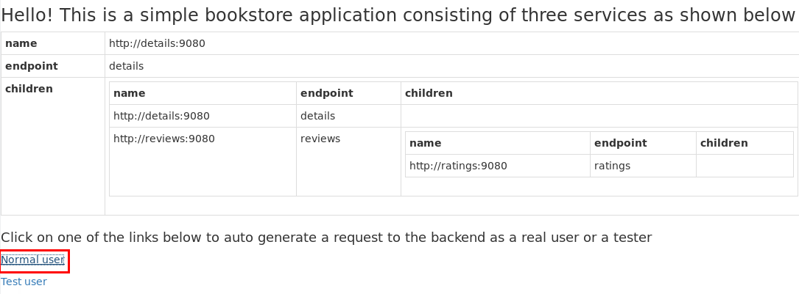

:noaudio:
:scrollbar:
:toc2:
:linkattrs:
:data-uri:

== Final Lab

.Goal
* Assess hands-on proficiency with Red Hat^(R)^ OpenShift^(R)^ Service Mesh

.Expectations
* The final lab takes approximately six to eight hours to complete.
* The final lab is an individual effort--you must complete the final lab without collaboration.
* The final lab simulates a challenge typically encountered in a Red Hat consulting engagement.
** The final lab requirements are intentionally vague.

:numbered:

== Business Use Case
You are a consultant assigned to BookRetail Inc., an e-commerce hosting platform.
BookRetail Inc. is developing a new online retail platform to sell their books.

BookRetail Inc. is architecting their new online retail platform as a microservices-architected application.
They have asked you to lead a proof-of-concept (POC) using Red Hat OpenShift Service Mesh.
The purpose of the POC is to determine the feasibility of using OpenShift Service Mesh to _connect_, _control_, and _secure_ the various services that comprise their new retail platform application.

== POC Environment

You need a Red Hat OpenShift Container Platform 4 cluster to complete this POC.
You can order the OpenShift Container Platform 4 environment in the same way you did for the prerequisite training you attended prior to going on-site at BookRetail Inc.
In particular, refer to the first lab of the link:https://learning.redhat.com/enrol/index.php?id=1627[Red Hat OpenShift Service Mesh Foundations] course for ordering an OpenShift 4 cluster.

== Business Application

BookRetail Inc. has made the Linux^(R)^ containers and corresponding OpenShift configurations available for their `bookinfo` application.

Complete the following steps once your OpenShift Container Platform 4 lab environment has been provisioned.

. Create a new OpenShift project for the `bookinfo` application:
+
-----
oc new-project bookinfo
-----

. Deploy the `bookinfo` application in the new project:
+
-----
oc apply -f https://raw.githubusercontent.com/istio/istio/1.4.0/samples/bookinfo/platform/kube/bookinfo.yaml -n bookinfo
-----

. Review a description and architectural overview of the `bookinfo` application in the first section of its link:https://istio.io/docs/examples/bookinfo/[documentation].
+
IMPORTANT: You do _NOT_ need to execute the tasks in any of the sections in this documentation.

. Expose the `productpage` service as an OpenShift route:
+
-----
oc expose service productpage
-----

. In your browser, navigate to the `bookinfo` application's `productpage` service at the following URL:
+
-----
echo -en "\n$(oc get route productpage --template '{{ .spec.host }}')\n"
-----

. Study the hierarchy of network calls to the various services of the `bookinfo` application.
. Test the application by clicking *Normal user* at the bottom of the page:
+

. Note that ratings, reviews, and details were retrieved for a book:
+

== OpenShift Service Mesh Operator and Control Plane
The POC for BookRetail Inc. requires the `bookinfo` application be managed by OpenShift Service Mesh.

. Install the OpenShift Service Mesh `operator` in the same OpenShift Container Platform 4 cluster where you installed the `bookinfo` application.

* Refer to the product documentation for instructions for installing the operator.
You can also repeat the steps for installing the OpenShift Service Mesh operator found in the link:https://learning.redhat.com/enrol/index.php?id=1627[Red Hat OpenShift Service Mesh Foundations] course.

. Install a service mesh _control plane_ with the following requirements:
* The name of the OpenShift project where the service mesh control plane must reside is `bookretail-istio-system`.
* The 3scale Istio adapter is not needed.
* Global mTLS is not needed.
+
NOTE: You enable mTLS later in a more fine-grained manner.

* Make sure that all of the _observability_ components of OpenShift Service Mesh--that is, Kiali and tracing via Jaeger--are enabled.

== ServiceMeshMemberRoll

IMPORTANT: All of the following configurations need to be executed as part of an automation script written in `ansible` or `bash`.

. Install a `ServiceMeshMemberRoll` resource with `bookinfo` as its only member.

.. Make sure that your `bookinfo` project now includes the appropriate service mesh-related labels.

. Add a service mesh _data plane_ auto-injection annotation to your `bookinfo` deployments.

.. Make sure that all of your `bookinfo` deployments now include the Envoy sidecar proxy.

== mTLS Security
The POC requires mTLS traffic between all services of the `bookinfo` application.

IMPORTANT: All of the following configurations need to be executed as part of an automation script written in `ansible` or `bash`.

. If the `bookinfo` deployments include liveness and readiness probes, customize them to use equivalent _command-based_ probes.
. Create a link:https://istio.io/docs/reference/config/security/istio.authentication.v1alpha1/#Policy[policy]  object for the `bookinfo` namespace deployments.
.. Specify an mTLS mode of `STRICT`.
. Create appropriate TLS certificates, `DestinationRules`, `VirtualService`, and other resources for your `bookinfo` application.

== Final Lab Submittal

* *Grading*:  Minimum *75%* score needed to pass

* *Criteria*:
** 25%: OpenShift Service Mesh operator and multi-tenant `ServiceMeshControlPlane`
** 25%: `ServiceMeshMemberRoll` and auto-injected `bookinfo` deployments (configured via an `ansible` or `bash` script)
** 50%: Strict mTLS network traffic between `bookinfo` services (configured via an `ansible` or `bash` script)

* *Deliverables*:

** A README file with the URL to the OpenShift Container Platform master API along with the user IDs and passwords of the service mesh control plane and `bookinfo` administrators.
+
IMPORTANT: Make sure that the lab environment is accessible for two days after submission to enable the instructor to access the URLs for grading.

** Automation script written in `ansible` or `bash` that provisions the tasks described in the previous sections.

* *Final Lab Submittal*:

** Submit your final lab via one of the following:

*** *Red Hat employees*: link:https://docs.google.com/document/d/1nxlvAOlSdNs3-y8AkmDjnc8vtCH9rJdI5zbN9deCK50/edit[Red Hat LMS]
*** *Red Hat partners*: link:https://partner.redhat.com[Red Hat Connect]

ifdef::showscript[]

test curl commands:
  1) curl http://ratings:9080/ratings/1234567890 | jq .
  2) curl http://reviews:9080/reviews/1234567890 | jq .
  3) curl http://details:9080/details/1234567890 | jq .
  4) curl http://productpage:9080/productpage?u=normal

endif::showscript[]
